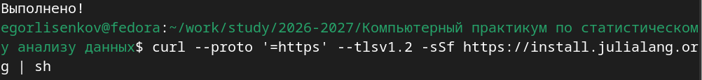
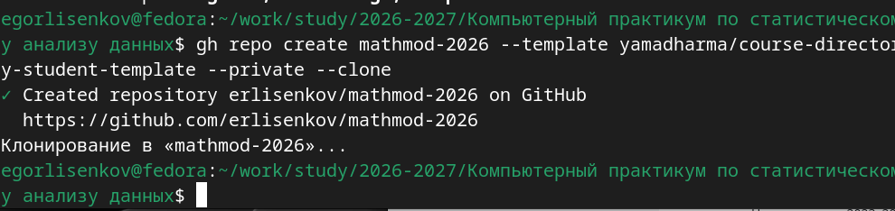
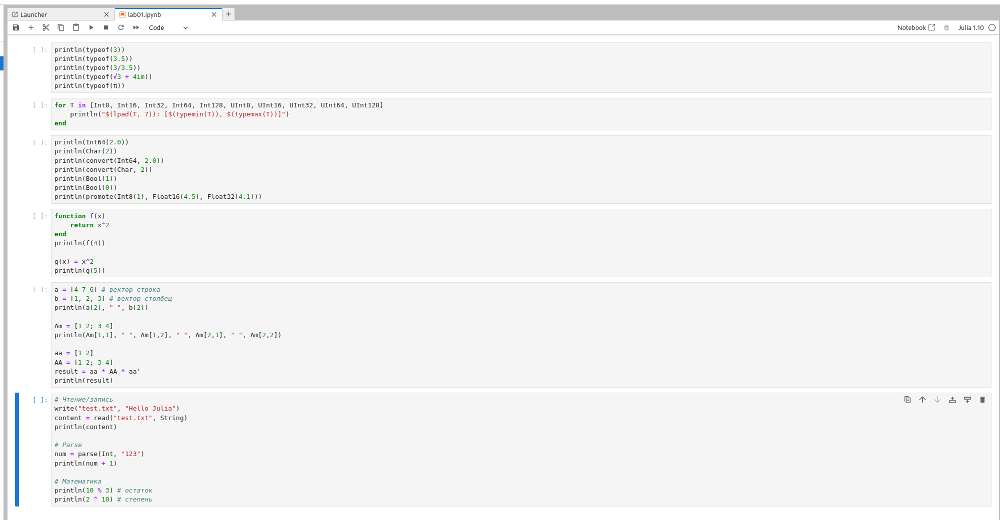
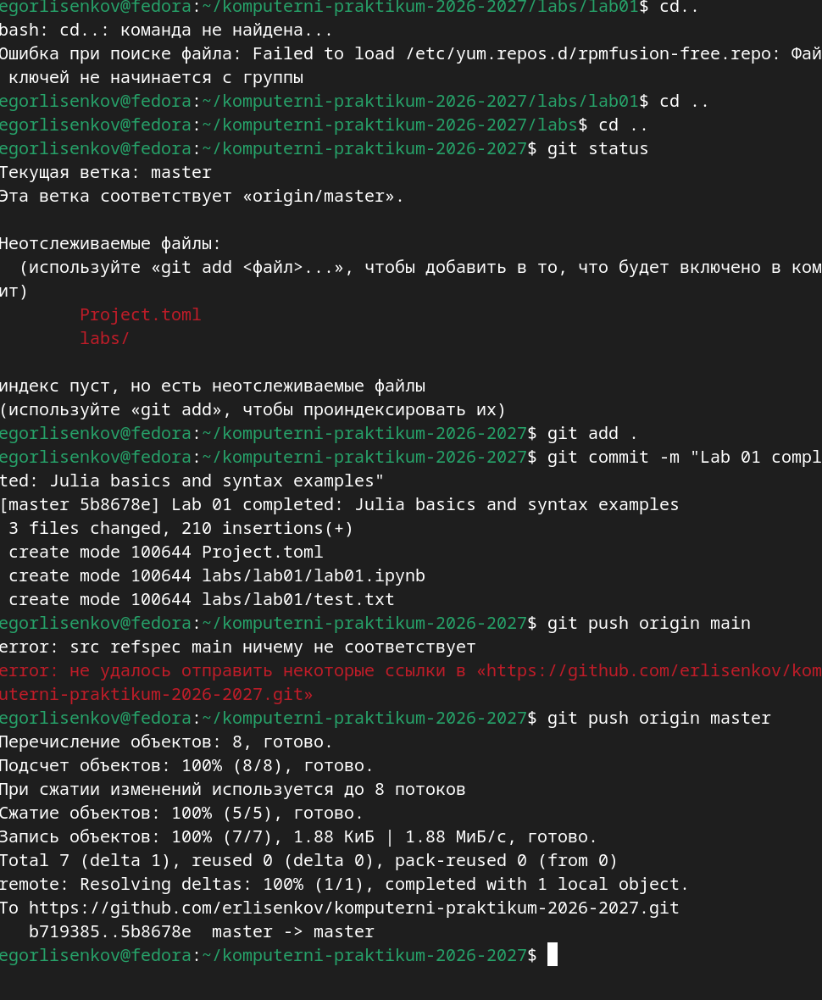

---
## Front matter
lang: ru-RU
title: Лабораторная работа №1
subtitle: Компьютерный практикум по статистическому анализу данных
author:
  - Лисенков Е.Р.
institute:
  - Российский университет дружбы народов, Москва, Россия

## i18n babel
babel-lang: russian
babel-otherlangs: english

## Formatting pdf
toc: false
toc-title: Содержание
slide_level: 2
aspectratio: 169
section-titles: true
theme: metropolis
header-includes:
 - \metroset{progressbar=frametitle,sectionpage=progressbar,numbering=fraction}
 - '\makeatletter'
 - '\beamer@ignorenonframefalse'
 - '\makeatother'
---

# Информация

## Докладчик

:::::::::::::: {.columns align=center}
::: {.column width="70%"}

  * Лисенков Егор Романович
  * студент НФИбд-02-23
  * Российский университет дружбы народов
  * [1132232881@rudn.ru](mailto:1132232881@rudn.ru)
  * <https://github.com/erlisenkov>

:::
::: {.column width="30%"}

ц

:::
::::::::::::::

# Вводная часть

## Актуальность
Подготовка воспроизводимого вычислительного окружения на базе языка Julia и интерактивной среды Jupyter Lab является фундаментом для современного научного программирования и статистического анализа данных.

## Объект и предмет исследования
Объектом является инструментарий вычислительного эксперимента на языке Julia, а предметом — настройка рабочего пространства, интеграция с Git/GitHub и освоение базового синтаксиса языка.

## Цели и задачи
Целью работы выступает подготовка окружения для курса компьютерного практикума, а задачами — установка Julia и Jupyter, настройка репозитория по шаблону курса и выполнение примеров базового синтаксиса.

## Материалы и методы
Работа выполнена в ОС Fedora Linux с использованием пакетного менеджера dnf, установщика juliaup, среды Jupyter Lab, системы контроля версий Git и утилиты GitHub CLI.

## Обновление системы и установка средств разработки
Выполнено обновление репозиториев Fedora и установка базовых инструментов разработки: git, curl, gcc и make, необходимых для сборки пакетов Julia.
{#fig:001 width=100%}

## Установка Julia через официальный скрипт
С помощью утилиты curl загружен и выполнен установочный скрипт julialang.org, который автоматически развернул менеджер версий juliaup.
{#fig:002 width=100%}

## Проверка версии установленной Julia
Команда julia --version подтвердила успешную установку интерпретатора Julia версии 1.10.3, готового к работе в командной строке.
{#fig:003 width=100%}

## Установка Python 3 и pip
Через пакетный менеджер dnf установлены интерпретатор Python 3 и пакетный менеджер pip, необходимые для последующего развёртывания Jupyter Lab.
{#fig:004 width=100%}

## Подготовка к установке Jupyter Lab
Система проверила наличие зависимостей и подтвердила, что Jupyter Lab уже установлен в стандартных путях Python, что позволяет перейти к настройке ядра Julia.
{#fig:005 width=100%}

## Настройка Git и проверка авторизации GitHub CLI
Заданы глобальные параметры пользователя Git, а команда gh auth status подтвердила успешный вход в аккаунт GitHub с правами доступа к репозиториям.
{#fig:006 width=100%}

## Создание репозитория из шаблона через GitHub CLI
Утилита gh repo create автоматически создала приватный репозиторий mathmod-2026 на основе шаблона course-directory-student-template и клонировала его локально.
{#fig:007 width=100%}

## Установка пакета IJulia для интеграции с Jupyter
В интерактивном режиме REPL Julia выполнен запуск пакетного менеджера Pkg и установка библиотеки IJulia, обеспечивающей связь между Julia и Jupyter Lab.
{#fig:008 width=100%}

## Клонирование репозитория курса на локальную машину
Команда git clone успешно загрузила все объекты репозитория komputerni-praktikum-2026-2027 с GitHub, используя сохранённые учётные данные GitHub CLI.
{#fig:009 width=100%}

## Проверка установки Jupyter Lab
Команда pip3 install jupyterlab подтвердила наличие всех необходимых компонентов интерактивной среды в системе, завершив этап подготовки инструментария.
{#fig:010 width=100%}

## Проверка статуса Git и обнаружение неотслеживаемых файлов
Команда git status выявила новые файлы Project.toml и каталог labs/, требующие добавления в индекс для фиксации структуры проекта в системе контроля версий.
{#fig:011 width=100%}

## Выполнение заданий лабораторной работы в Jupyter Lab
В блокноте lab01.ipynb реализованы примеры определения типов, диапазонов целых чисел, преобразования типов, функций и операций с массивами согласно методическим указаниям.
{#fig:012 width=100%}

## Фиксация изменений в Git и отправка на GitHub
После добавления файлов в индекс и создания коммита изменения успешно отправлены в удалённый репозиторий, несмотря на первоначальную ошибку именования ветки.
{#fig:013 width=100%}

## Результаты

В ходе выполнения лабораторной работы №1 было успешно подготовлено рабочее пространство и инструментарий для работы с языком программирования Julia на операционной системе Fedora. Установлен язык Julia версии 1.10.3 через официальный скрипт juliaup, настроена интерактивная среда Jupyter Lab с ядром IJulia, установлены необходимые средства разработки (git, curl, gcc, make) и настроена интеграция с GitHub через утилиту GitHub CLI. Создан репозиторий komputerni-praktikum-2026-2027 на основе шаблона course-directory-student-template с правильной структурой каталогов для лабораторных работ (labs/lab01 ... labs/lab08).

## Выводы

В результате выполнения лабораторной работы №1 были освоены базовые навыки работы с языком программирования Julia и интерактивной средой Jupyter Lab. Практически подтверждена простота и выразительность синтаксиса Julia для численных вычислений: автоматический вывод типов, множественная диспетчеризация, встроенная поддержка комплексных чисел и математических констант, удобные операции с массивами и матрицами без необходимости явного импорта библиотек.

