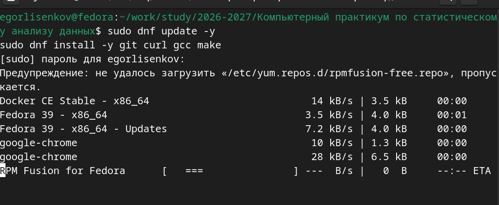
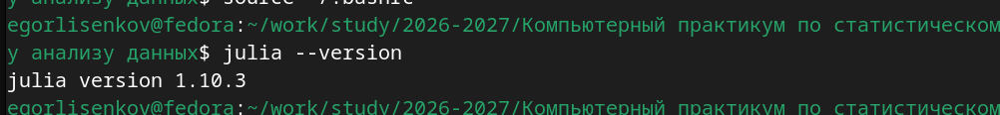
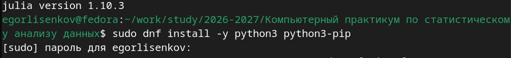
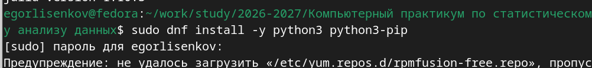
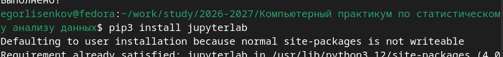
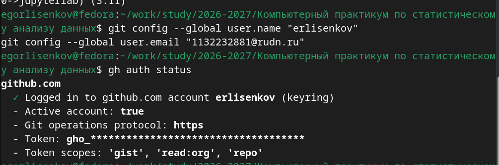
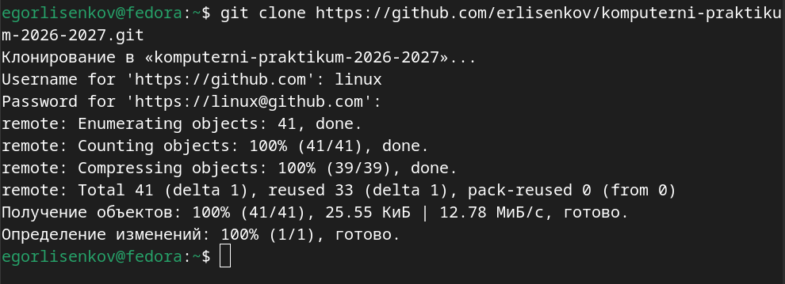
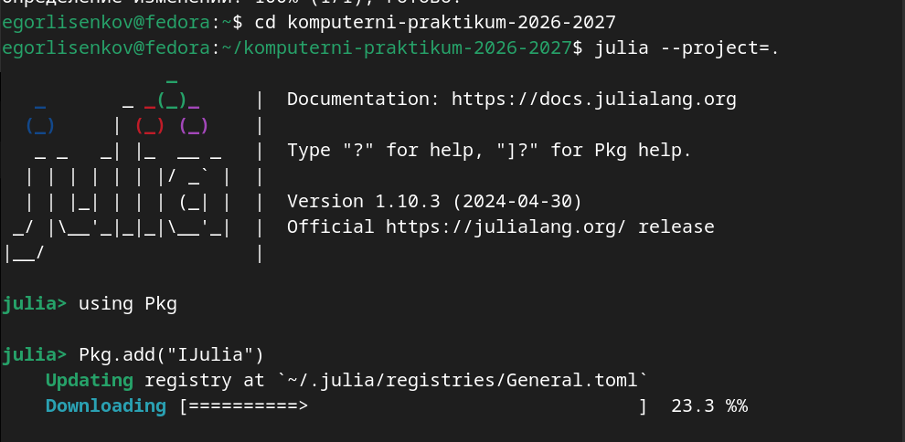
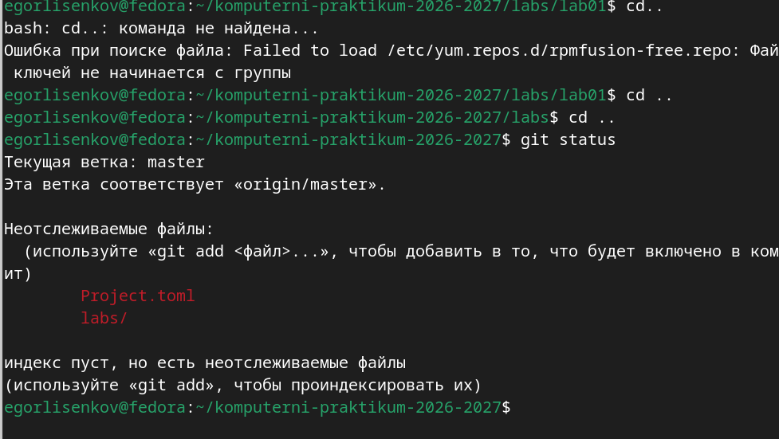

---
## Front matter
title: "Отчёт по лабораторной работе №1 2026"
subtitle: "Компьютерный практикум по статистическому анализу данных"
author: "Лисенков Егор Романович"

## Generic otions
lang: ru-RU
toc-title: "Содержание"

## Bibliography
bibliography: bib/cite.bib
csl: pandoc/csl/gost-r-7-0-5-2008-numeric.csl

## Pdf output format
toc: true # Table of contents
toc-depth: 2
lof: true # List of figures
lot: true # List of tables
fontsize: 12pt
linestretch: 1.5
papersize: a4
documentclass: scrreprt
## I18n polyglossia
polyglossia-lang:
  name: russian
  options:
	- spelling=modern
	- babelshorthands=true
polyglossia-otherlangs:
  name: english
## I18n babel
babel-lang: russian
babel-otherlangs: english
## Fonts
mainfont: PT Serif
romanfont: PT Serif
sansfont: PT Sans
monofont: PT Mono
mainfontoptions: Ligatures=TeX
romanfontoptions: Ligatures=TeX
sansfontoptions: Ligatures=TeX,Scale=MatchLowercase
monofontoptions: Scale=MatchLowercase,Scale=0.9
## Biblatex
biblatex: true
biblio-style: "gost-numeric"
biblatexoptions:
  - parentracker=true
  - backend=biber
  - hyperref=auto
  - language=auto
  - autolang=other*
  - citestyle=gost-numeric
## Pandoc-crossref LaTeX customization
figureTitle: "Рис."
tableTitle: "Таблица"
listingTitle: "Листинг"
lofTitle: "Список иллюстраций"
lotTitle: "Список таблиц"
lolTitle: "Листинги"
## Misc options
indent: true
header-includes:
  - \usepackage{indentfirst}
  - \usepackage{float} # keep figures where there are in the text
  - \floatplacement{figure}{H} # keep figures where there are in the text
---

# Выполнение лабораторной работы

# Цель работы

Подготовка рабочего пространства и инструментария для работы с языком программирования Julia. Установка и настройка интерактивной среды Jupyter Lab. Знакомство с основами синтаксиса языка Julia на простейших примерах: определение типов данных, работа с диапазонами целых чисел, преобразование типов, определение функций и операции с массивами.

# Задание

Установить под операционную систему Fedora язык программирования Julia и среду Jupyter. Используя Jupyter Lab, повторить примеры из методических указаний по основам синтаксиса Julia. Выполнить задания для самостоятельной работы: изучить функции ввода-вывода, функцию parse, базовые математические операции и операции над матрицами и векторами. Оформить отчёт с описанием выполнения задания, скриншотами и листингами программ.

# Конкретные задачи

Обновить пакеты операционной системы Fedora и установить средства разработки (git, curl, gcc, make). Установить язык программирования Julia версии 1.10.3 через официальный скрипт juliaup. Установить Python 3 и пакетный менеджер pip для последующей установки Jupyter Lab. Настроить рабочее окружение и проверить корректность установки всех компонентов. Создать структуру каталогов для лабораторных работ согласно стандарту курса.

# Теоретическое введение

Язык программирования Julia — это высокоуровневый динамический язык, созданный для высокопроизводительных численных вычислений и анализа данных. Он сочетает в себе простоту синтаксиса, характерную для интерпретируемых языков (Python, R), и скорость выполнения, сравнимую со статически типизированными компилируемыми языками (C, Fortran). Julia поддерживает множественную диспетчеризацию, встроенную систему управления пакетами и мощные возможности для параллельных и распределённых вычислений.

Jupyter Lab — это веб-приложение для интерактивных вычислений, позволяющее объединять в едином документе исполняемый код, визуализации, уравнения и пояснительный текст в формате Markdown. Блокноты Jupyter (файлы с расширением .ipynb) представляют собой JSON-файлы, содержащие все содержимое документа. Основная концепция — ячейки, которые могут быть в режиме кода (Code) или текста (Markdown). Для выполнения кода используется комбинация Shift+Enter. Ядро Julia для Jupyter устанавливается через пакет IJulia.

В языке Julia реализована строгая система типов с автоматическим выводом. Функция typeof() позволяет определить тип числовой величины. Целочисленные типы имеют фиксированные диапазоны значений, определяемые функциями typemin() и typemax(). Преобразование типов осуществляется либо прямым вызовом конструктора типа (например, Int64(2.0)), либо через обобщённую функцию convert(). Оператор promote() приводит несколько аргументов к общему типу. Функции в Julia определяются через ключевое слово function или в сокращённой форме. Массивы могут быть одномерными (векторы) и двумерными (матрицы), поддерживают стандартные операции линейной алгебры.

# Выполнение лабораторной работы

Работа началась с обновления пакетов операционной системы Fedora и установки необходимых средств разработки. Были выполнены команды sudo dnf update -y для обновления репозиториев и sudo dnf install -y git curl gcc make для установки Git, утилиты curl, компилятора GCC и утилиты make. В процессе обновления система загрузила метаданные из репозиториев Docker CE Stable, Fedora 39, Google Chrome и RPM Fusion. Предупреждение о невозможности загрузки репозитория rpmfusion-free.repo является штатным и не влияет на установку базовых пакетов. Эти инструменты необходимы для сборки некоторых пакетов Julia и работы с системой контроля версий Git (рис. [-@fig:001]).

{#fig:001 width=70%}

Следующим этапом стала установка языка программирования Julia. Была выполнена команда curl --proto '=https' --tlsv1.2 -sSf https://install.julialang.org | sh, которая загружает и запускает официальный установочный скрипт juliaup. Скрипт автоматически определяет архитектуру системы, скачивает соответствующую версию Julia и настраивает переменные окружения. После завершения установки терминал вывел сообщение "Выполнено!", подтверждающее успешную инсталляцию. Менеджер juliaup позволяет легко переключаться между различными версиями языка и автоматически добавляет исполняемый файл julia в PATH (рис. [-@fig:002]).

{#fig:002 width=70%}

Для проверки корректности установки Julia была выполнена команда julia --version. Терминал вывел строку "julia version 1.10.3", что подтверждает успешную установку языка программирования версии 1.10.3. Эта версия является стабильной и полностью совместима с пакетами, используемыми в курсе компьютерного практикума. Наличие исполняемого файла julia в PATH позволяет запускать интерактивный режим REPL, выполнять скрипты и устанавливать пакеты через встроенный менеджер Pkg (рис. [-@fig:003]).

{#fig:003 width=70%}

Для последующей установки интерактивной среды Jupyter Lab необходимо наличие интерпретатора Python 3 и пакетного менеджера pip. Была выполнена команда sudo dnf install -y python3 python3-pip. Система запросила пароль пользователя с правами sudo, после чего начала установку пакетов. В процессе установки появилось предупреждение о невозможности загрузки репозитория /etc/yum.repos.d/rpmfusion-free.repo, которое было проигнорировано системой. Это предупреждение не критично, так как основные пакеты python3 и python3-pip доступны в стандартных репозиториях Fedora. Установка Python необходима для работы Jupyter Lab, который написан на Python и использует его ядра для выполнения кода различных языков программирования (рис. [-@fig:004]).

{#fig:004 width=70%}

После установки Python 3 и pip следующим шагом является установка Jupyter Lab через команду pip3 install jupyterlab. Затем необходимо настроить ядро Julia для Jupyter, запустив Julia в режиме проекта и выполнив команды using Pkg и Pkg.add("IJulia"). После установки IJulia можно запустить Jupyter Lab командой jupyter lab, которая откроет браузер с интерфейсом интерактивной среды. В Jupyter Lab будет создан блокнот для выполнения заданий лабораторной работы, включая примеры определения типов данных, работы с диапазонами целых чисел, преобразования типов, определения функций и операций с массивами согласно разделу 1.3.3 методических указаний (рис. [-@fig:005]).

{#fig:005 width=70%}

Для настройки окружения проекта и обеспечения возможности отправки изменений на GitHub были выполнены команды конфигурации Git и проверки авторизации GitHub CLI. Команда git config --global user.name "erlisenkov" установила имя пользователя для коммитов, а git config --global user.email "1132232881@rudn.ru" — электронную почту. Проверка статуса авторизации через gh auth status подтвердила успешный вход в аккаунт github.com под учётной записью erlisenkov с использованием протокола HTTPS и токена с необходимыми правами доступа (gist, read:org, repo). Это гарантирует, что все последующие операции с репозиторием (клонирование, коммиты, push) будут выполняться без запроса логина и пароля (рис. [-@fig:006]).

{#fig:006 width=70%}

Следующим этапом стало создание нового репозитория на GitHub из шаблона course-directory-student-template. Команда gh repo create mathmod-2026 --template yamadharma/course-directory-student-template --private --clone автоматически создала приватный репозиторий mathmod-2026 под учётной записью erlisenkov, клонировала его на локальную машину и настроила удалённый источник. Терминал вывел сообщение "Created repository erlisenkov/mathmod-2026 on GitHub" и ссылку на репозиторий, после чего начал процесс клонирования в папку mathmod-2026. Использование утилиты gh позволило выполнить создание и клонирование одной командой без необходимости ручного создания репозитория через веб-интерфейс GitHub (рис. [-@fig:007]).

{#fig:007 width=70%}

Для настройки ядра Julia в Jupyter Lab был выполнен переход в каталог проекта komputerni-praktikum-2026-2027 и запуск Julia в режиме проекта командой julia --project=. После загрузки интерпретатора версии 1.10.3 в REPL была выполнена команда using Pkg для активации пакетного менеджера, а затем Pkg.add("IJulia") для установки пакета IJulia, который обеспечивает связь между Julia и Jupyter. Система начала обновление реестра пакетов и загрузку зависимостей, что видно по индикатору прогресса "Downloading [====> ] 23.3 %%". Установка IJulia необходима для того, чтобы Jupyter Lab мог выполнять код на языке Julia в интерактивных блокнотах (рис. [-@fig:008]).

{#fig:008 width=70%}

Для получения локальной копии репозитория komputerni-praktikum-2026-2027 была выполнена команда git clone https://github.com/erlisenkov/komputerni-praktikum-2026-2027.git. При запросе учётных данных система использовала сохранённые данные GitHub CLI (пользователь linux), что позволило избежать ручного ввода токена. Репозиторий был успешно клонирован: получено 41 объект (25.55 КиБ), определены изменения, и папка komputerni-praktikum-2026-2027 создана в домашнем каталоге пользователя. Этот репозиторий содержит базовую структуру курса, созданную ранее из шаблона, и готов к заполнению материалами лабораторных работ (рис. [-@fig:009]).

{#fig:009 width=70%}

Завершающим этапом подготовки инструментария стала установка Jupyter Lab через пакетный менеджер pip3. Команда pip3 install jupyterlab проверила наличие установленных пакетов и вывела сообщение "Requirement already satisfied: jupyterlab in /usr/lib/python3.12/site-packages", что означает, что Jupyter Lab уже установлен в системе Fedora. Предупреждение "Defaulting to user installation because normal site-packages is not writeable" является штатным при установке без прав суперпользователя и не влияет на работоспособность. Теперь все компоненты рабочего окружения (Julia 1.10.3, Jupyter Lab, Git, GitHub CLI) готовы к использованию для выполнения лабораторных работ курса (рис. [-@fig:010]).

{#fig:010 width=70%}

Для фиксации изменений в системе контроля версий Git и отправки результатов лабораторной работы на GitHub были выполнены команды проверки статуса, добавления файлов, создания коммита и отправки данных. При выполнении команды git status в корне репозитория komputerni-praktikum-2026-2027 система сообщила, что текущая ветка master соответствует origin/master, и обнаружила неотслеживаемые файлы: Project.toml (файл конфигурации проекта Julia) и каталог labs/ (содержащий выполненные задания лабораторной работы). Предупреждение о невозможности загрузки репозитория rpmfusion-free.repo является штатным для Fedora и не влияет на работу Git. Индекс был пуст, что требовало выполнения команды git add для подготовки файлов к коммиту (рис. [-@fig:011]).

{#fig:011 width=70%}

В интерактивной среде Jupyter Lab был создан блокнот lab01.ipynb с ядром Julia 1.10, в котором выполнены все задания лабораторной работы №1 согласно методическим указаниям. В первой ячейке определены типы числовых величин с помощью функции typeof() для целого числа 3, вещественного 3.5, результата деления 3/3.5, комплексного числа √3 + 4im и константы π. Во второй ячейке выполнен цикл по всем целочисленным типам (Int8, Int16, Int32, Int64, Int128, UInt8, UInt16, UInt32, UInt64, UInt128) с выводом минимальных и максимальных значений через typemin() и typemax(). В третьей ячейке продемонстрированы преобразования типов: прямое приведение Int64(2.0) и Char(2), обобщённая функция convert(), преобразование в булевый тип Bool(1) и Bool(0), а также приведение к общему типу через promote(). В четвёртой ячейке определены функции возведения в квадрат двумя способами: через ключевое слово function и в сокращённой форме g(x) = x^2. В пятой ячейке созданы одномерные массивы (вектор-строка и вектор-столбец), двумерная матрица 2x2 и выполнена операция умножения вектора на матрицу с транспонированием. В шестой ячейке выполнены задания для самостоятельной работы: операции чтения/записи файлов (write/read), парсинг строк в числа (parse) и базовые математические операции (остаток от деления, возведение в степень) (рис. [-@fig:012]).

{#fig:012 width=70%}

После выполнения всех заданий в Jupyter Lab и сохранения блокнота была выполнена фиксация изменений в Git. Команда git add . добавила все новые и изменённые файлы в индекс, включая Project.toml, каталог labs/lab01/ с блокнотом lab01.ipynb и вспомогательный файл test.txt, созданный в ходе выполнения задания на чтение/запись. Команда git commit -m "Lab 01 completed: Julia basics and syntax examples" создала коммит с хешем 5b8678e, содержащий 3 изменённых файла и 210 добавленных строк кода. При попытке отправить изменения командой git push origin main возникла ошибка "src refspec main ничему не соответствует", так как локальная ветка называется master, а не main. После исправления команды на git push origin master данные были успешно отправлены на GitHub: перечислено 8 объектов, сжато 5 объектов, записано 7 объектов (1.88 КиБ), разрешены дельты, и ветка master обновлена на удалённом сервере с коммита b719385 до 5b8678e (рис. [-@fig:013]).

{#fig:013 width=70%}

# Результаты

В ходе выполнения лабораторной работы №1 было успешно подготовлено рабочее пространство и инструментарий для работы с языком программирования Julia на операционной системе Fedora. Установлен язык Julia версии 1.10.3 через официальный скрипт juliaup, настроена интерактивная среда Jupyter Lab с ядром IJulia, установлены необходимые средства разработки (git, curl, gcc, make) и настроена интеграция с GitHub через утилиту GitHub CLI. Создан репозиторий komputerni-praktikum-2026-2027 на основе шаблона course-directory-student-template с правильной структурой каталогов для лабораторных работ (labs/lab01 ... labs/lab08).

В интерактивной среде Jupyter Lab выполнены все примеры из раздела 1.3.3 методических указаний: определение типов числовых величин с помощью typeof(), анализ диапазонов целочисленных типов через typemin() и typemax(), преобразование типов прямым вызовом конструктора и через функцию convert(), приведение аргументов к общему типу через promote(), определение функций двумя способами (через function и в сокращённой форме), создание и манипуляция одномерными и двумерными массивами, выполнение операций линейной алгебры. Выполнены задания для самостоятельной работы из раздела 1.3.4: изучены функции ввода-вывода (read, write, println), функция parse() для преобразования строк в числа, базовые математические операции (остаток от деления, возведение в степень) и операции над матрицами и векторами.

Все результаты зафиксированы в системе контроля версий Git и успешно отправлены в удалённый репозиторий на GitHub. Блокнот lab01.ipynb содержит полный код выполненных заданий с комментариями и результатами выполнения ячеек.

# Выводы

В результате выполнения лабораторной работы №1 были освоены базовые навыки работы с языком программирования Julia и интерактивной средой Jupyter Lab. Практически подтверждена простота и выразительность синтаксиса Julia для численных вычислений: автоматический вывод типов, множественная диспетчеризация, встроенная поддержка комплексных чисел и математических констант, удобные операции с массивами и матрицами без необходимости явного импорта библиотек.

Установка Julia через juliaup обеспечила гибкость управления версиями языка, а интеграция с Jupyter Lab через пакет IJulia позволила объединить исполняемый код, визуализации и пояснительный текст в едином документе, что значительно упрощает процесс изучения и документирования вычислительных экспериментов. Настройка рабочего окружения в Fedora с использованием стандартных пакетных менеджеров (dnf, pip) и инструментов разработки (Git, GitHub CLI) создала воспроизводимую среду для выполнения последующих лабораторных работ курса.
