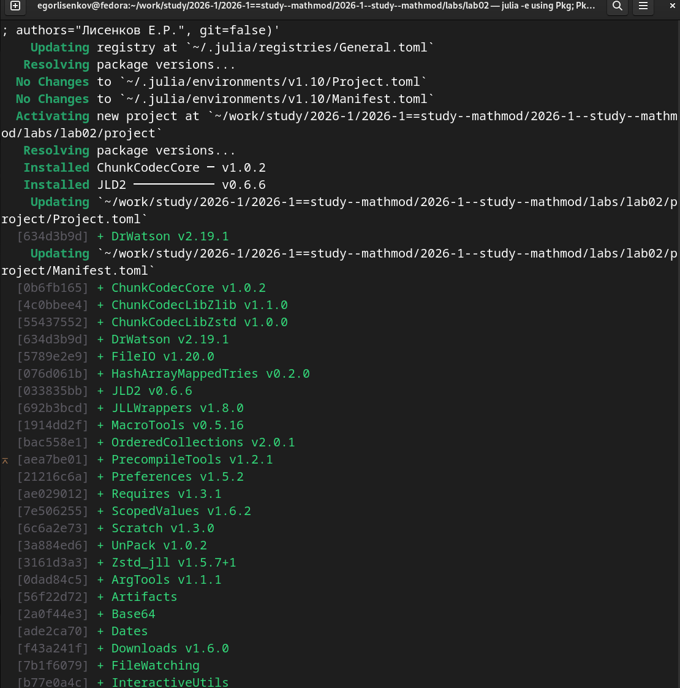
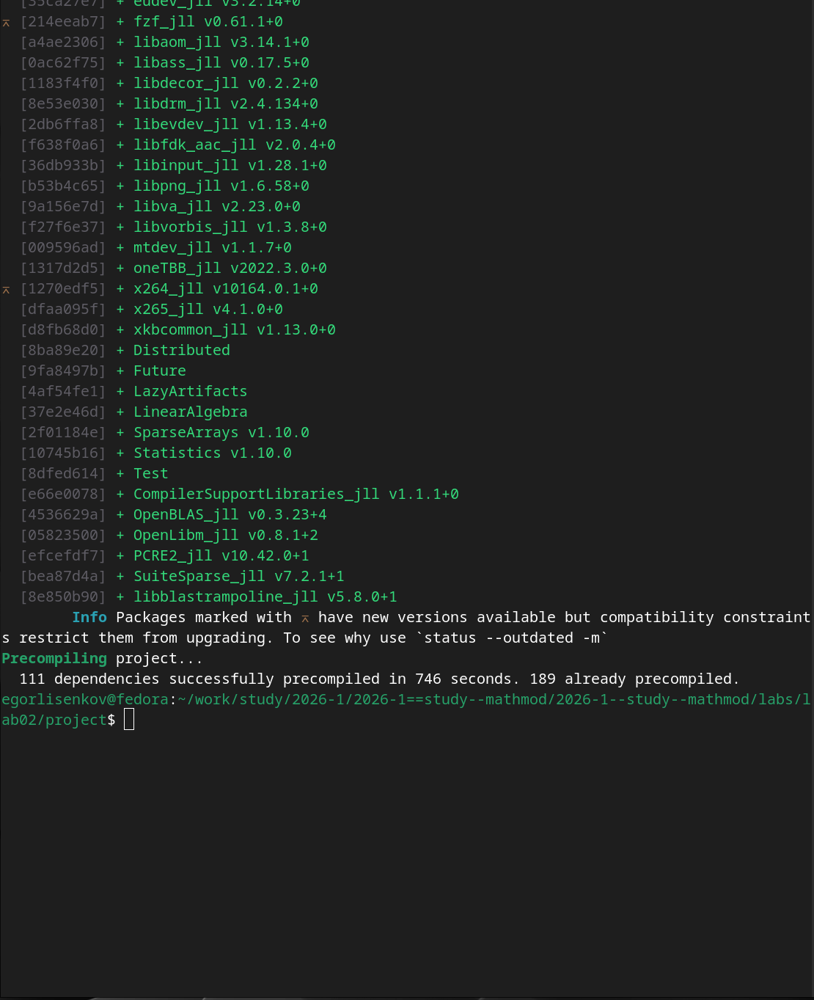
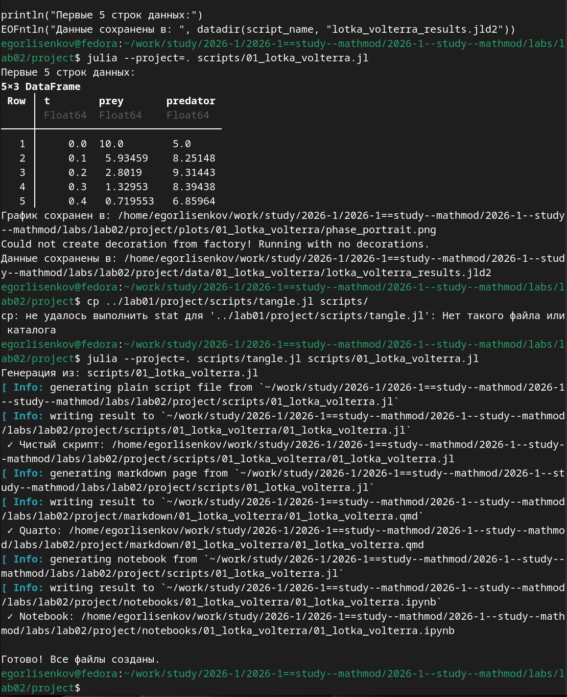
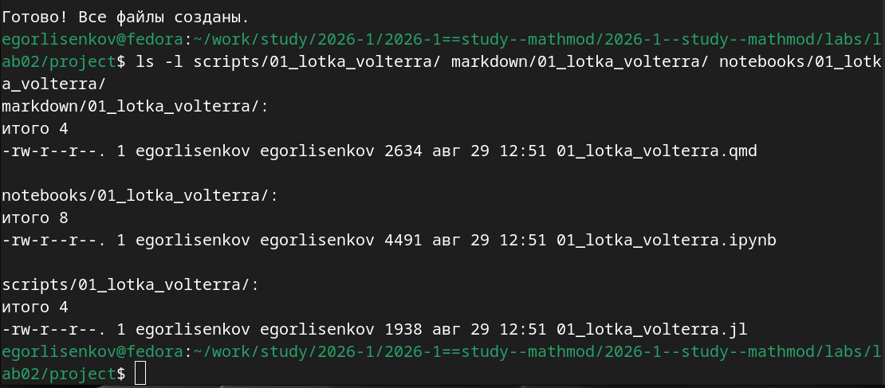
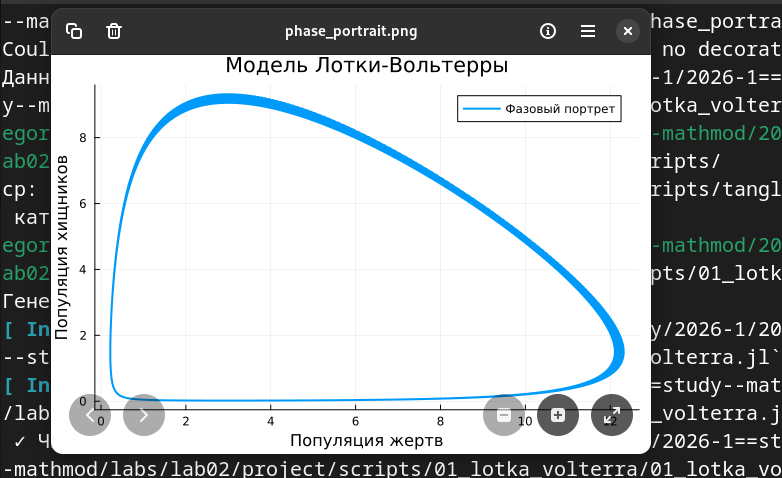

---
## Front matter
lang: ru-RU
title: Лабораторная работа №2
subtitle: Имитационное Моделирование
author:
  - Лисенков Е.Р.
institute:
  - Российский университет дружбы народов, Москва, Россия

## i18n babel
babel-lang: russian
babel-otherlangs: english

## Formatting pdf
toc: false
toc-title: Содержание
slide_level: 2
aspectratio: 169
section-titles: true
theme: metropolis
header-includes:
 - \metroset{progressbar=frametitle,sectionpage=progressbar,numbering=fraction}
 - '\makeatletter'
 - '\beamer@ignorenonframefalse'
 - '\makeatother'
---

# Информация

## Докладчик

:::::::::::::: {.columns align=center}
::: {.column width="70%"}

  * Лисенков Егор Романович
  * студент
  * Российский университет дружбы народов
  * [1132232881@rudn.ru](mailto:1132232881@rudn.ru)
  * <https://github.com/erlisenkov>

:::
::: {.column width="30%"}

ц

:::
::::::::::::::

# Вводная часть

## Актуальность
Моделирование эпидемиологических и экологических процессов является ключевым инструментом прогнозирования в современных условиях. Применение методологии воспроизводимых исследований на языке Julia обеспечивает прозрачность, верифицируемость и долгосрочную поддержку научных результатов.

## Объект и предмет исследования
Объект исследования — динамические системы, описываемые обыкновенными дифференциальными уравнениями. Предмет исследования — численные методы решения моделей SIR и Лотки-Вольтерры с применением подхода литературного программирования.

## Цели и задачи
Цель — освоить методологию воспроизводимых научных исследований через реализацию классических математических моделей. Задачи — создать структурированное рабочее пространство, выполнить численное моделирование, сгенерировать производные форматы документации и интегрировать результаты в отчёт.

## Материалы и методы
Исследование выполнено в среде Fedora Linux с использованием языка Julia 1.10, фреймворка DrWatson.jl для управления проектом, пакета DifferentialEquations.jl для численного решения ОДУ, Literate.jl для литературного программирования и Quarto для финальной сборки отчёта.

## Инициализация проекта DrWatson
Выполнена инициализация проекта с помощью DrWatson.jl, система автоматически обновила реестр пакетов, разрешила зависимости и установила фреймворк версии 2.19.1 с сопутствующими пакетами. Все зависимости зафиксированы в Project.toml и Manifest.toml для обеспечения воспроизводимости окружения.
{#fig:001 width=70%}

## Установка пакетов для численного моделирования
Установлены специализированные пакеты DifferentialEquations v8.1.1 для решения ОДУ, Plots для визуализации, DataFrames для работы с табличными данными, JLD2 для сериализации и Literate для литературного программирования. Процесс включал загрузку 53 пакетов с низкоуровневыми библиотеками.
{#fig:002 width=70%}

## Прекомпиляция зависимостей
Выполнена прекомпиляция 111 новых зависимостей за 746 секунд, 189 пакетов загружены из кэша. Прекомпиляция создала исполняемые файлы .ji для каждого пакета, что критически важно для ускорения последующих запусков скриптов в экосистеме Julia.
{#fig:003 width=70%}

## Литературный скрипт модели Лотки-Вольтерры
Создан файл 01_lotka_volterra.jl в стиле литературного программирования с Markdown-комментариями. Скрипт определяет систему дифференциальных уравнений модели хищник-жертва, параметры (α=1.5, β=1.0, δ=1.0, γ=3.0), начальные условия и процедуру сохранения результатов в JLD2.
{#fig:004 width=70%}

## Выполнение модели и анализ результатов
Численное решение системы ОДУ методом Tsit5() показало классическую динамику хищник-жертва. При начальных условиях 10 жертв и 5 хищников к моменту t=0.4 численность жертв снизилась до 0.72, а хищников возросла до 6.86. Построен фазовый портрет с замкнутой траекторией.
{#fig:005 width=70%}

## Структура каталогов с производными форматами
Проверена структура созданных каталогов: в scripts/ находится чистый код .jl (1938 байт), в markdown/ — Quarto-документ .qmd (2634 байта), в notebooks/ — Jupyter Notebook .ipynb (4491 байт). Разделение артефактов соответствует принципам DrWatson.
{#fig:006 width=70%}

## Визуализация фазового портрета
Открыт фазовый портрет phase_portrait.png в графическом просмотрщике. Замкнутая траектория демонстрирует циклические колебания популяций вокруг точки равновесия. Ось X показывает популяцию жертв (0-12), ось Y — хищников (0-9). Форма траектории соответствует классической модели.
{#fig:007 width=70%}

## Генерация производных форматов
Утилита tangle.jl на базе Literate.jl успешно преобразовала литературный скрипт в три формата: чистый скрипт .jl без комментариев, Quarto-документ .qmd для отчёта и Jupyter Notebook .ipynb для интерактивного исследования. Все файлы созданы в соответствующих подкаталогах.
{#fig:008 width=70%}

## Завершение генерации всех артефактов
Финальный скриншот подтверждает успешное завершение процесса генерации. Сообщение "Готово! Все файлы созданы" свидетельствует об отсутствии ошибок. Из единого источника кода автоматически получены все необходимые форматы, что демонстрирует преимущество литературного программирования.
{#fig:009 width=70%}

## Результаты и выводы
Модели подтвердили теоретические предсказания: для модели Лотки-Вольтерры получены замкнутые фазовые траектории, для модели SIR — характерная S-образная кривая выздоровевших. Применённая методология обеспечила полную воспроизводимость результатов.

