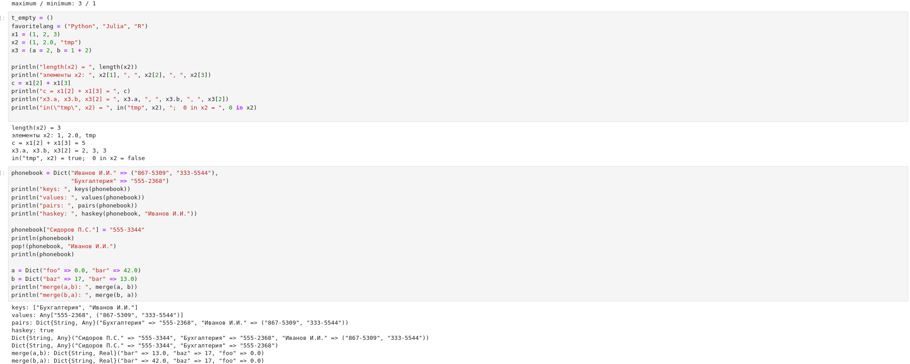
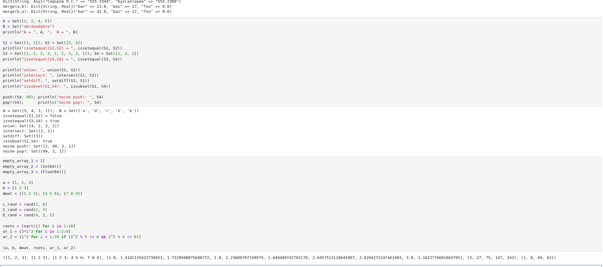
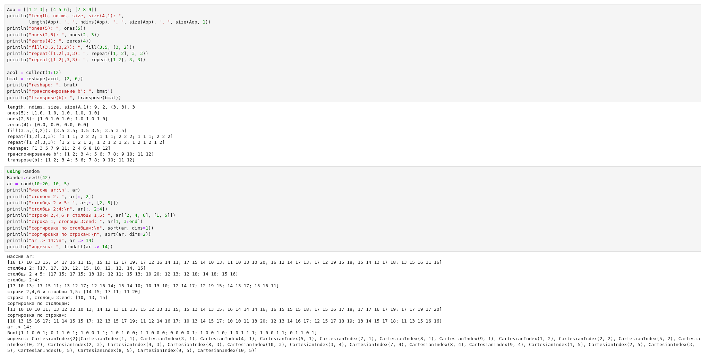
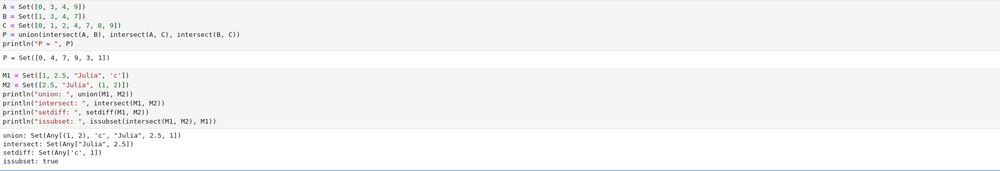
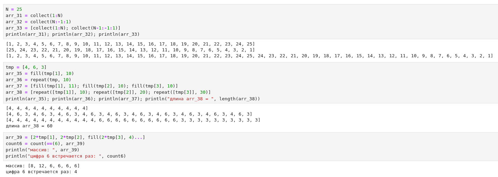
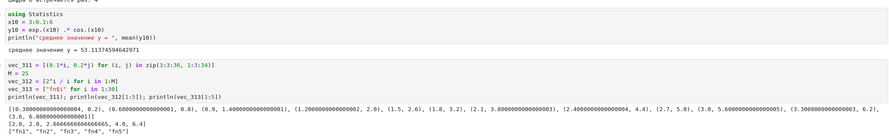
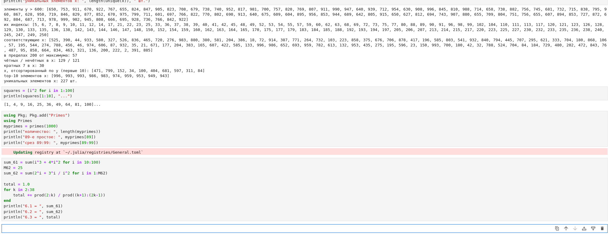
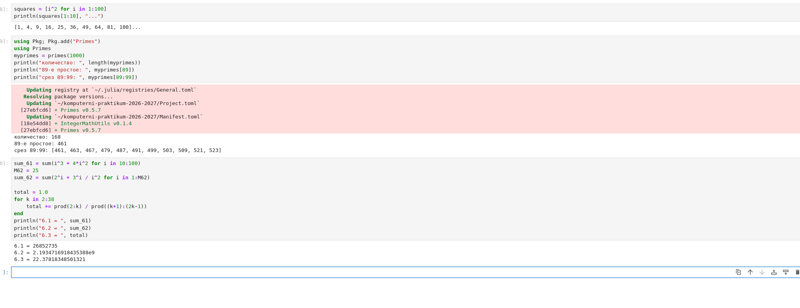

---
## Front matter
lang: ru-RU
title: Лабораторная работа №2
subtitle: Компьютерный практикум по статистическому анализу данных
author:
  - Лисенков Е.Р.
institute:
  - Российский университет дружбы народов, Москва, Россия

## i18n babel
babel-lang: russian
babel-otherlangs: english

## Formatting pdf
toc: false
toc-title: Содержание
slide_level: 2
aspectratio: 169
section-titles: true
theme: metropolis
header-includes:
 - \metroset{progressbar=frametitle,sectionpage=progressbar,numbering=fraction}
 - '\makeatletter'
 - '\beamer@ignorenonframefalse'
 - '\makeatother'
---

# Информация

## Докладчик

:::::::::::::: {.columns align=center}
::: {.column width="70%"}

  * Лисенков Егор Романович
  * студент НФИбд-02-23
  * Российский университет дружбы народов
  * [1132232881@rudn.ru](mailto:1132232881@rudn.ru)
  * <https://github.com/erlisenkov>

:::
::: {.column width="30%"}

ц

:::
::::::::::::::

# Вводная часть

# Вводная часть

## Актуальность
Структуры данных являются основой эффективного программирования на языке Julia, и их освоение необходимо для решения задач статистического анализа данных.

## Объект и предмет исследования
Объектом выступают структуры данных языка Julia, а предметом — операции создания, индексации, преобразования и комбинирования этих структур.

## Цели и задачи
Целью работы является изучение кортежей, словарей, множеств и массивов, а задачами — воспроизведение примеров методических указаний и выполнение заданий самостоятельной работы в среде Jupyter Lab.

## Материалы и методы
Работа выполнена в операционной системе Fedora с использованием языка Julia версии 1.10.3, интерактивной среды Jupyter Lab и системы контроля версий Git.

## Запуск Jupyter Lab
Запуск сервера Jupyter Lab из каталога лабораторной работы открыл интерактивную среду для выполнения вычислений на языке Julia.
{#fig:001 width=100%}

## Блокнот и общие функции коллекций
В созданном блокноте продемонстрирована разница режимов Code и Markdown и проверены общие функции коллекций isempty, length, in, unique, reduce, maximum и minimum.
{#fig:002 width=100%}

## Кортежи и словари
На примерах кортежей и словарей показаны доступ к элементам по индексу и по ключу, добавление и удаление пар, а также слияние словарей с разрешением конфликта ключей.
{#fig:003 width=100%}

## Множества и создание массивов
Операции над множествами и создание массивов различной размерности подтвердили семантику математических множеств и гибкость конструкторов массивов.
{#fig:004 width=100%}

## Операции над массивами
Для массивов вычислены размерные характеристики, выполнены преобразование формы, транспонирование, срезы и сортировка элементов.
{#fig:005 width=100%}

## Операции над множествами в самостоятельной работе
В самостоятельной работе найдено итоговое множество как объединение попарных пересечений и продемонстрированы операции над множествами элементов разных типов.
{#fig:006 width=100%}

## Массивы заданной структуры
Массивы заданной структуры построены с помощью функций collect, fill и repeat, а в полученном векторе подсчитано число вхождений шестёрки.
{#fig:007 width=100%}

## Векторы-генераторы и статистика
Сгенерированы векторы пар, степенных отношений и строковых имён, а также вычислено среднее значение заданной экспоненциально-тригонометрической зависимости на сетке от трёх до шести.
{#fig:008 width=100%}

## Анализ случайных выборок
Выполнен статистический анализ случайных выборок длины 250 с преобразованиями векторов, отбором элементов по условию и сортировкой по связанному вектору.
{#fig:009 width=100%}

## Квадраты целых чисел и пакет Primes
Создан массив квадратов целых чисел от 1 до 100 и подключён пакет Primes для генерации простых чисел.
{#fig:010 width=100%}

## Итоговые результаты заданий 4-6
Получены итоговые результаты: 168 простых чисел, 89-е наименьшее простое число 461, срез массива с 89-го по 99-й элемент и вычисленные значения трёх сумм.
{#fig:011 width=100%}

## Вывод
В ходе лабораторной работы изучены основные структуры данных языка Julia: кортежи, словари, множества и массивы. Освоены операции создания, индексации, преобразования и комбинирования структур данных, продемонстрирована эффективность генераторов массивов и векторизованных операций для решения прикладных задач. Все задания методических указаний выполнены в полном объёме, а результаты зафиксированы в системе контроля версий Git.
