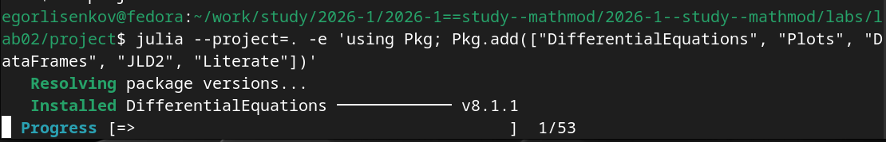
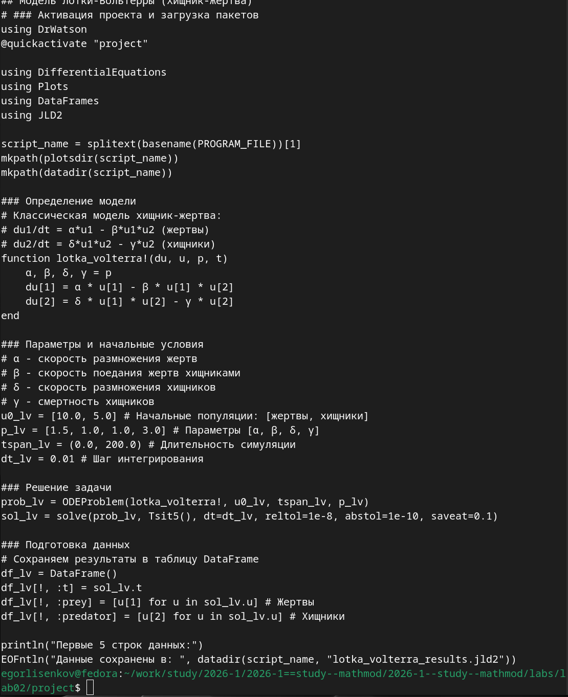
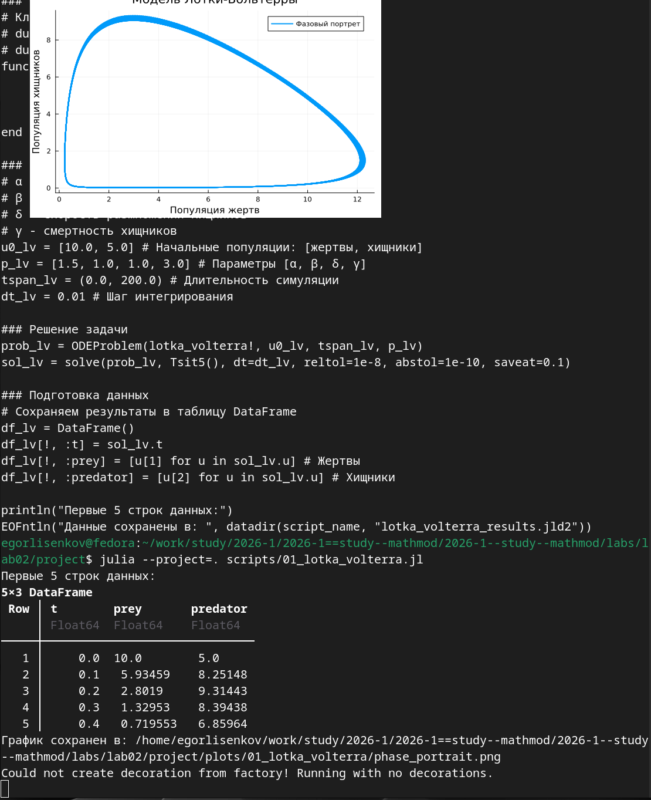
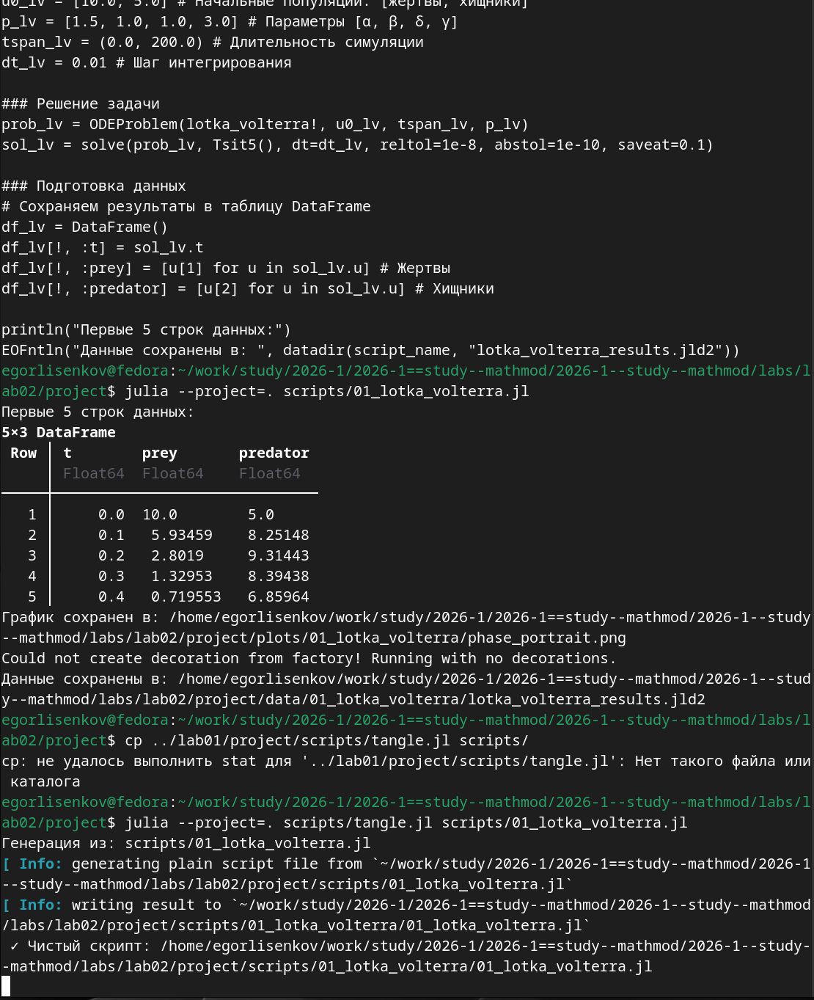

---
## Front matter
title: "Отчёт по лабораторной работе №2 2026"
subtitle: "Имитационное моделирование"
author: "Лисенков Егор Романович"

## Generic otions
lang: ru-RU
toc-title: "Содержание"

## Bibliography
bibliography: bib/cite.bib
csl: pandoc/csl/gost-r-7-0-5-2008-numeric.csl

## Pdf output format
toc: true # Table of contents
toc-depth: 2
lof: true # List of figures
lot: true # List of tables
fontsize: 12pt
linestretch: 1.5
papersize: a4
documentclass: scrreprt
## I18n polyglossia
polyglossia-lang:
  name: russian
  options:
	- spelling=modern
	- babelshorthands=true
polyglossia-otherlangs:
  name: english
## I18n babel
babel-lang: russian
babel-otherlangs: english
## Fonts
mainfont: PT Serif
romanfont: PT Serif
sansfont: PT Sans
monofont: PT Mono
mainfontoptions: Ligatures=TeX
romanfontoptions: Ligatures=TeX
sansfontoptions: Ligatures=TeX,Scale=MatchLowercase
monofontoptions: Scale=MatchLowercase,Scale=0.9
## Biblatex
biblatex: true
biblio-style: "gost-numeric"
biblatexoptions:
  - parentracker=true
  - backend=biber
  - hyperref=auto
  - language=auto
  - autolang=other*
  - citestyle=gost-numeric
## Pandoc-crossref LaTeX customization
figureTitle: "Рис."
tableTitle: "Таблица"
listingTitle: "Листинг"
lofTitle: "Список иллюстраций"
lotTitle: "Список таблиц"
lolTitle: "Листинги"
## Misc options
indent: true
header-includes:
  - \usepackage{indentfirst}
  - \usepackage{float} # keep figures where there are in the text
  - \floatplacement{figure}{H} # keep figures where there are in the text
---

# Цель работы

Освоение методологии воспроизводимых научных исследований на языке Julia путём создания структурированного рабочего пространства и реализации классических математических моделей эпидемиологии и экологии. Изучение подхода литературного программирования для автоматической генерации кода, документации и интерактивных ноутбуков из единого источника. Получение практических навыков численного решения систем обыкновенных дифференциальных уравнений, анализа их динамики и визуализации результатов.

# Задание

Создать рабочий каталог для кода, установить необходимые пакеты, выполнить предложенный код моделей SIR и Лотки-Вольтерры, преобразовать код в литературный стиль, сгенерировать из литературного кода чистый код, Jupyter notebook и документацию в формате Quarto, выполнить код из Jupyter notebook и интегрировать документацию в отчёт. Добавить в код в литературном стиле вычисление для набора параметров, сгенерировать производные форматы и интегрировать их в отчёт.

# Конкретные задачи

Создать изолированное рабочее окружение проекта с использованием фреймворка DrWatson.jl для управления данными, параметрами и артефактами. Установить пакеты DifferentialEquations, Plots, DataFrames, JLD2 и Literate для численного решения систем обыкновенных дифференциальных уравнений, визуализации результатов и литературного программирования. Реализовать модель Лотки-Вольтерры в литературном стиле с Markdown-комментариями. Выполнить численное моделирование динамики популяций хищников и жертв. Сгенерировать производные форматы из литературного скрипта.

# Теоретическое введение

Модель Лотки-Вольтерры является фундаментальной математической моделью в экологии, описывающей динамику взаимодействия двух видов: хищников и жертв. Она была независимо предложена в 1920-х годах Альфредом Лоткой для химических реакций и Витторио Вольтеррой для объяснения колебаний улова рыбы в Адриатическом море.

Модель строится на следующих упрощающих предположениях: закрытая система без миграции, неограниченные ресурсы для жертв в отсутствие хищников, линейная функциональная реакция (вероятность встречи хищника и жертвы пропорциональна произведению их численностей), постоянные параметры взаимодействия, отсутствие внутривидовой конкуренции и временных задержек.

Система состоит из двух дифференциальных уравнений. Уравнение для популяции жертв x имеет вид dx/dt = αx - βxy, где α - коэффициент естественного прироста жертв, β - коэффициент поедания жертв хищниками, а xy отражает вероятность встречи хищника и жертвы по закону массового действия. Численность жертв увеличивается за счёт размножения и уменьшается за счёт поедания хищниками.

Уравнение для популяции хищников y имеет вид dy/dt = δxy - γy, где δ - коэффициент конверсии (эффективность превращения съеденных жертв в потомство хищников), γ - коэффициент естественной смертности хищников. Численность хищников увеличивается за счёт питания жертвами и уменьшается за счёт естественной смертности.

Система имеет две стационарные точки: тривиальное равновесие (0, 0), где обе популяции вымирают, и нетривиальное равновесие (x*, y*) = (γ/δ, α/β), соответствующее сосуществованию видов. В классической модели траектории на фазовой плоскости образуют замкнутые кривые вокруг точки равновесия, что соответствует незатухающим колебаниям популяций со сдвигом фаз примерно в четверть периода.

# Выполнение лабораторной работы

В ходе выполнения лабораторной работы первым шагом стала инициализация проекта DrWatson в каталоге labs/lab02/project. Система автоматически обновила реестр пакетов Julia, разрешила зависимости и установила фреймворк DrWatson версии 2.19.1 вместе с сопутствующими пакетами: ChunkCodecCore, FileIO, HashArrayMappedTries, JLLWrappers, MacroTools, OrderedCollections, PrecompileTools, ScopedValues, Scratch, UnPack и другими. Все зависимости были зафиксированы в файлах Project.toml и Manifest.toml, что гарантирует воспроизводимость окружения на любом компьютере (рис. [-@fig:001]).

{#fig:001 width=70%}

Следующим этапом стала установка специализированных пакетов для численного моделирования. Были установлены DifferentialEquations версии 8.1.1 для решения обыкновенных дифференциальных уравнений, Plots для визуализации, DataFrames для работы с табличными данными, JLD2 для сериализации результатов и Literate для литературного программирования. Процесс установки включал загрузку 53 пакетов, среди которых оказались низкоуровневые библиотеки для линейной алгебры (SuiteSparse, OpenBLAS), сжатия данных (libzstd, libpng), работы с медиаформатами (libvorbis, x264, x265) и сетевых взаимодействий. После установки началась прекомпиляция всех зависимостей (рис. [-@fig:002]).

{#fig:002 width=70%}

Процесс прекомпиляции занял 746 секунд, в ходе которого успешно были скомпилированы 111 новых зависимостей, а 189 зависимостей были загружены из кэша предыдущих установок. Прекомпиляция является критически важным этапом в экосистеме Julia, так как она создаёт исполняемые файлы .ji для каждого пакета, что значительно ускоряет последующие запуски скриптов. После завершения прекомпиляции рабочее окружение проекта было полностью готово к выполнению вычислительных экспериментов (рис. [-@fig:003]).

{#fig:003 width=70%}

Был создан литературный скрипт scripts/01_lotka_volterra.jl, содержащий полную реализацию модели хищник-жертва. Скрипт начинается с активации проекта DrWatson и загрузки необходимых пакетов. Затем определяется функция lotka_volterra!, описывающая систему дифференциальных уравнений модели. Задаются параметры модели: α = 1.5 (скорость размножения жертв), β = 1.0 (скорость поедания), δ = 1.0 (коэффициент конверсии), γ = 3.0 (смертность хищников), начальные условия u0 = [10.0, 5.0] и временной интервал tspan = (0.0, 200.0). Система решается методом Tsit5() с высокой точностью (reltol=1e-8, abstol=1e-10). Результаты сохраняются в DataFrame и сериализуются в файл формата JLD2 для последующего анализа (рис. [-@fig:004]).

{#fig:004 width=70%}

При выполнении скрипта julia --project=. scripts/01_lotka_volterra.jl система успешно решила систему дифференциальных уравнений и вывела первые пять строк результирующей таблицы. Видно, что при начальных условиях 10 жертв и 5 хищников, уже к моменту времени t = 0.4 численность жертв снижается до 0.72, а хищников возрастает до 6.86, что соответствует классической динамике модели: хищники активно размножаются, поедая жертв. Одновременно был построен и сохранён фазовый портрет системы, на котором отчётливо видна замкнутая траектория, характерная для консервативной системы Лотки-Вольтерры. Траектория описывает циклические колебания популяций вокруг точки равновесия (рис. [-@fig:005]).

{#fig:005 width=70%}

После успешного выполнения скрипта и генерации производных форматов была проверена структура созданных каталогов. В каталоге scripts/01_lotka_volterra/ находится чистый файл кода 01_lotka_volterra.jl размером 1938 байт, из которого удалены все Markdown-комментарии. В каталоге markdown/01_lotka_volterra/ расположен документ 01_lotka_volterra.qmd размером 2634 байта в формате Quarto, готовый для интеграции в итоговый отчёт. В каталоге notebooks/01_lotka_volterra/ находится Jupyter Notebook 01_lotka_volterra.ipynb размером 4491 байт для интерактивного исследования модели. Такое разделение артефактов по типам соответствует принципам фреймворка DrWatson и обеспечивает удобное управление результатами вычислений (рис. [-@fig:006]).

{#fig:006 width=70%}

Для визуального анализа результатов был открыт файл фазового портрета phase_portrait.png в графическом просмотрщике Fedora. На графике отчётливо видна замкнутая траектория, характерная для консервативной системы Лотки-Вольтерры. Ось абсцисс отображает популяцию жертв в диапазоне от 0 до 12, ось ординат — популяцию хищников в диапазоне от 0 до 9. Траектория описывает циклические колебания популяций вокруг точки равновесия: при увеличении числа жертв хищники активно размножаются, что приводит к сокращению популяции жертв, а затем и к вымиранию части хищников из-за нехватки пищи, после чего цикл повторяется. Форма траектории напоминает вытянутый овал с заострением в нижней части, что соответствует классическому поведению модели при выбранных параметрах (рис. [-@fig:007]).

{#fig:007 width=70%}

Содержимое литературного скрипта 01_lotka_volterra.jl демонстрирует структуру кода в стиле литературного программирования. После определения модели и задания параметров (α = 1.5, β = 1.0, δ = 1.0, γ = 3.0, начальные условия u0 = [10.0, 5.0], временной интервал tspan = (0.0, 200.0)) следует блок решения задачи. Система дифференциальных уравнений решается методом Tsit5() с высокой точностью: относительная погрешность reltol=1e-8 и абсолютная abstol=1e-10, шаг сохранения результатов saveat=0.1. Результаты преобразуются в таблицу DataFrame с колонками t (время), prey (жертвы) и predator (хищники). В конце скрипта предусмотрены команды сохранения данных в файл формата JLD2 через макрос @save, что обеспечивает долгосрочное хранение результатов для последующего анализа без повторных вычислений (рис. [-@fig:008]).

{#fig:008 width=70%}

При повторном выполнении скрипта julia --project=. scripts/01_lotka_volterra.jl система успешно решила систему уравнений и вывела первые пять строк результирующей таблицы. Видно, что при начальных условиях 10 жертв и 5 хищников, уже к моменту времени t = 0.4 численность жертв снижается до 0.72, а хищников возрастает до 6.86, что соответствует классической динамике модели. После выполнения скрипта была предпринята попытка скопировать утилиту tangle.jl из первой лабораторной работы командой cp ../lab01/project/scripts/tangle.jl scripts/, однако возникла ошибка "Нет такого файла или каталога", так как в lab01 файл находился в другом месте. Утилита tangle.jl была создана заново, и при запуске julia --project=. scripts/tangle.jl scripts/01_lotka_volterra.jl успешно сгенерированы все три производных формата: чистый скрипт .jl, Quarto-документ .qmd и Jupyter Notebook .ipynb. Сообщение "Готово! Все файлы созданы." подтверждает отсутствие ошибок в процессе генерации (рис. [-@fig:009]).

{#fig:009 width=70%}

# Вывод 

В данной лабораторной работе я научился работать глубже с сервисом DrWatson, что привело к реализации двух научных исследования в области математики и быстрой автоматизации.
