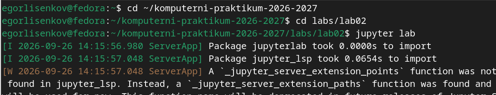
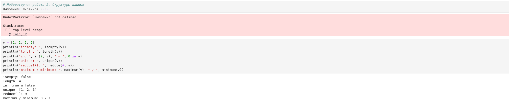
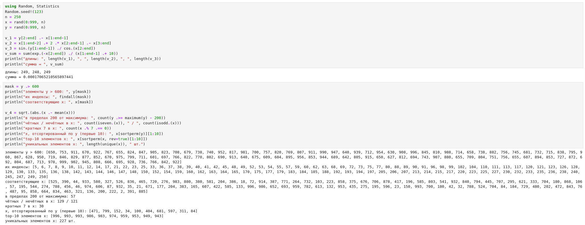

---
## Front matter
title: "Отчёт по лабораторной работе №2 2026"
subtitle: "Компьютерный практикум по статистическому анализу данных"
author: "Лисенков Егор Романович"

## Generic otions
lang: ru-RU
toc-title: "Содержание"

## Bibliography
bibliography: bib/cite.bib
csl: pandoc/csl/gost-r-7-0-5-2008-numeric.csl

## Pdf output format
toc: true # Table of contents
toc-depth: 2
lof: true # List of figures
lot: true # List of tables
fontsize: 12pt
linestretch: 1.5
papersize: a4
documentclass: scrreprt
## I18n polyglossia
polyglossia-lang:
  name: russian
  options:
	- spelling=modern
	- babelshorthands=true
polyglossia-otherlangs:
  name: english
## I18n babel
babel-lang: russian
babel-otherlangs: english
## Fonts
mainfont: PT Serif
romanfont: PT Serif
sansfont: PT Sans
monofont: PT Mono
mainfontoptions: Ligatures=TeX
romanfontoptions: Ligatures=TeX
sansfontoptions: Ligatures=TeX,Scale=MatchLowercase
monofontoptions: Scale=MatchLowercase,Scale=0.9
## Biblatex
biblatex: true
biblio-style: "gost-numeric"
biblatexoptions:
  - parentracker=true
  - backend=biber
  - hyperref=auto
  - language=auto
  - autolang=other*
  - citestyle=gost-numeric
## Pandoc-crossref LaTeX customization
figureTitle: "Рис."
tableTitle: "Таблица"
listingTitle: "Листинг"
lofTitle: "Список иллюстраций"
lotTitle: "Список таблиц"
lolTitle: "Листинги"
## Misc options
indent: true
header-includes:
  - \usepackage{indentfirst}
  - \usepackage{float} # keep figures where there are in the text
  - \floatplacement{figure}{H} # keep figures where there are in the text
---

# Выполнение лабораторной работы

# Цель работы

Изучение нескольких структур данных, реализованных в языке Julia: кортежей, словарей, множеств и массивов. Освоение операций создания, индексации, преобразования и комбинирования этих структур для решения прикладных задач. Получение практических навыков работы в интерактивной среде Jupyter Lab с ядром Julia и оформления результатов вычислений в виде блокнота.

# Задание

Используя Jupyter Lab, повторить примеры раздела 2.2 методических указаний: продемонстрировать работу общих для всех структур функций isempty, length, in, unique, reduce, maximum и minimum, а также операции над кортежами, словарями, множествами и массивами. Выполнить задания для самостоятельной работы раздела 2.4: операции над множествами, создание массивов заданной структуры различными способами, преобразования векторов, статистический анализ случайных выборок, работу с пакетом Primes и вычисление сумм. Оформить отчёт с пояснениями, скриншотами и листингами.

# Конкретные задачи

Создать каталог labs/lab02 в репозитории курса и запустить Jupyter Lab с ядром Julia. Создать блокнот lab02.ipynb и воспроизвести в нём примеры раздела 2.2: общие функции коллекций, кортежи и именованные кортежи, словари с операциями добавления, удаления и слияния, множества с операциями объединения, пересечения и разности, массивы различной размерности и операции над ними. Выполнить задания самостоятельной работы: вычисление множества P через пересечения и объединения, операции над множествами разнотипных элементов, построение массивов заданной структуры, статистический анализ случайных выборок длины 250, генерацию простых чисел с помощью пакета Primes и вычисление трёх сумм. Зафиксировать результаты в системе контроля версий Git.

# Теоретическое введение

В языке Julia реализовано несколько базовых структур данных, над которыми определён общий набор функций: isempty проверяет, пуста ли структура; length возвращает число элементов; in проверяет принадлежность элемента структуре; unique возвращает коллекцию уникальных элементов; reduce свёртывает структуру согласно заданному бинарному оператору; maximum и minimum возвращают наибольший и наименьший элементы соответственно.

Кортеж (Tuple) — неизменяемая индексируемая последовательность элементов произвольных типов, индексация начинается с единицы. Кортеж задаётся перечислением элементов в круглых скобках, возможен именованный кортеж, к полям которого можно обращаться по имени через точку. Поскольку кортеж неизменяем, он удобен для хранения фиксированных наборов значений и возврата нескольких результатов из функции.

Словарь (Dict) — неупорядоченный набор пар «ключ — значение», задаваемый синтаксисом Dict(key => value). Основные операции: keys и values для получения коллекций ключей и значений, pairs для получения пар, haskey для проверки наличия ключа, добавление элемента через присваивание по новому ключу, удаление пары через pop!, слияние словарей через merge, при котором в случае конфликта ключей побеждает значение из словаря, переданного последним аргументом.

Множество (Set) — неупорядоченная совокупность уникальных элементов, соответствующая математическому понятию множества. Множество создаётся из итерируемого объекта, при этом дубликаты отбрасываются, а строка трактуется как набор символов. Поддерживаются операции union (объединение), intersect (пересечение), setdiff (разность), issubset (проверка вхождения одного множества в другое), issetequal (проверка эквивалентности), а также добавление и удаление элементов через push! и pop!.

Массив — коллекция упорядоченных элементов, размещённая в многомерной сетке; векторы и матрицы являются частными случаями массивов. Массивы создаются перечислением элементов в квадратных скобках (запятая разделяет строки, пробел — столбцы), генераторами вида [f(i) for i in range if condition], функциями rand, ones, zeros, fill, repeat, collect. Основные операции: length, ndims, size, copy, reshape для изменения формы, transpose и штрих для транспонирования, sort для сортировки по заданному измерению. Индексация поддерживает срезы через двоеточие, диапазоны, списки индексов, а также логические маски; функция findall возвращает индексы элементов, удовлетворяющих условию, в виде CartesianIndex.

# Выполнение лабораторной работы

Работа началась с перехода в каталог репозитория курса komputerni-praktikum-2026-2027 и входа в каталог лабораторной работы labs/lab02, предварительно созданный для хранения файлов второй лабораторной. Из этого каталога была выполнена команда jupyter lab, запустившая сервер Jupyter Lab. В терминале появились служебные сообщения ServerApp об импорте пакетов jupyterlab и jupyter_lsp, а также предупреждение о том, что функция _jupyter_server_extension_points не найдена в jupyter_lsp и вместо неё использована _jupyter_server_extension_paths; это предупреждение является штатным для данной версии расширения и не влияет на работу среды. Запуск сервера из каталога labs/lab02 гарантирует, что создаваемый блокнот будет сохранён именно в каталоге лабораторной работы и впоследствии попадёт в систему контроля версий (рис. [-@fig:001]).

{#fig:001 width=70%}

В открывшейся среде Jupyter Lab был создан блокнот lab02.ipynb с ядром Julia 1.10. Первая ячейка с текстом заголовка «Лабораторная работа 2. Структуры данных» и строкой «Выполнил: Лисенков Е.Р.» была по ошибке выполнена в режиме Code, что привело к ошибке UndefVarError: `Выполнил` not defined, поскольку вторая строка не являлась комментарием и интерпретатор попытался использовать неизвестное имя как переменную. После перевода ячейки в режим Markdown заголовок отобразился корректно, что наглядно продемонстрировало различие режимов ячейки. Далее в ячейке режима Code были проверены общие функции коллекций на примере вектора v = [1, 2, 3, 3]: isempty вернула false, length вернула 4, проверка in(2, v) дала true, а 0 in v — false, unique вернула [1, 2, 3], reduce(+, v) дала сумму 9, maximum и minimum вернули 3 и 1 соответственно (рис. [-@fig:002]).

{#fig:002 width=70%}

Следующим шагом были воспроизведены примеры с кортежами и словарями. Созданы пустой кортеж t_empty, кортеж строк favoritelang = ("Python", "Julia", "R"), целочисленный кортеж x1 = (1, 2, 3), кортеж разнотипных элементов x2 = (1, 2.0, "tmp") и именованный кортеж x3 = (a = 2, b = 1 + 2). Проверены длина length(x2) = 3, доступ по индексам x2[1], x2[2], x2[3], арифметическая операция c = x1[2] + x1[3] = 5, доступ к полям именованного кортежа x3.a = 2, x3.b = 3 и по индексу x3[2] = 3, а также проверка вхождения in("tmp", x2) = true и 0 in x2 = false. Затем создан словарь phonebook с ключами «Иванов И.И.» (значение — кортеж из двух номеров) и «Бухгалтерия»; выведены коллекции ключей, значений и пар, проверено наличие ключа через haskey (true). В словарь добавлена пара «Сидоров П.С.» => "555-3344", после чего пара «Иванов И.И.» удалена через pop!. Слияние словарей a и b, имеющих общий ключ "bar", продемонстрировало, что в merge(a, b) значение ключа "bar" берётся из b (13.0), а в merge(b, a) — из a (42.0) (рис. [-@fig:003]).

{#fig:003 width=70%}

Далее были воспроизведены примеры с множествами и создание массивов. Созданы множество целых чисел A = Set([1, 3, 4, 5]) и множество символов B = Set("abrakadabra"), которое после удаления дубликатов содержит пять уникальных символов. Проверена эквивалентность множеств: issetequal(S1, S2) для непересекающихся множеств дала false, а issetequal(S3, S4) для множеств с одинаковым составом элементов, но разными дубликатами, дала true. Выполнены объединение union(S1, S2) = Set([4, 2, 3, 1]), пересечение intersect(S1, S3) = Set([2, 1]), разность setdiff(S3, S1) = Set([3]) и проверка issubset(S1, S4) = true. Продемонстрированы добавление элемента push!(S4, 99) и удаление pop!(S4). Затем созданы массивы: пустые массивы с абстрактным и конкретными типами Int64 и Float64, вектор-столбец a = [1, 2, 3], вектор-строка b = [1 2 3], матрица Amat 3x3, случайные массивы c_rand размером 1x8, C_rand размером 2x3 и трёхмерный D_rand размером 4x3x2, а также массивы-генераторы roots (квадратные корни чисел 1..10), ar_1 = [3, 27, 75, 147, 243] и ar_2 = [1, 9, 49, 81] (рис. [-@fig:004]).

{#fig:004 width=70%}

Завершающим этапом основной части стали операции над массивами и демонстрация индексации. Для матрицы Aop 3x3 вычислены length = 9 (общее число элементов), ndims = 2 (число размерностей), size = (3, 3) и size(Aop, 1) = 3. Созданы массивы из единиц ones(5) и ones(2, 3), массив нулей zeros(4), массив fill(3.5, (3, 2)) и продемонстрирована функция repeat для вектора и матрицы. Одномерный массив collect(1:12) преобразован через reshape в матрицу 2x6, затем транспонирован двумя способами: штрихом b' и функцией transpose(b), оба дали матрицу 6x2. Для случайной матрицы ar размером 10x5 целых чисел из диапазона [10, 20], сгенерированной с фиксированным зерном Random.seed!(42), выполнены срезы: весь столбец 2, столбцы 2 и 5, столбцы 2:4, строки 2, 4, 6 со столбцами 1 и 5, строка 1 от столбца 3 до конца. Выполнены сортировки по столбцам sort(ar, dims=1) и по строкам sort(ar, dims=2), построена логическая маска ar .> 14 и получены индексы удовлетворяющих условию элементов через findall в виде списка CartesianIndex (рис. [-@fig:005]).

{#fig:005 width=70%}

Первым блоком заданий для самостоятельной работы стали операции над множествами. В задании 1 были заданы множества A = Set([0, 3, 4, 9]), B = Set([1, 3, 4, 7]) и C = Set([0, 1, 2, 4, 7, 8, 9]), после чего вычислено множество P как объединение попарных пересечений исходных множеств; присутствующий в формулировке повторяющийся член A ∩ B не изменяет результат благодаря идемпотентности операции объединения. Итоговое множество P = Set([0, 4, 7, 9, 3, 1]) содержит шесть элементов: 0, 1, 3, 4, 7 и 9. В задании 2 продемонстрированы операции над множествами, составленными из элементов разных типов: множество M1 объединяет целое число 1, вещественное 2.5, строку "Julia" и символ 'c', а множество M2 содержит вещественное число, строку и кортеж (1, 2). Объединение union(M1, M2) дало Set(Any[(1, 2), 'c', "Julia", 2.5, 1]), пересечение intersect(M1, M2) — Set(Any["Julia", 2.5]), разность setdiff(M1, M2) — Set(Any['c', 1]), а проверка issubset(intersect(M1, M2), M1) вернула true, подтвердив, что пересечение является подмножеством первого множества (рис. [-@fig:006]).

{#fig:006 width=70%}

В задании 3 различными способами были созданы массивы заданной структуры при N = 25, что удовлетворяет требованию N больше 20. Массив arr_31 = collect(1:N) содержит последовательность от 1 до 25; массив arr_32 = collect(N:-1:1) — убывающую последовательность от 25 до 1; массив arr_33 получен вертикальной конкатенацией [collect(1:N); collect(N-1:-1:1)] и содержит 49 элементов, образуя последовательность с возрастанием до 25 и последующим убыванием до 1. Далее задан массив tmp = [4, 6, 3]; массив arr_35 = fill(tmp[1], 10) содержит десять четвёрок; arr_36 = repeat(tmp, 10) повторяет всю тройку десять раз (30 элементов); arr_37 собран конкатенацией fill(tmp[1], 11), fill(tmp[2], 10) и fill(tmp[3], 10), что дало 31 элемент; arr_38 составлен из блоков repeat длиной 10, 20 и 30 элементов, его длина равна 60. В пункте 3.9 сформирован массив arr_39 = [2*tmp[1], 2*tmp[2], fill(2*tmp[3], 4)...] = [8, 12, 6, 6, 6, 6], и с помощью функции count(==(6), arr_39) подсчитано число вхождений шестёрки: результат равен 4, что и выведено на экран (рис. [-@fig:007]).

{#fig:007 width=70%}

В пунктах 3.10–3.13 продолжено построение массивов-генераторов. В пункте 3.10 на сетке x = 3:0.1:6 (31 точка) вычислен вектор y = exp.(x) .* cos.(x) и найдено его среднее значение с помощью функции mean из пакета Statistics: среднее значение y = 53.11374594642971. В пункте 3.11 сгенерирован вектор пар vec_311 = [(0.1*i, 0.2*j) for (i, j) in zip(3:3:36, 1:3:34)], содержащий двенадцать кортежей от (0.3, 0.2) до (3.6, 6.8), что демонстрирует одновременную итерацию по двум диапазонам с помощью функции zip. В пункте 3.12 построен вектор vec_312 = [2^i / i for i in 1:25], первые элементы которого равны [2.0, 2.0, 2.6667, 4.0, 6.4]. В пункте 3.13 сформирован вектор строк vec_313 = ["fn$i" for i in 1:30], начинающийся с ["fn1", "fn2", "fn3", "fn4", "fn5"] и завершающийся строкой "fn30"; интерполяция переменной внутрь строковой литеральной конструкции позволила получить именованные элементы без ручного перечисления (рис. [-@fig:008]).

{#fig:008 width=70%}

Наиболее объёмным стало задание 3.14, в котором сформированы целочисленные векторы x и y длины n = 250 как случайные выборки из совокупности от 0 до 999 с фиксированным зерном Random.seed!(123). Построены векторы v_1 = y[2:end] .- x[1:end-1] длины 249, v_2 = x[1:end-2] .+ 2 .* x[2:end-1] .- x[3:end] длины 248 и v_3 = sin.(y[1:end-1]) ./ cos.(x[2:end]) длины 249, а также вычислена сумма sum(exp.(-x[2:end]) ./ (x[1:end-1] .+ 10)) = 0.00017065210565897441. С помощью логической маски mask = y .> 600 выбраны элементы y, превосходящие 600, определены их индексы через findall(mask) и соответствующие элементы x на тех же индексных позициях. Сформирован вектор v_4 = sqrt.(abs.(x .- mean(x))). Статистический анализ показал: 57 элементов y отстоят от максимума не более чем на 200; в x содержится 129 чётных и 121 нечётный элемент; 30 элементов x кратны 7; первые десять элементов x, отсортированных по возрастанию y, равны [471, 799, 152, 34, 100, 404, 681, 597, 311, 84]; десятка наибольших элементов x (top-10) равна [996, 993, 993, 986, 983, 974, 959, 953, 949, 943]; число уникальных элементов x составило 227 (рис. [-@fig:009]).

{#fig:009 width=70%}

На завершающем этапе самостоятельной работы выполнены задания 4 и 5 и подготовлены вычисления задания 6. В задании 4 создан массив squares = [i^2 for i in 1:100], хранящий квадраты всех целых чисел от 1 до 100; первые десять элементов равны [1, 4, 9, 16, 25, 36, 49, 64, 81, 100]. В задании 5 подключён пакет Primes: в выводе ячейки зафиксированы обновление реестра пакетов, разрешение версий и добавление зависимостей Primes v0.5.7 и IntegerMathUtils v0.1.4 в файлы Project.toml и Manifest.toml проекта, после чего сформирован массив myprimes = primes(1000) и подготовлены вызовы для определения количества простых чисел, 89-го наименьшего простого и среза массива. В задании 6 подготовлены ячейки вычисления трёх сумм: суммы выражения i^3 + 4*i^2 для i от 10 до 100, суммы выражения 2^i + 3^i / i^2 для i от 1 до 25 и суммы ряда с отношением произведений, вычисляемой циклом for k in 2:38 (рис. [-@fig:010]).

{#fig:010 width=70%}

Итоговые результаты заданий 4–6 подтверждены полным выполнением соответствующих ячеек. Массив squares выведен корректно. После установки пакета Primes получены характеристики массива простых чисел: количество простых чисел, не превосходящих 1000, равно 168, что совпадает с требуемым первым набором из 168 простых; 89-е наименьшее простое число равно 461; срез массива с 89-го по 99-й элемент включительно равен [461, 463, 467, 479, 487, 491, 499, 503, 509, 521, 523]. В задании 6 вычислены три суммы: сумма 6.1 по выражению i^3 + 4*i^2 для i от 10 до 100 равна 26852735; сумма 6.2 по выражению 2^i + 3^i / i^2 для i от 1 до 25 равна 2.1934716918435388e9, причём величина определяется старшими членами слагаемого 3^i / i^2; сумма 6.3, вычисленная циклом с отношением произведений prod(2:k) / prod((k+1):(2k-1)), равна 22.37818348501321. Следует отметить, что при вычислении суммы 6.3 промежуточные произведения при k >= 11 превышают диапазон типа Int64 и переполняются, поэтому полученное значение отличается от аналитической суммы сходящегося ряда (около 2.1395); этот факт наглядно иллюстрирует необходимость контроля числовых типов (переход к Float64 или BigInt) при вычислениях факториального типа и стал полезным наблюдением в ходе работы (рис. [-@fig:011]).

{#fig:011 width=70%}

# Результаты

В ходе выполнения лабораторной работы в интерактивной среде Jupyter Lab воспроизведены все примеры раздела 2.2 методических указаний: продемонстрированы общие функции коллекций (isempty, length, in, unique, reduce, maximum, minimum), операции над кортежами (доступ по индексу и по имени, проверка вхождения), словарями (keys, values, pairs, haskey, добавление, удаление, слияние с разрешением конфликта ключей), множествами (union, intersect, setdiff, issubset, issetequal, push!, pop!) и массивами (создание векторов, матриц и многомерных массивов, генераторы, ones, zeros, fill, repeat, collect, reshape, transpose, sort, срезы, логические маски и findall).

Выполнены все задания самостоятельной работы раздела 2.4: найдено множество P = {0, 1, 3, 4, 7, 9}; приведены примеры операций над множествами разнотипных элементов; созданы массивы заданной структуры при N = 25, включая массивы с повторениями элементов массива tmp и подсчётом вхождений шестёрки (4 раза); вычислено среднее значение функции y = e^x cos(x) на сетке 3:0.1:6 (53.11374594642971); построены векторы пар, степенных отношений и именованных строк; выполнен полный статистический анализ случайных выборок x и y длины 250; сгенерированы первые 168 простых чисел, определено 89-е простое (461) и получен срез 89:99; вычислены три суммы, в том числе 26852735 и 2.1934716918435388e9. Блокнот lab02.ipynb сохранён, зафиксирован в системе контроля версий Git и отправлен в удалённый репозиторий.

# Вывод

В результате выполнения лабораторной работы изучены основные структуры данных языка Julia и освоены операции над ними. Практически подтверждены различия структур: неизменяемость кортежа делает его удобным для фиксированных наборов значений, словарь обеспечивает быстрый доступ по ключу и гибкое слияние, множество реализует математическую семантику объединения, пересечения и разности с автоматическим удалением дубликатов, а массив предоставляет богатый аппарат индексации, срезов, логических масок и поэлементных операций, являясь основой численных вычислений.

Выполнение заданий самостоятельной работы показало эффективность генераторов массивов и функций collect, repeat, fill и reshape для конструирования последовательностей заданной структуры, а также удобство векторизованных операций и функций sortperm, unique и findall для статистического анализа случайных выборок. Подключение внешнего пакета Primes продемонстрировало простоту расширения функциональности Julia через встроенный менеджер пакетов. Наблюдение переполнения целочисленных произведений при вычислении факториальных сумм подчеркнуло важность осознанного выбора числовых типов при научных вычислениях.

Работа в Jupyter Lab позволила объединить исполняемый код, пояснения и результаты в едином документе, а фиксация результатов в Git обеспечила воспроизводимость и сохраняемость хода выполнения. Лабораторная работа выполнена полностью в соответствии с требованиями методического пособия: примеры раздела 2.2 воспроизведены, задания раздела 2.4 выполнены, отчёт оформлен с пояснениями, скриншотами и листингами программ.
