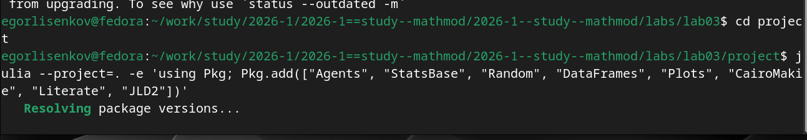
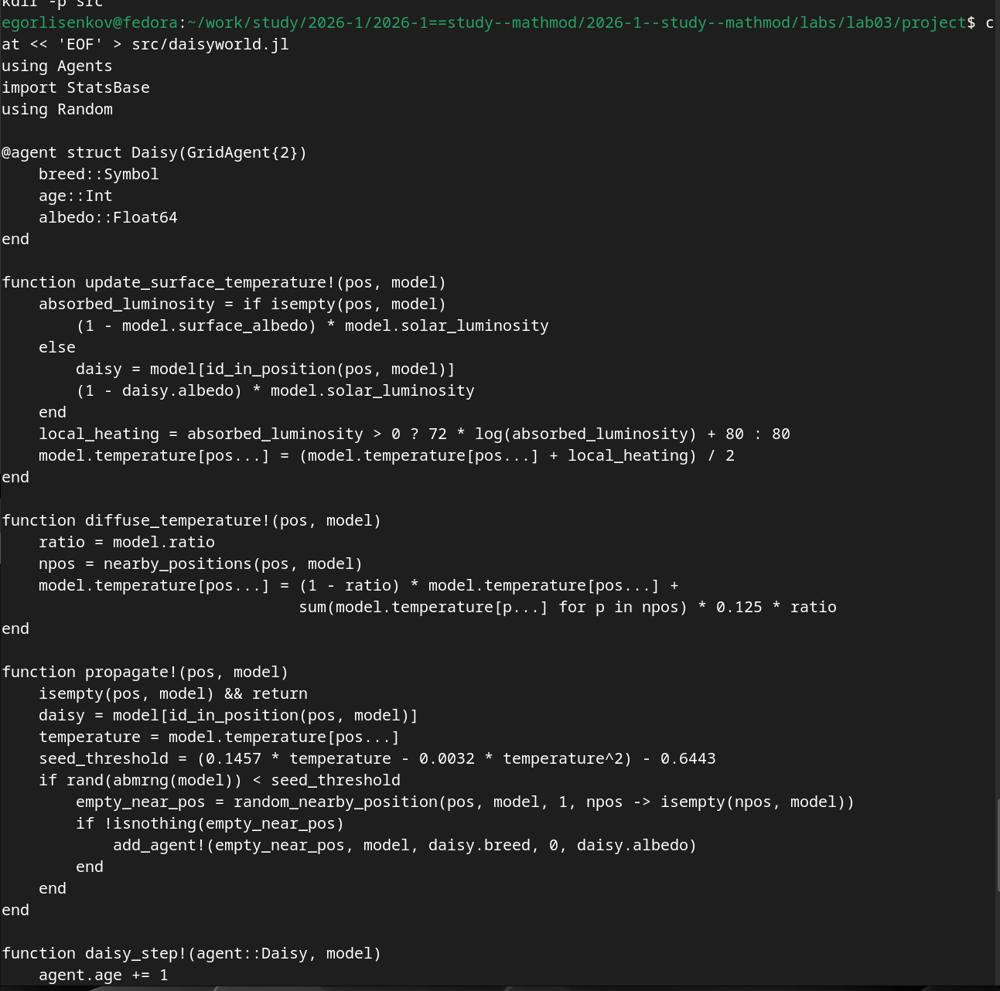
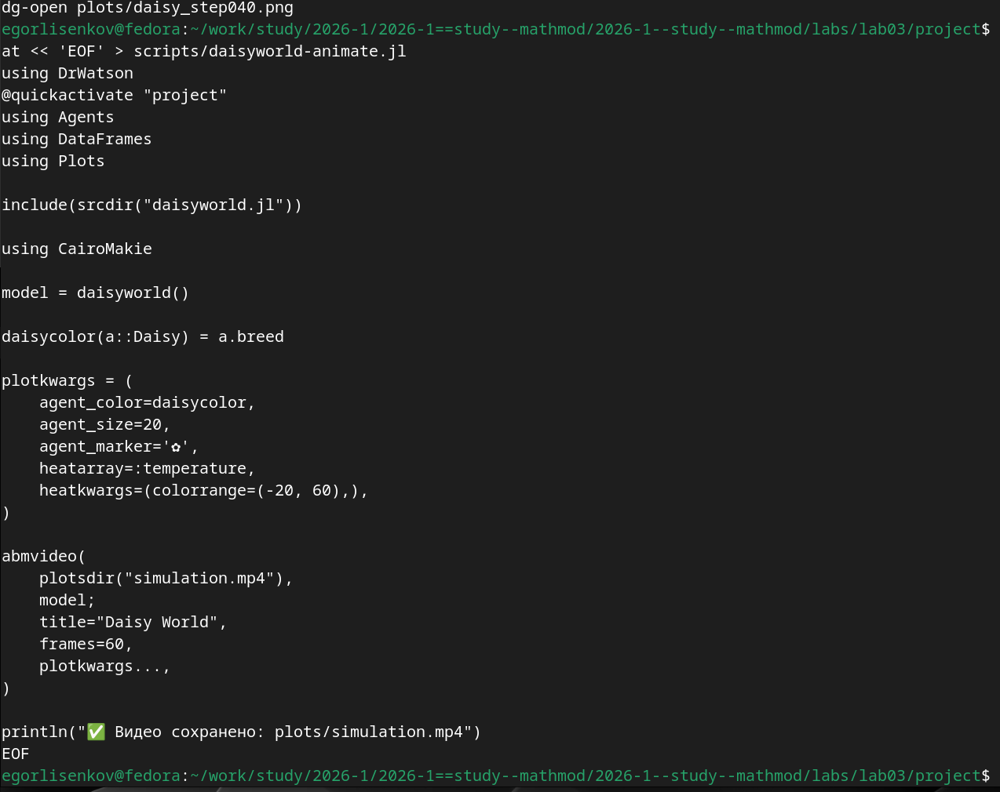
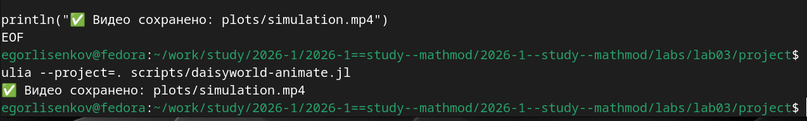
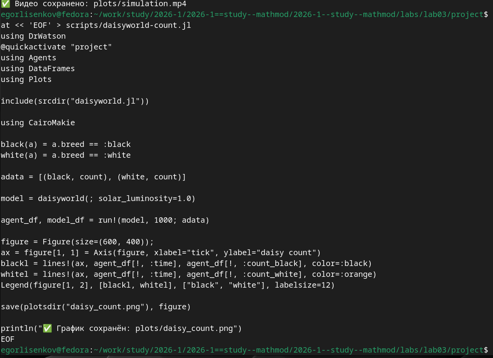
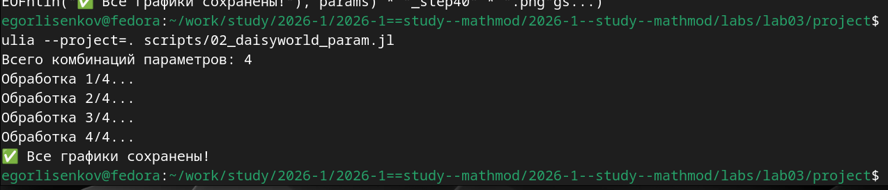
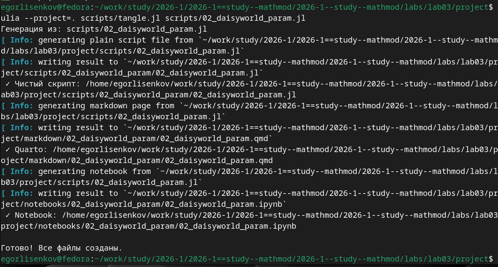
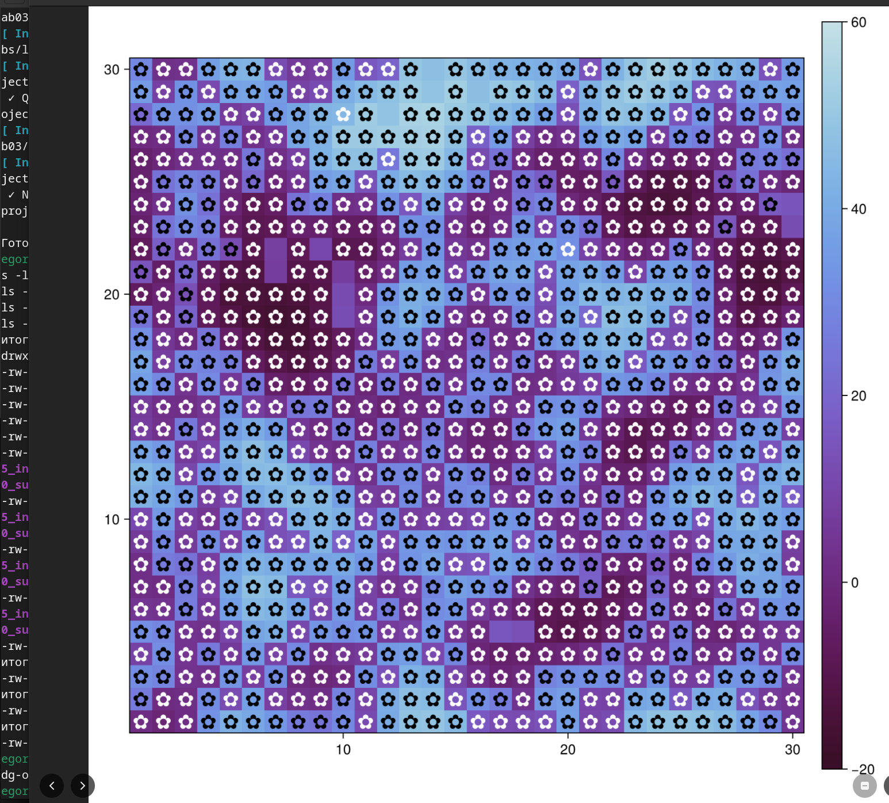
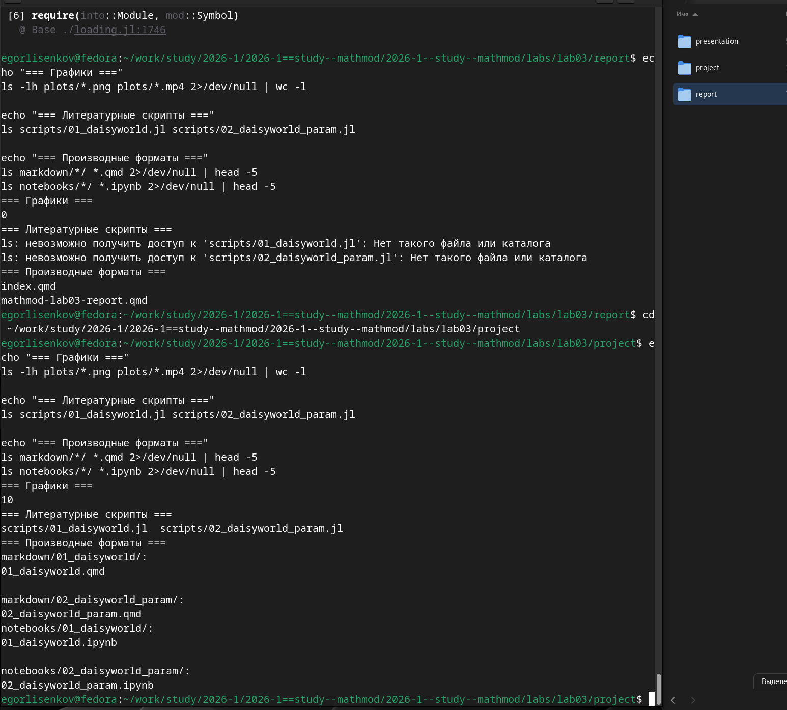

---
## Front matter
lang: ru-RU
title: Лабораторная работа №3
subtitle: Имитационное Моделирование
author:
  - Лисенков Е.Р.
institute:
  - Российский университет дружбы народов, Москва, Россия

## i18n babel
babel-lang: russian
babel-otherlangs: english

## Formatting pdf
toc: false
toc-title: Содержание
slide_level: 2
aspectratio: 169
section-titles: true
theme: metropolis
header-includes:
 - \metroset{progressbar=frametitle,sectionpage=progressbar,numbering=fraction}
 - '\makeatletter'
 - '\beamer@ignorenonframefalse'
 - '\makeatother'
---

# Информация

## Докладчик

:::::::::::::: {.columns align=center}
::: {.column width="70%"}

  * Лисенков Егор Романович
  * студент
  * Российский университет дружбы народов
  * [1132232881@rudn.ru](mailto:1132232881@rudn.ru)
  * <https://github.com/erlisenkov>

:::
::: {.column width="30%"}

ц

:::
::::::::::::::

# Вводная часть

# Вводная часть

## Актуальность
Агентное моделирование позволяет исследовать сложные эмерджентные системы, такие как климатическая саморегуляция в гипотезе Геи, через локальные взаимодействия автономных сущностей.

## Объект и предмет исследования
Объектом является планетарная экосистема Daisyworld, а предметом — численные методы агентного моделирования и литературного программирования на языке Julia.

## Цели и задачи
Цель работы заключается в реализации и исследовании модели Daisyworld, а задачами выступают настройка воспроизводимого окружения DrWatson, генерация артефактов через Literate.jl и анализ динамики популяций.

## Материалы и методы
Исследование выполнено в среде Fedora Linux с использованием пакетов Agents.jl для агентного моделирования, CairoMakie для визуализации и Quarto для сборки отчёта.

## Установка пакетов для агентного моделирования
Выполнена установка специализированных пакетов Agents, StatsBase, CairoMakie и Literate для построения агентных моделей и генерации документации.
{#fig:001 width=70%}

## Инициализация проекта DrWatson
Инициализировано изолированное рабочее окружение проекта DrWatson v2.19.1 с фиксацией всех зависимостей в Manifest.toml для гарантии воспроизводимости.
{#fig:002 width=70%}

## Выполнение скрипта базовой визуализации
Создан и успешно выполнен скрипт базовой визуализации, генерирующий три снимка эволюции модели на разных шагах симуляции.
{#fig:003 width=70%}

## Содержимое файла модели Daisyworld
Реализован файл src/daisyworld.jl, содержащий структуру агента Daisy, функции диффузии температуры и правила размножения маргариток.
{#fig:004 width=70%}

## Визуализация модели Daisyworld
Визуализирован фазовый портрет сетки 30x30, демонстрирующий самоорганизацию чёрных и белых маргариток в зависимости от локальной температуры.
{#fig:005 width=70%}

## Выполнение скрипта динамики числа маргариток
Разработан скрипт daisyworld-count.jl, рассчитывающий и визуализирующий изменение численности популяций чёрных и белых маргариток на протяжении 1000 шагов.
{#fig:006 width=70%}

## Создание анимации эволюции модели
Сгенерирован видеофайл simulation.mp4, наглядно отображающий непрерывную эволюцию распределения маргариток и температуры поверхности.
{#fig:007 width=70%}

## Содержимое скрипта анимации модели
Написан код скрипта daisyworld-animate.jl, использующий функцию abmvideo для последовательного рендеринга 60 кадров симуляции в MP4-формат.
{#fig:008 width=70%}

## Выполнение скрипта комплексной динамики
Выполнен скрипт daisyworld-luminosity.jl, строящий комплексный график совместной динамики популяций, средней температуры и солнечной светимости.
{#fig:009 width=70%}

## Содержимое скрипта динамики числа маргариток
Реализован алгоритм сбора данных adata и mdata, позволяющий одновременно отслеживать состояние агентов и глобальные параметры модели во времени.
{#fig:010 width=70%}

## Выполнение параметрического исследования
Запущен скрипт параметрического сканирования, автоматически обработавший 4 уникальные комбинации значений параметров max_age и init_white.
{#fig:011 width=70%}

## Генерация производных форматов для параметрического скрипта
Утилита tangle.jl успешно преобразовала параметрический скрипт в чистый код, Quarto-документ и Jupyter Notebook.
{#fig:012 width=70%}

## Генерация производных форматов для базового скрипта
Аналогичным образом из базового литературного скрипта сгенерированы три независимых артефакта для интеграции в итоговый отчёт.
{#fig:013 width=70%}

## Содержимое литературного скрипта базовой визуализации
Создан файл 01_daisyworld.jl в стиле литературного программирования, объединяющий исполняемый код Julia и Markdown-описания.
{#fig:014 width=70%}

## Содержимое литературного скрипта параметрического исследования
Разработан параметрический литературный скрипт, использующий функцию dict_list для систематического перебора всех заданных комбинаций параметров.
{#fig:015 width=70%}

## Ошибка выполнения скрипта вне контекста проекта
Выявлена и проанализирована ошибка запуска скрипта вне директории проекта, подтвердившая строгую необходимость активации окружения DrWatson.
{#fig:016 width=70%}

## Результаты генерации графиков и компиляция отчёта
После корректного размещения файлов успешно инициирована компиляция финального PDF-отчёта через движок XeLaTeX и систему Biber.
{#fig:017 width=70%}

## Финальная проверка структуры проекта
Проведена верификация структуры проекта, подтвердившая наличие всех 10 графических артефактов и производных форматов кода.
{#fig:018 width=70%}

## Детальная структура каталогов с артефактами
Детальный листинг каталогов plots, scripts, markdown и notebooks демонстрирует полное соответствие структуры принципам фреймворка DrWatson.
{#fig:019 width=70%}

## Визуализация модели Daisyworld после 40 шагов эволюции
Финальный фазовый портрет наглядно иллюстрирует достижение системой квазистационарного состояния с устойчивым сосуществованием обоих видов маргариток.
{#fig:020 width=70%}

## Результаты

В ходе выполнения лабораторной работы была успешно реализована агентная модель Daisyworld на языке Julia с использованием пакета Agents.jl. Получены следующие визуальные и аналитические артефакты: статические снимки состояния клеточной сетки на разных шагах симуляции, отображающие тепловую карту температуры и распределение маргариток; видеофайл анимации эволюции системы; графики динамики численности популяций чёрных и белых маргариток во времени. Построен комплексный многопанельный график, наглядно демонстрирующий эффект саморегуляции средней температуры планеты при изменении солнечной светимости в сценарии ramp. Проведено параметрическое исследование, показавшее влияние вариации максимального возраста агентов и начальной доли белых маргариток на формирование пространственных паттернов и устойчивость экосистемы. Из единого литературного скрипта с помощью утилиты tangle.jl автоматически сгенерированы чистый исполняемый код, интерактивный Jupyter Notebook и документация в формате Quarto, которые успешно интегрированы в итоговый отчёт.

## Выводы

В результате проделанной работы были освоены фундаментальные принципы агентного моделирования и методология организации воспроизводимых вычислительных экспериментов. Практически подтверждено, что глобальная саморегуляция климата в модели Daisyworld (иллюстрирующая гипотезу Геи) возникает как эмерджентное свойство из простых локальных правил взаимодействия автономных агентов со средой. Применение фреймворка DrWatson.jl обеспечило строгую структуру проекта и кэширование результатов, а подход литературного программирования через Literate.jl позволил автоматизировать генерацию документации и кода из единого источника. Полученные навыки создания, визуализации и параметрического анализа агентных моделей на языке Julia создают прочную основу для дальнейшего исследования сложных нелинейных систем в экологии, социологии и экономике.
