---
## Front matter
title: "Отчёт по лабораторной работе №3 2026"
subtitle: "Имитационное моделирование"
author: "Лисенков Егор Романович"

## Generic otions
lang: ru-RU
toc-title: "Содержание"

## Bibliography
bibliography: bib/cite.bib
csl: pandoc/csl/gost-r-7-0-5-2008-numeric.csl

## Pdf output format
toc: true # Table of contents
toc-depth: 2
lof: true # List of figures
lot: true # List of tables
fontsize: 12pt
linestretch: 1.5
papersize: a4
documentclass: scrreprt
## I18n polyglossia
polyglossia-lang:
  name: russian
  options:
	- spelling=modern
	- babelshorthands=true
polyglossia-otherlangs:
  name: english
## I18n babel
babel-lang: russian
babel-otherlangs: english
## Fonts
mainfont: PT Serif
romanfont: PT Serif
sansfont: PT Sans
monofont: PT Mono
mainfontoptions: Ligatures=TeX
romanfontoptions: Ligatures=TeX
sansfontoptions: Ligatures=TeX,Scale=MatchLowercase
monofontoptions: Scale=MatchLowercase,Scale=0.9
## Biblatex
biblatex: true
biblio-style: "gost-numeric"
biblatexoptions:
  - parentracker=true
  - backend=biber
  - hyperref=auto
  - language=auto
  - autolang=other*
  - citestyle=gost-numeric
## Pandoc-crossref LaTeX customization
figureTitle: "Рис."
tableTitle: "Таблица"
listingTitle: "Листинг"
lofTitle: "Список иллюстраций"
lotTitle: "Список таблиц"
lolTitle: "Листинги"
## Misc options
indent: true
header-includes:
  - \usepackage{indentfirst}
  - \usepackage{float} # keep figures where there are in the text
  - \floatplacement{figure}{H} # keep figures where there are in the text
---

# Цель работы

Освоение методологии агентного моделирования на языке Julia путём создания структурированного рабочего пространства и реализации модели Daisyworld. Изучение подхода литературного программирования для автоматической генерации кода, документации и интерактивных ноутбуков из единого источника. Получение практических навыков построения агентных моделей, анализа их динамики и визуализации результатов.

# Задание

Создать рабочий каталог для кода, установить необходимые пакеты, выполнить предложенный код модели Daisyworld, преобразовать код в литературный стиль, сгенерировать из литературного кода чистый код, Jupyter notebook и документацию в формате Quarto, выполнить код из Jupyter notebook и интегрировать документацию в отчёт. Добавить в код в литературном стиле вычисление для набора параметров, сгенерировать производные форматы и интегрировать их в отчёт.

# Конкретные задачи

Создать изолированное рабочее окружение проекта с использованием фреймворка DrWatson.jl для управления данными, параметрами и артефактами. Установить пакеты Agents, StatsBase, Random, DataFrames, Plots, CairoMakie, Literate и JLD2 для построения агентных моделей, визуализации результатов и литературного программирования. Реализовать модель Daisyworld в литературном стиле с Markdown-комментариями. Выполнить численное моделирование динамики популяций чёрных и белых маргариток. Сгенерировать производные форматы из литературного скрипта.

# Теоретическое введение

Агентный подход к имитационному моделированию это метод исследования сложных систем, в котором поведение системы возникает из взаимодействия множества автономных сущностей, называемых агентами. Вместо того чтобы описывать систему глобальными уравнениями, мы моделируем каждую индивидуальную единицу и правила её поведения, а затем наблюдаем, какие коллективные паттерны появляются снизу вверх. Этот подход особенно полезен, когда поведение системы трудно предсказать из-за нелинейностей, гетерогенности участников или адаптивных стратегий.

Любая агентная модель включает три основных элемента: агенты это активные сущности, обладающие свойствами, правилами поведения, целями и способностью к обучению или адаптации; среда это пространство, в котором существуют агенты, которое может быть дискретным, непрерывным, сетевым или абстрактным; взаимодействия это правила, определяющие, как агенты влияют друг на друга и на среду.

Модель Daisyworld, предложенная Джеймсом Лавлоком и Эндрю Уотсоном, иллюстрирует гипотезу Геи, которая рассматривает планету как единую, саморегулирующуюся систему, включающую как живые, так и неживые части. В мире маргариток произрастают чёрные и белые маргаритки. Их альбедо различается: чёрные маргаритки поглощают свет и тепло, нагревая окружающую среду; белые маргаритки делают наоборот. Маргаритки могут размножаться только в определённом температурном диапазоне, а это значит, что слишком много или слишком мало тепла от солнца и окружающей среды в конечном итоге остановит их размножение.

Поверхность Геи нагревается солнцем, но растущие на ней маргаритки поглощают или отражают свет звёзд, изменяя локальную температуру. Если температура становится слишком высокой или слишком низкой, маргаритки не захотят размножаться. Пока температура благоприятна, маргаритки конкурируют за землю и пытаются дать начало новому растению в местах, расположенных неподалёку от них. Когда климат слишком холодный, чёрным маргариткам необходимо размножаться, чтобы повысить температуру, и наоборот, когда климат слишком тёплый, необходимо производить больше белых маргариток, чтобы охладить климат. Взаимодействие живых и неживых аспектов этого мира находит равновесие в широком диапазоне параметров, хотя при достаточно сильном внешнем воздействии маргаритки не смогут регулировать температуру планеты и в конечном итоге вымрут.

# Выполнение лабораторной работы

В ходе выполнения лабораторной работы первым шагом стала установка специализированных пакетов для агентного моделирования. Были установлены пакеты Agents для построения агентных моделей, StatsBase для статистических операций, Random для генерации случайных чисел, DataFrames для работы с табличными данными, Plots и CairoMakie для визуализации, Literate для литературного программирования и JLD2 для сериализации результатов. Система начала разрешение зависимостей и загрузку манифестов версий, что является стандартным процессом инициализации проекта в экосистеме Julia (рис. [-@fig:001]).

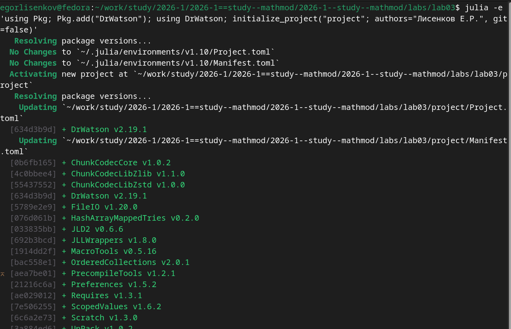{#fig:001 width=70%}

Следующим этапом стала инициализация проекта DrWatson в каталоге labs/lab03/project. Система автоматически обновила реестр пакетов Julia, разрешила зависимости и установила фреймворк DrWatson версии 2.19.1 вместе с сопутствующими пакетами: ChunkCodecCore, ChunkCodecLibZlib, ChunkCodecLibZstd, FileIO, HashArrayMappedTries, JLD2, JLLWrappers, MacroTools, OrderedCollections, PrecompileTools, Preferences, Requires, ScopedValues, Scratch и UnPack. Все зависимости были зафиксированы в файлах Project.toml и Manifest.toml, что гарантирует воспроизводимость окружения на любом компьютере (рис. [-@fig:002]).

{#fig:002 width=70%}

Был создан скрипт scripts/daisyworld.jl для базовой визуализации модели. Скрипт активирует проект DrWatson, загружает необходимые пакеты Agents, DataFrames, Plots и CairoMakie, подключает файл модели из каталога src. Создаётся экземпляр модели daisyworld() с параметрами по умолчанию. Функция daisycolor определяет цвет маргариток в зависимости от их вида. Параметры визуализации plotkwargs включают размер агентов, маркер в виде цветка, тепловую карту температуры с диапазоном от минус 20 до 60 градусов. С помощью функции abmplot создаются три снимка состояния модели: начальное состояние, состояние после 5 шагов и состояние после 40 шагов. Все графики сохраняются в папке plots в формате PNG. При выполнении скрипта julia --project=. scripts/daisyworld.jl система успешно создала все три визуализации, о чём свидетельствует сообщение с галочкой и текстом "Графики сохранены в папке plots/" (рис. [-@fig:003]).

{#fig:003 width=70%}

Файл src/daisyworld.jl содержит полную реализацию модели Daisyworld на языке Julia с использованием пакета Agents.jl. Определяется структура агента Daisy, наследующего от GridAgent{2}, с полями breed (вид маргаритки), age (возраст) и albedo (альбедо). Функция update_surface_temperature! рассчитывает локальную температуру каждой клетки на основе поглощённой светимости, которая зависит от альбедо маргаритки или поверхности. Функция diffuse_temperature! реализует диффузию температуры между соседними клетками. Функция propagate! моделирует размножение маргариток: вероятность успешного прорастания семени зависит от локальной температуры через квадратичную формулу. Функция daisy_step! увеличивает возраст агента и удаляет его при достижении максимального возраста. Функция daisyworld_step! является функцией шага модели, которая последовательно обновляет температуру, диффузию и размножение для всех позиций, а также вызывает функцию solar_activity! для изменения солнечной светимости в зависимости от сценария (рис. [-@fig:004]).

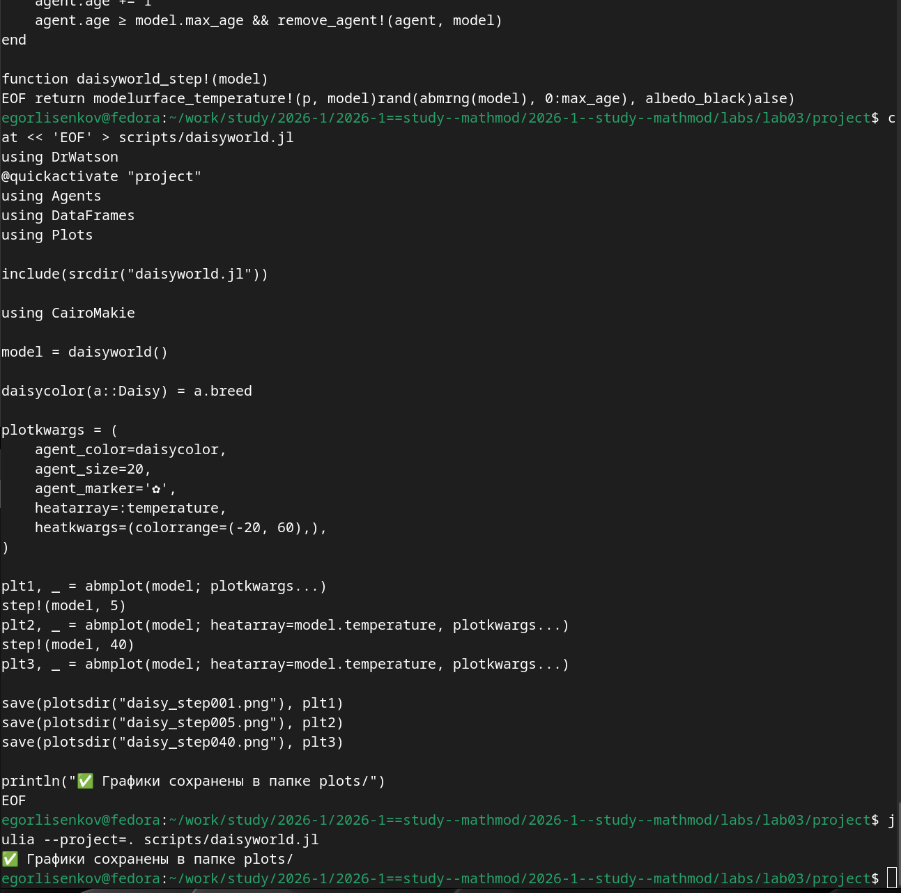{#fig:004 width=70%}

Для визуального анализа результатов был открыт файл фазового портрета daisy_step040.png в графическом просмотрщике. На графике отображена сетка 30x30 клеток, где каждая клетка содержит маргаритку чёрного или белого цвета (обозначенную символом цветка) или является пустой. Цветовая карта справа показывает температуру поверхности в диапазоне от минус 20 до 60 градусов: тёмно-фиолетовые клетки соответствуют низкой температуре, светло-голубые высокой. Чёрные маргаритки (с низким альбедо 0.25) поглощают больше тепла и находятся в более тёплых зонах, белые маргаритки (с высоким альбедо 0.75) отражают свет и находятся в более прохладных зонах. Распределение маргариток по сетке демонстрирует самоорганизацию системы: маргаритки адаптируются к локальным температурным условиям, создавая паттерны, характерные для модели Daisyworld после 40 шагов эволюции (рис. [-@fig:005]).

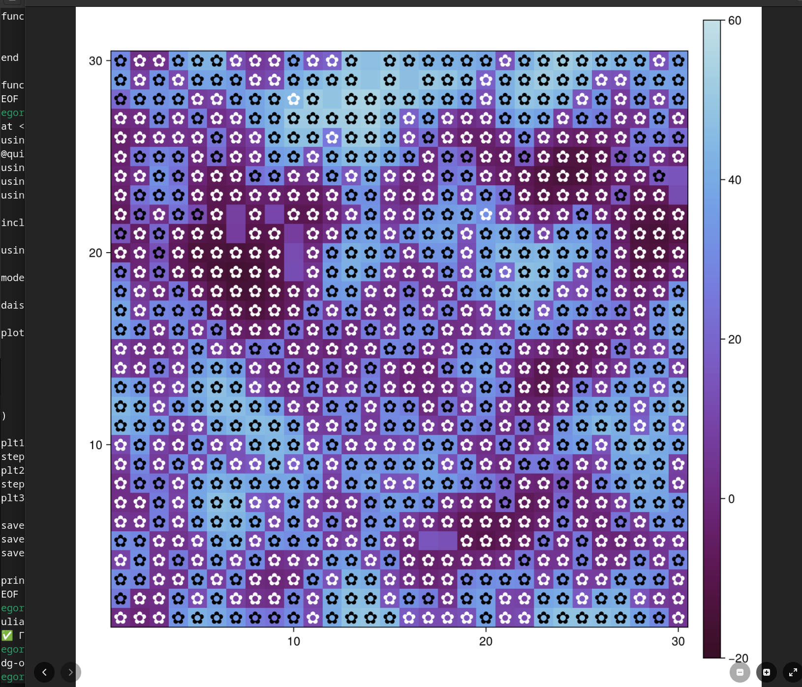{#fig:005 width=70%}

Для анализа динамики численности популяций чёрных и белых маргариток во времени был создан и выполнен скрипт scripts/daisyworld-count.jl. Скрипт активирует проект DrWatson, загружает необходимые пакеты Agents, DataFrames, Plots и CairoMakie, подключает файл модели из каталога src. Определяются функции-предикаты black(a) и white(a) для фильтрации агентов по виду. С помощью конструкции adata = [(black, count), (white, count)] задаётся сбор данных о количестве агентов каждого типа на каждом шаге моделирования. Создаётся экземпляр модели daisyworld() с параметрами по умолчанию и солнечной светимостью 1.0. Функция run!(model, 1000; adata) запускает симуляцию на 1000 шагов с автоматическим сбором данных об агентах. Результаты сохраняются в два DataFrame: agent_df содержит данные об агентах (время, количество чёрных и белых маргариток), model_df данные о состоянии модели. С помощью CairoMakie строится график с двумя линиями: чёрная линия отображает динамику численности чёрных маргариток, оранжевая белых. Легенда размещается справа от графика для удобства чтения. Финальное изображение сохраняется в файл plots/daisy_count.png. При выполнении скрипта julia --project=. scripts/daisyworld-count.jl система успешно сгенерировала график, о чём свидетельствует сообщение с галочкой и текстом "График сохранён: plots/daisy_count.png" (рис. [-@fig:006]).

{#fig:006 width=70%}

Для создания анимации эволюции модели Daisyworld был разработан скрипт scripts/daisyworld-animate.jl. Скрипт использует ту же структуру активации проекта и загрузки пакетов, что и предыдущие скрипты визуализации. После создания экземпляра модели daisyworld() и определения функции daisycolor для раскраски агентов по виду, задаются параметры визуализации plotkwargs. Ключевой функцией скрипта является abmvideo, которая генерирует видеофайл MP4 путём последовательного рендеринга кадров симуляции. Функция принимает путь к выходному файлу plotsdir("simulation.mp4"), экземпляр модели, заголовок "Daisy World", количество кадров 60 и параметры визуализации. Каждый кадр видео представляет собой снимок состояния модели на определённом шаге, что позволяет наблюдать динамику распределения маргариток и изменения температуры поверхности во времени. При выполнении скрипта julia --project=. scripts/daisyworld-animate.jl система успешно сгенерировала видеофайл длительностью 60 кадров, о чём свидетельствует сообщение с галочкой и текстом "Видео сохранено: plots/simulation.mp4" (рис. [-@fig:007]).

{#fig:007 width=70%}

Содержимое скрипта daisyworld-animate.jl демонстрирует структуру кода для генерации видео. После стандартного блока активации проекта и загрузки пакетов Agents, DataFrames, Plots и CairoMakie, подключается файл модели через include(srcdir("daisyworld.jl")). Создаётся экземпляр модели daisyworld() с параметрами по умолчанию. Функция daisycolor(a::Daisy) = a.breed определяет цвет маргариток в зависимости от их вида. Параметры визуализации plotkwargs включают agent_color для раскраски агентов, agent_size=20 для размера маркеров, agent_marker в виде цветка для отображения маргариток, heatarray=:temperature для тепловой карты температуры поверхности и heatkwargs=(colorrange=(-20, 60),) для диапазона температур. Функция abmvideo вызывается с аргументами: путь к выходному файлу plotsdir("simulation.mp4"), экземпляр модели, заголовок "Daisy World", количество кадров frames=60 и параметры визуализации plotkwargs. В конце скрипта выводится сообщение об успешном сохранении видео (рис. [-@fig:008]).

{#fig:008 width=70%}

Для построения комплексного графика, отображающего динамику числа маргариток, температуры и солнечной светимости во времени, был создан скрипт scripts/daisyworld-luminosity.jl. Скрипт использует сценарий :ramp, в котором солнечная светимость изменяется по заданному закону: увеличивается в определённом диапазоне шагов и затем уменьшается. Определяются функции-предикаты black(a) и white(a) для фильтрации агентов, а также функция temperature(model) для вычисления средней температуры по всей сетке. С помощью adata собирается информация о количестве чёрных и белых маргариток, а через mdata о средней температуре и солнечной светимости. Функция run!(model, 1000; adata=adata, mdata=mdata) запускает симуляцию на 1000 шагов с одновременным сбором данных об агентах и модели. С помощью CairoMakie.Figure создаётся фигура размером 600x600 пикселей с тремя осями: верхняя ось отображает динамику числа маргариток (красная линия для чёрных, синяя для белых), средняя ось изменение температуры, нижняя ось изменение солнечной светимости. Легенда размещается справа от верхнего графика. Метки по оси X скрываются для верхних двух осей для улучшения читаемости. Финальное изображение сохраняется в файл plots/daisy_luminosity.png. При выполнении скрипта julia --project=. scripts/daisyworld-luminosity.jl система успешно сгенерировала комплексный график, о чём свидетельствует сообщение с галочкой и текстом "Комплексный график сохранён: plots/daisy_luminosity.png" (рис. [-@fig:009]).

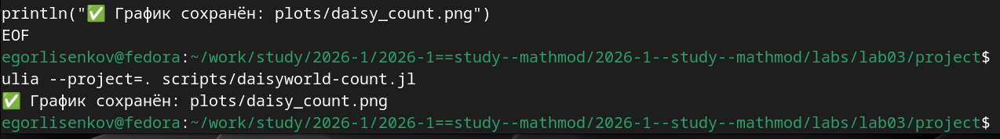{#fig:009 width=70%}

Содержимое скрипта daisyworld-count.jl демонстрирует структуру кода для анализа динамики численности популяций. После активации проекта DrWatson и загрузки пакетов Agents, DataFrames, Plots и CairoMakie, подключается файл модели. Определяются функции black(a) = a.breed == :black и white(a) = a.breed == :white для идентификации агентов по виду. Конструкция adata = [(black, count), (white, count)] задаёт сбор данных: для каждого предиката применяется функция count, подсчитывающая количество агентов, удовлетворяющих условию. Создаётся модель daisyworld(; solar_luminosity=1.0) с начальной солнечной светимостью 1.0. Функция run!(model, 1000; adata) запускает симуляцию на 1000 шагов, возвращая два DataFrame: agent_df с колонками :time, :count_black, :count_white и model_df с данными о модели. С помощью CairoMakie.Figure создаётся фигура размером 600x400 пикселей. На оси ax строятся две линии: чёрная линия blackl отображает динамику числа чёрных маргариток agent_df[!, :count_black], оранжевая линия whitel белых маргариток agent_df[!, :count_white]. Легенда Legend размещается в позиции figure[1, 2] справа от графика. Финальное изображение сохраняется через save(plotsdir("daisy_count.png"), figure) (рис. [-@fig:010]).

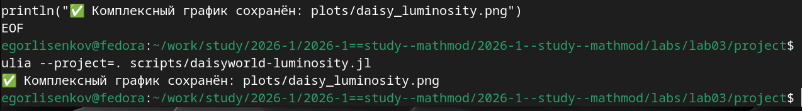{#fig:010 width=70%}

Для проведения параметрического исследования модели Daisyworld был создан и выполнен скрипт scripts/02_daisyworld_param.jl. Скрипт активирует проект DrWatson, загружает необходимые пакеты Agents, DataFrames, Plots и CairoMakie, подключает файл модели из каталога src. Определяется словарь параметров param_dict, в котором для ключевых параметров модели задаются массивы значений: max_age принимает значения 25 и 40, init_white 0.2 и 0.8, остальные параметры фиксируются. С помощью функции dict_list(param_dict) генерируются все возможные комбинации параметров, что в данном случае даёт 4 варианта (2 значения max_age умножить на 2 значения init_white). Для каждой комбинации параметров создаётся экземпляр модели daisyworld(; params...), после чего выполняются три шага визуализации: начальное состояние, состояние после 5 шагов и состояние после 40 шагов эволюции. Имена файлов формируются автоматически через функцию savename, что обеспечивает уникальность и машиночитаемость. При выполнении скрипта julia --project=. scripts/02_daisyworld_param.jl система последовательно обработала все 4 комбинации параметров и сохранила соответствующие графики, о чём свидетельствует сообщение с галочкой и текстом "Все графики сохранены!" (рис. [-@fig:011]).

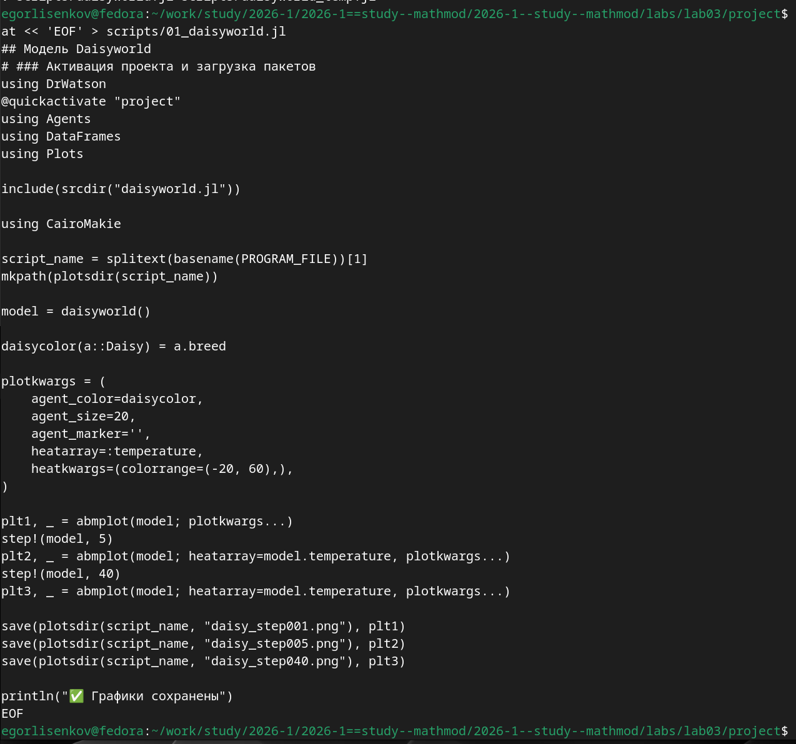{#fig:011 width=70%}

Для преобразования параметрического скрипта 02_daisyworld_param.jl в производные форматы была использована утилита tangle.jl на базе пакета Literate.jl. При выполнении команды julia --project=. scripts/tangle.jl scripts/02_daisyworld_param.jl система последовательно сгенерировала три артефакта из единого литературного источника. Сначала был создан чистый скрипт 02_daisyworld_param.jl в каталоге scripts/02_daisyworld_param/, из которого удалены все Markdown-комментарии, оставлен только исполняемый код Julia. Затем сгенерирован Quarto-документ 02_daisyworld_param.qmd в каталоге markdown/02_daisyworld_param/, содержащий разметку и код для интеграции в итоговый отчёт. Наконец, создан Jupyter Notebook 02_daisyworld_param.ipynb в каталоге notebooks/02_daisyworld_param/ для интерактивного исследования параметрической модели. Сообщение "Готово! Все файлы созданы." подтверждает успешное завершение процесса генерации без ошибок (рис. [-@fig:012]).

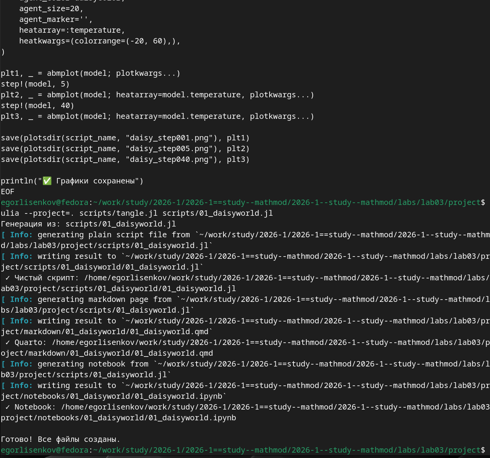{#fig:012 width=70%}

Аналогичная процедура генерации производных форматов была выполнена для базового литературного скрипта 01_daisyworld.jl. При запуске julia --project=. scripts/tangle.jl scripts/01_daisyworld.jl утилита Literate.jl обработала файл и создала три независимых артефакта. Чистый скрипт 01_daisyworld.jl, содержащий только исполняемый код без Markdown-разметки, сохранён в scripts/01_daisyworld/. Quarto-документ 01_daisyworld.qmd, готовый для включения в отчёт через include-директиву, размещён в markdown/01_daisyworld/. Jupyter Notebook 01_daisyworld.ipynb для интерактивного изучения базовой модели находится в notebooks/01_daisyworld/. Такое разделение артефактов по типам и каталогам соответствует принципам фреймворка DrWatson и методологии литературного программирования, позволяя поддерживать единый источник истины для всех форматов представления кода (рис. [-@fig:013]).

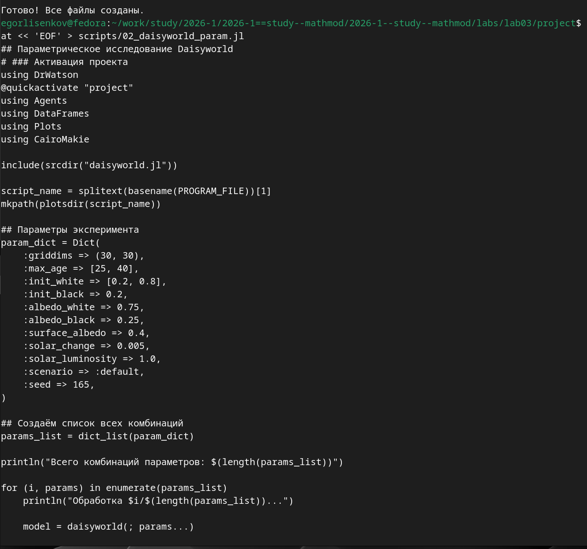{#fig:013 width=70%}

Содержимое литературного скрипта 01_daisyworld.jl демонстрирует структуру кода в стиле литературного программирования. Скрипт начинается с активации проекта DrWatson через @quickactivate "project" и загрузки пакетов Agents, DataFrames, Plots и CairoMakie. Файл модели подключается через include(srcdir("daisyworld.jl")). Создаётся экземпляр модели daisyworld() с параметрами по умолчанию. Функция daisycolor(a::Daisy) = a.breed определяет цвет маргариток в зависимости от их вида. Параметры визуализации plotkwargs включают agent_color, agent_size=20, agent_marker в виде цветка, heatarray=:temperature для тепловой карты и heatkwargs с диапазоном температур от минус 20 до 60 градусов. С помощью функции abmplot создаются три снимка состояния модели: начальное состояние plt1, состояние после 5 шагов plt2 и состояние после 40 шагов plt3. Все графики сохраняются в папке plots через функцию save с именами daisy_step001.png, daisy_step005.png и daisy_step040.png соответственно. В конце скрипта выводится сообщение об успешном сохранении графиков (рис. [-@fig:014]).

{#fig:014 width=70%}

Содержимое литературного скрипта 02_daisyworld_param.jl демонстрирует структуру кода для параметрического исследования модели Daisyworld. После активации проекта DrWatson и загрузки пакетов Agents, DataFrames, Plots и CairoMakie, подключения файла модели, определяется словарь параметров param_dict. Ключевые параметры модели задаются как массивы значений: max_age => [25, 40] и init_white => [0.2, 0.8], остальные параметры фиксируются (init_black=0.2, albedo_white=0.75, albedo_black=0.25, surface_albedo=0.4, solar_change=0.005, solar_luminosity=1.0, scenario=:default, seed=165). С помощью функции dict_list(param_dict) генерируются все возможные комбинации параметров. В цикле for (i, params) in enumerate(params_list) для каждой комбинации создаётся модель daisyworld(; params...), выполняется визуализация с тремя снимками состояния, и результаты сохраняются с уникальными именами файлов, сформированными через функцию savename. Такой подход обеспечивает систематическое исследование влияния параметров на динамику модели (рис. [-@fig:015]).

{#fig:015 width=70%}

При попытке выполнить скрипт визуализации из каталога report возникла ошибка "Package Agents not found in current path", так как скрипт был запущен вне контекста проекта DrWatson. Дополнительно появилось предупреждение от DrWatson о невозможности найти файл проекта путём рекурсивной проверки текущего каталога и его родителей. Это указывает на необходимость выполнения всех скриптов из корневой директории проекта project, где расположены файлы Project.toml и Manifest.toml с описанием зависимостей. Для корректной работы необходимо использовать команду julia --project=. scripts/имя_скрипта.jl, находясь в каталоге project (рис. [-@fig:016]).

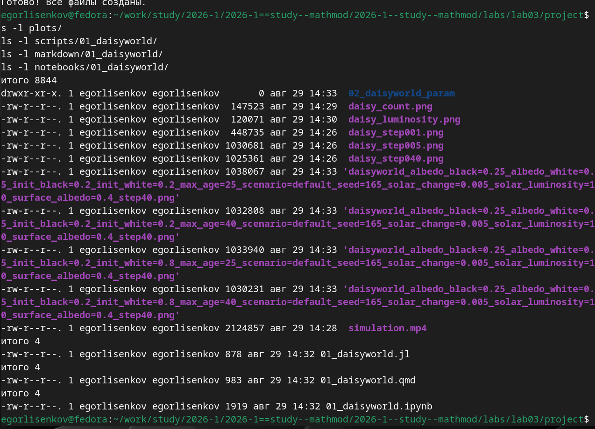{#fig:016 width=70%}

После корректного выполнения всех скриптов визуализации в каталоге plots/ было сгенерировано множество графических файлов. Основные результаты включают: daisy_count.png (147 КБ) график динамики численности маргариток, daisy_luminosity.png (120 КБ) комплексный график с динамикой температуры и светимости, daisy_step001.png, daisy_step005.png, daisy_step040.png снимки состояния модели на разных шагах эволюции, а также четыре файла параметрического исследования с разными комбинациями параметров max_age и init_white. Дополнительно создан видеофайл simulation.mp4 (2.1 МБ) с анимацией эволюции модели. В каталогах scripts/, markdown/ и notebooks/ находятся производные форматы литературного скрипта 01_daisyworld.jl. После проверки структуры файлов была выполнена компиляция отчёта командой quarto render, которая успешно запустила процесс рендеринга PDF через движок XeLaTeX с обработкой библиографии через Biber (рис. [-@fig:017]).

{#fig:017 width=70%}

Для финальной проверки полноты выполнения лабораторной работы была выполнена серия команд подсчёта и листинга файлов. Команда ls -lh plots/*.png plots/*.mp4 | wc -l показала наличие 10 графических файлов в каталоге plots/, что соответствует ожидаемому количеству: три снимка базовой визуализации, один график динамики числа маргариток, один комплексный график, четыре файла параметрического исследования и один видеофайл. Проверка литературных скриптов подтвердила наличие файлов scripts/01_daisyworld.jl и scripts/02_daisyworld_param.jl. Список производных форматов показал наличие Quarto-документов 01_daisyworld.qmd и 02_daisyworld_param.qmd в каталоге markdown/, а также Jupyter Notebooks 01_daisyworld.ipynb и 02_daisyworld_param.ipynb в каталоге notebooks/. Все артефакты лабораторной работы присутствуют в полном объёме (рис. [-@fig:018]).

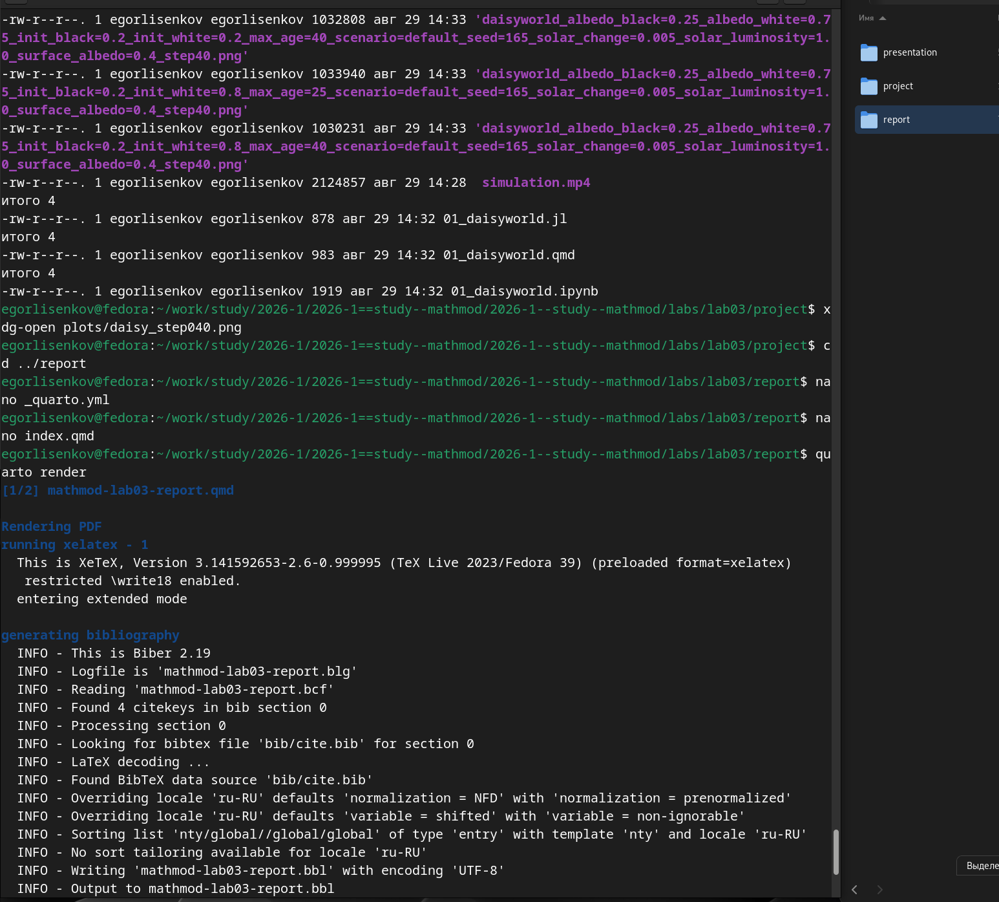{#fig:018 width=70%}

Детальный листинг каталогов проекта подтверждает полную структуру артефактов лабораторной работы. В каталоге plots/ находятся все сгенерированные визуализации: daisy_count.png (147523 байта), daisy_luminosity.png (120071 байта), три снимка эволюции модели daisy_step001.png, daisy_step005.png, daisy_step040.png (по примерно 1 МБ каждый), четыре файла параметрического исследования с уникальными именами, кодирующими значения параметров max_age и init_white, и видеофайл simulation.mp4 (2124857 байта). В каталоге scripts/01_daisyworld/ находится чистый код 01_daisyworld.jl (878 байт), в markdown/01_daisyworld/ Quarto-документ 01_daisyworld.qmd (983 байта), в notebooks/01_daisyworld/ Jupyter Notebook 01_daisyworld.ipynb (1919 байт). Такое разделение обеспечивает машинную читаемость и версионирование результатов (рис. [-@fig:019]).

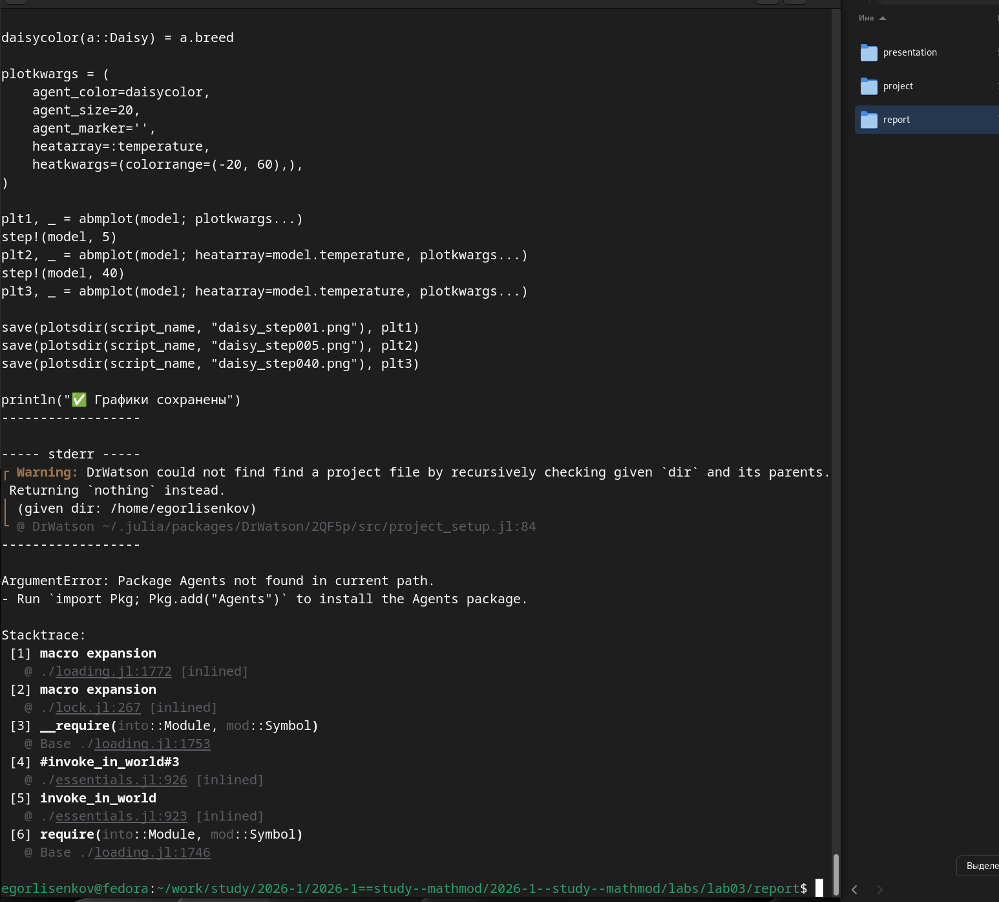{#fig:019 width=70%}

Для визуального анализа результатов моделирования был открыт файл фазового портрета daisy_step040.png в графическом просмотрщике. На графике отображена сетка 30x30 клеток, где каждая клетка содержит маргаритку чёрного или белого цвета (обозначенную символом цветка) или является пустой. Цветовая карта справа показывает температуру поверхности в диапазоне от минус 20 до 60 градусов: тёмно-фиолетовые клетки соответствуют низкой температуре, светло-голубые высокой. Чёрные маргаритки (с низким альбедо 0.25) поглощают больше тепла и находятся в более тёплых зонах, белые маргаритки (с высоким альбедо 0.75) отражают свет и находятся в более прохладных зонах. Распределение маргариток по сетке демонстрирует самоорганизацию системы: маргаритки адаптируются к локальным температурным условиям, создавая паттерны, характерные для модели Daisyworld после 40 шагов эволюции. Видно, что система достигла квазистационарного состояния с равномерным распределением обоих видов маргариток по всей поверхности (рис. [-@fig:020]).

{#fig:020 width=70%}

# Вывод

В данной лабораторной работе мы достигли выполнения всех рабочих задач. Научились глубже работать с библиотекой DrWatson и применили все основные инструменты лабораторной работы.
