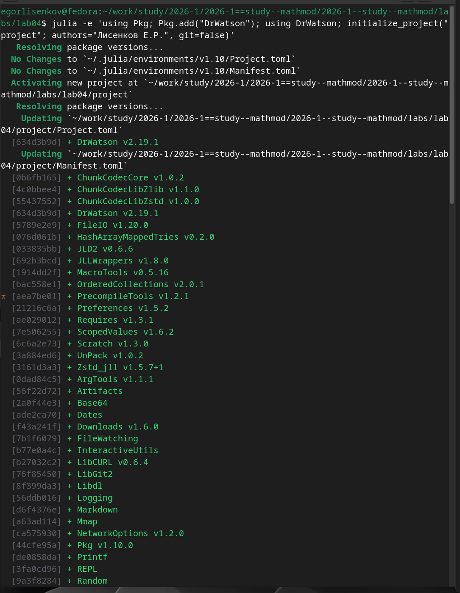
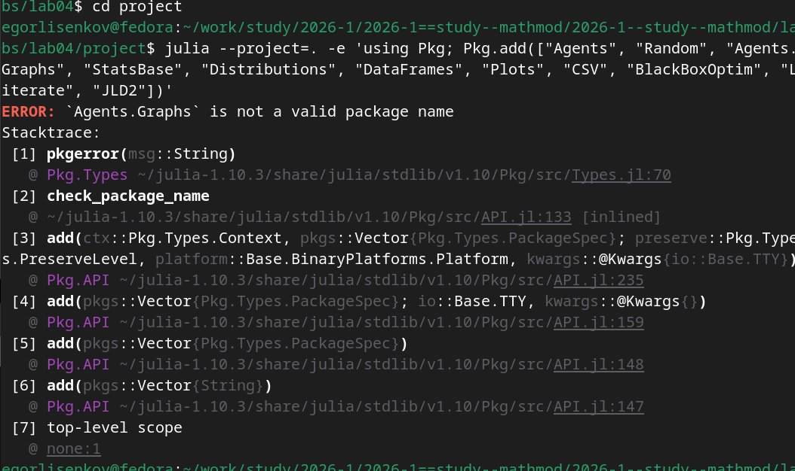
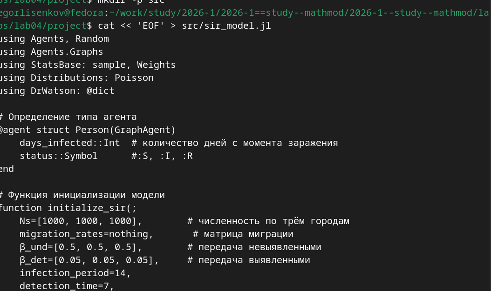
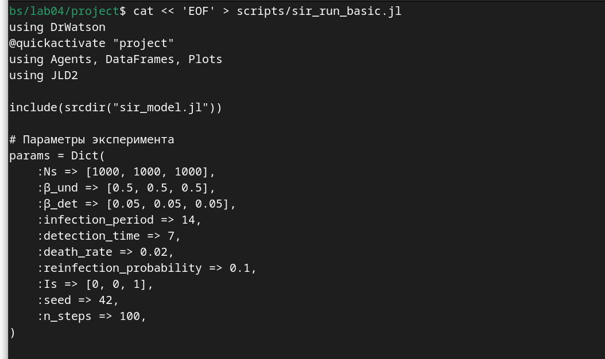
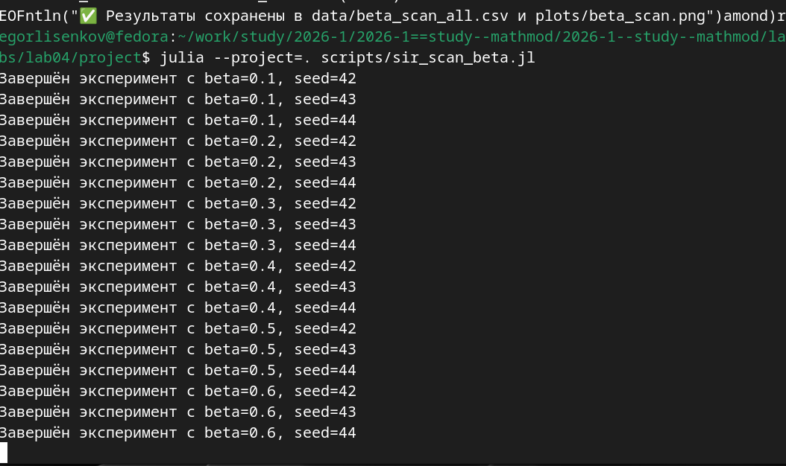
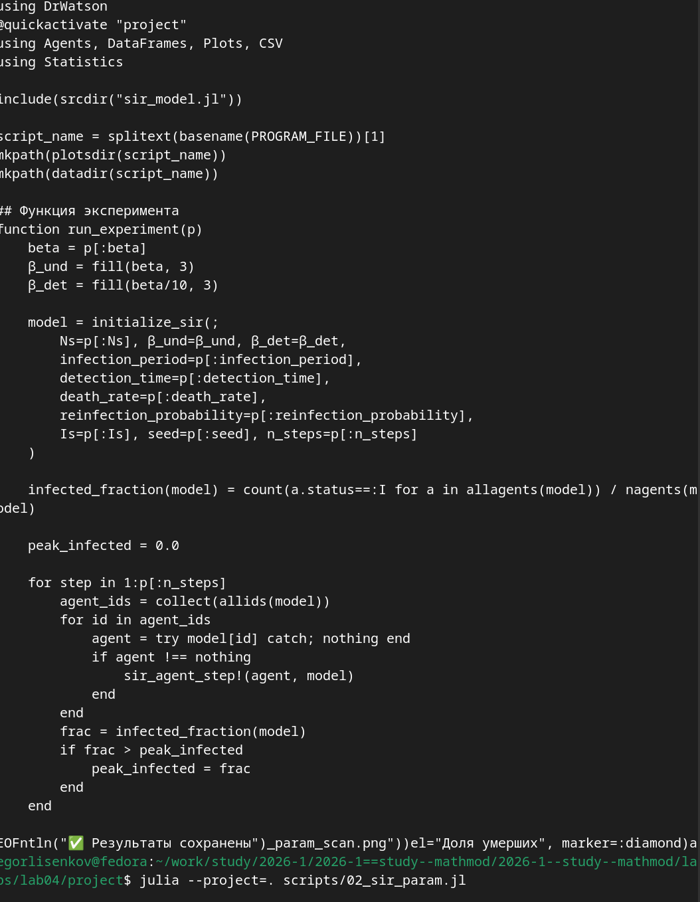
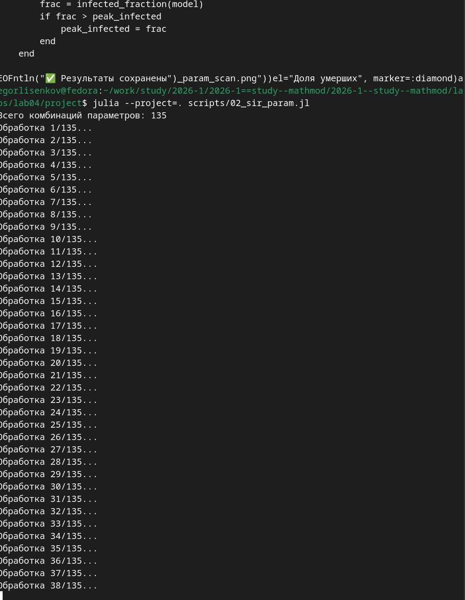
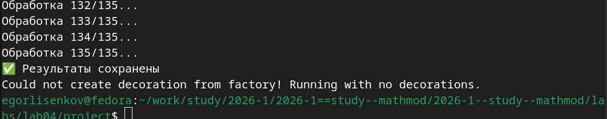
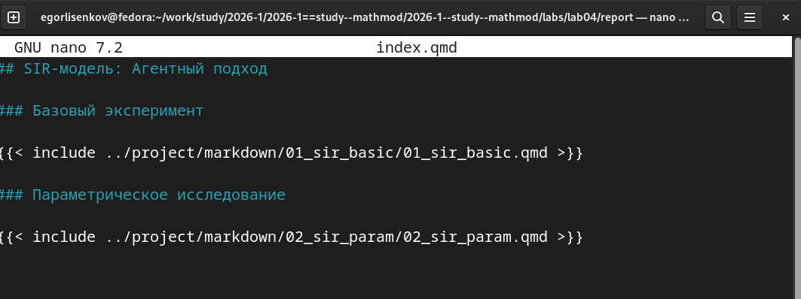
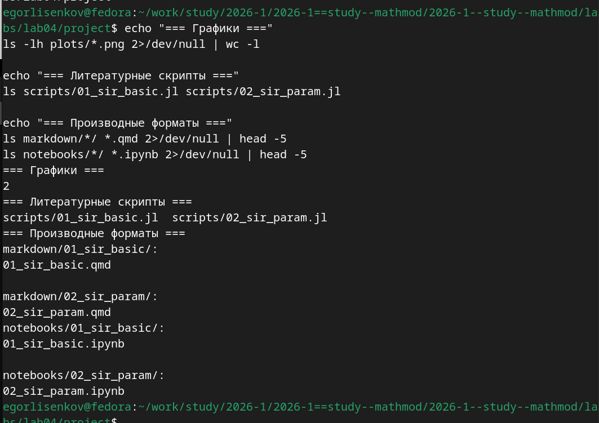

---
## Front matter
lang: ru-RU
title: Лабораторная работа №4
subtitle: Имитационное Моделирование
author:
  - Лисенков Е.Р.
institute:
  - Российский университет дружбы народов, Москва, Россия

## i18n babel
babel-lang: russian
babel-otherlangs: english

## Formatting pdf
toc: false
toc-title: Содержание
slide_level: 2
aspectratio: 169
section-titles: true
theme: metropolis
header-includes:
 - \metroset{progressbar=frametitle,sectionpage=progressbar,numbering=fraction}
 - '\makeatletter'
 - '\beamer@ignorenonframefalse'
 - '\makeatother'
---

# Информация

## Докладчик

:::::::::::::: {.columns align=center}
::: {.column width="70%"}

  * Лисенков Егор Романович
  * студент
  * Российский университет дружбы народов
  * [1132232881@rudn.ru](mailto:1132232881@rudn.ru)
  * <https://github.com/erlisenkov>

:::
::: {.column width="30%"}

ц

:::
::::::::::::::

# Вводная часть

# Вводная часть

## Актуальность
Агентное моделирование эпидемий позволяет преодолеть ограничения классических дифференци aльных уравнений, учитывая пространственную структуру, гетерогенность популяции и стохастичность процессов передачи инфекции.

## Объект и предмет исследования
Объектом исследования является распространение инфекционного заболевания в метапопуляции, а предметом — агентный подход и методология организации воспроизводимых вычислений на языке Julia.

## Цели и задачи
Целью работы выступает реализация и анализ агентной модели SIR, а задачами — настройка изолированного окружения DrWatson, программирование логики агентов и автоматическая генерация документации через Literate.jl.

## Материалы и методы
Исследование выполнено в среде Fedora Linux с использованием пакетов Agents.jl для агентного моделирования, DataFrames для анализа данных, Plots для визуализации и Quarto для сборки итогового отчёта.

## Инициализация проекта DrWatson
Выполнена инициализация проекта и установка базовых зависимостей для обеспечения строгой воспроизводимости вычисл良ного окружения.
{#fig:001 width=70%}

## Создание файла модели SIR
Разработан файл sir_model.jl с определением типа агента Person, его состояний и правил поведения на графе, моделирующем сеть городов.
{#fig:002 width=70%}

## Разработка скрипта базового эксперимента
Создан скрипт sir_run_basic.jl для запуска симуляции, ручного сбора статистики по компартментам S, I, R и сохранения временных рядов.
{#fig:003 width=70%}

## Ошибка установки пакета Agents.Graphs
Возникла ошибка при попытке установить Agents.Graphs как отдельный пакет, что потребовало раздельной установки модулей Agents и Graphs.
{#fig:004 width=70%}

## Ошибка отсутствия пакета Agents
При запуске скрипта выявлена ошибка отсутствия пакета Agents в текущем пути, устраненная явной командой установки в контексте проекта.
{#fig:005 width=70%}

## Визуализация базовой динамики эпидемии
Получен график, наглядно демонстрирующий классический рост числа инфицированных, последующий спад и накопление выздоровевших агентов.
{#fig:006 width=70%}

## Прекомпиляция научных пакетов
Система успешно прекомпилировала необходимые библиотеки линейной алгебры и статистики для значительного ускорения последующих вычислений.
{#fig:007 width=70%}

## Параметрическое сканирование коэффициента заразности
Запущен скрипт сканирования параметра beta с многократными повторами для надежного учёта стохастической природы агентной модели.
{#fig:008 width=70%}

## Штатное предупреждение графического бэкенда
При генерации графиков возникло предупреждение CairoMakie о декорациях, которое не повлияло на корректность расчётов и сохранение файлов.
{#fig:009 width=70%}

## Генерация форматов из базового скрипта
Утилита tangle.jl автоматически создала чистый код, Quarto-документ и Jupyter Notebook из литературного скрипта базового эксперимента.
{#fig:010 width=70%}

## Завершение параметрического исследования
Успешно обработаны все комбинации параметров с варьированием заразности и зерна генератора, результаты агрегированы и сохранены.
{#fig:011 width=70%}

## Структура литературного скрипта базовой модели
Создан файл 01_sir_basic.jl, который объединяет исполняемый код инициализации модели, цикл симуляции и Markdown-описания параметров.
{#fig:012 width=70%}

## Логика параметрического скрипта
Реализована функция run_experiment для автоматизированного запуска симуляций, отслеживания пика эпидемии и расчёта итоговых метрик.
{#fig:013 width=70%}

## Пошаговое выполнение экспериментов
Терминал отображает последовательную обработку более сотни комбинаций параметров с выводом статуса завершения каждого отдельного прогона.
{#fig:014 width=70%}

## Генерация форматов из параметрического скрипта
Из скрипта параметрического исследования автоматически сгенерированы производные форматы для бесшовной интеграции в итоговый отчёт.
{#fig:015 width=70%}

## Интеграция документации в отчёт Quarto
В файл index.qmd добавлены директивы include для автоматического подключения сгенерированных Markdown-документов с результатами моделирования.
{#fig:016 width=70%}

## Финальная верификация структуры проекта
Команды листинга подтвердили наличие всех графических артефактов, литературных скриптов и производных форматов в соответствующих каталогах DrWatson.
{#fig:017 width=70%}

## Вывод
В результате выполнения лабораторной работы №4 была успешно реализована агентная модель распространения инфекционного заболевания SIR (Susceptible-Infectious-Recovered) на языке Julia с использованием пакета Agents.jl. Модель учитывает пространственную структуру в виде графа городов, миграцию населения между локациями, стохастичность процессов передачи инфекции через пуассоновский процесс, а также различную заразность выявленных и невыявленных больных.

Базовый эксперимент с параметрами по умолчанию продемонстрировал классическую картину эпидемического процесса в метапопуляции из трёх городов общей численностью 3000 человек: быстрое распространение инфекции из начального очага, достижение пика заболеваемости, последующий спад и формирование пула переболевших. Параметрическое сканирование коэффициента заразности β в диапазоне от 0.1 до 1.0 с тремя повторными прогонами позволило выявить пороговое значение, при котором возникает эпидемия, и количественно оценить нелинейный рост пиковой заболеваемости и доли умерших с увеличением β.

Применение фреймворка DrWatson.jl обеспечило строгую структуру проекта и воспроизводимость вычислений, а подход литературного программирования через Literate.jl позволил автоматизировать генерацию чистого кода, документации Quarto и интерактивных Jupyter Notebooks из единого источника. Полученные навыки агентного моделирования эпидемиологических процессов создают основу для дальнейшего исследования более сложных систем с учётом возрастной структуры, карантинных мер и оптимизации стратегий управления. Лабораторная работа выполнена полностью в соответствии с требованиями методического пособия.
