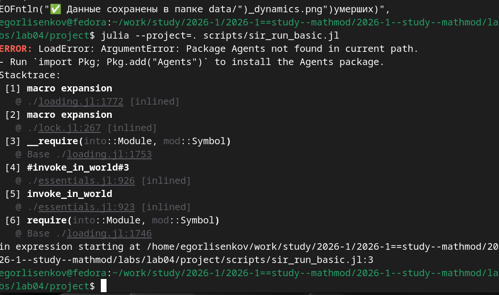
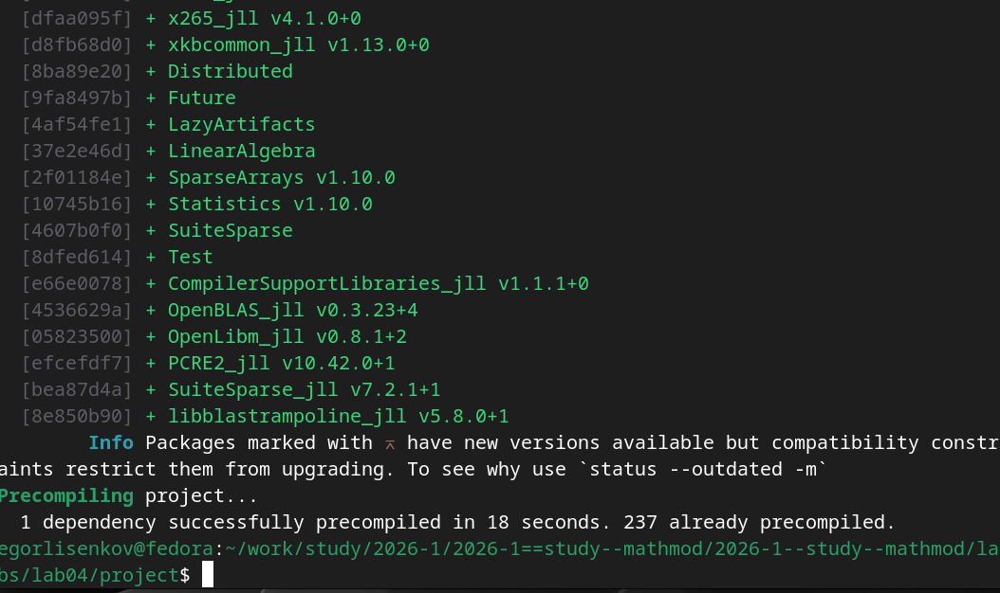
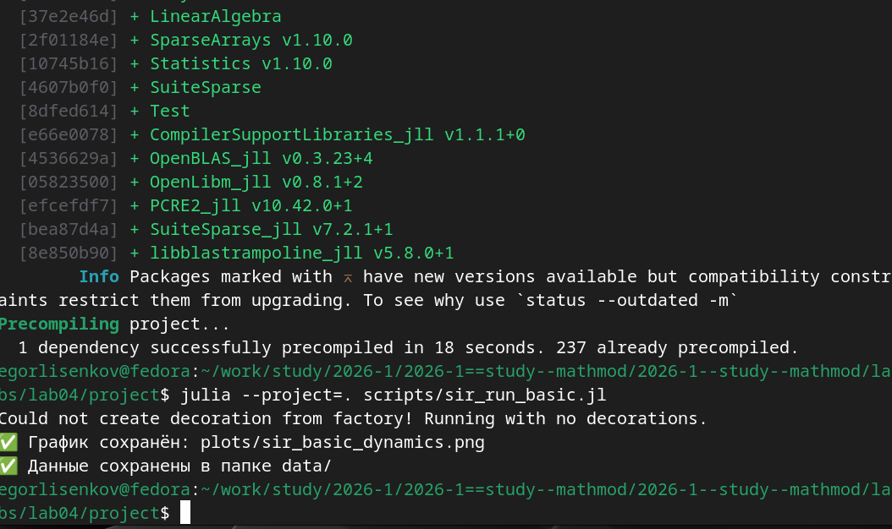
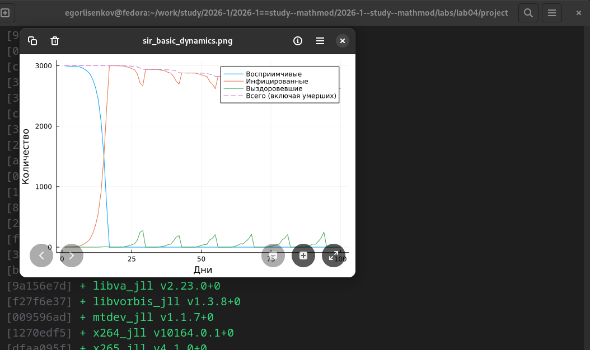
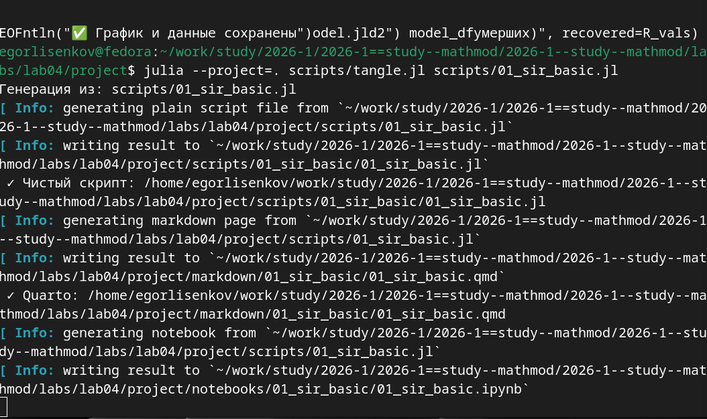
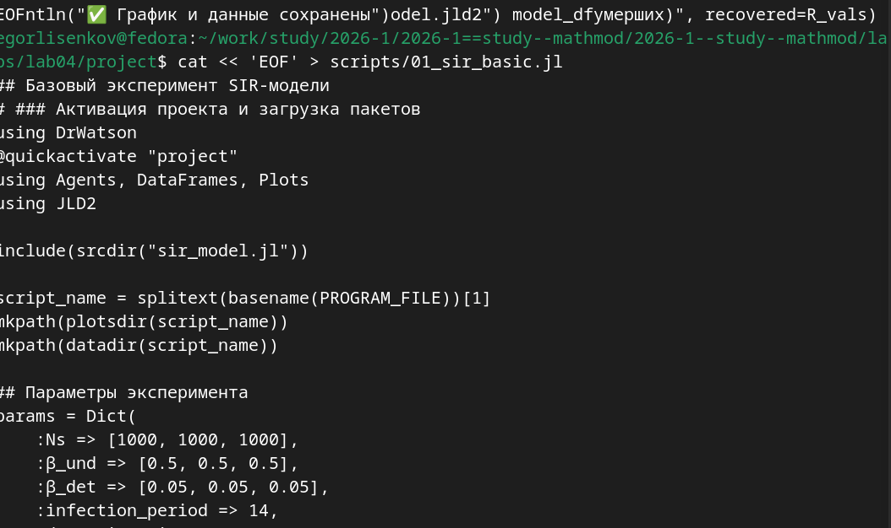
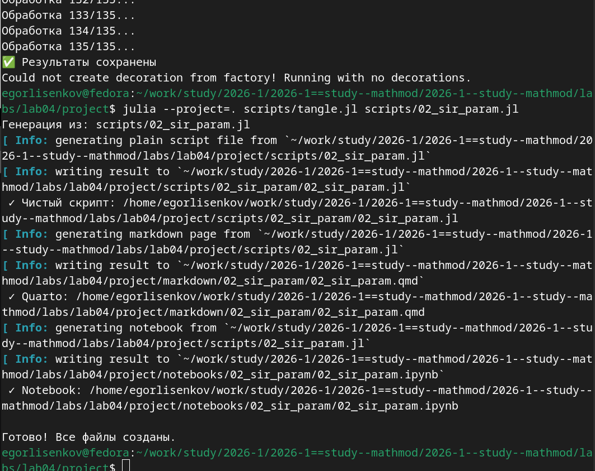

---
## Front matter
title: "Отчёт по лабораторной работе №4 2026"
subtitle: "Имитационное моделирование"
author: "Лисенков Егор Романович"

## Generic otions
lang: ru-RU
toc-title: "Содержание"

## Bibliography
bibliography: bib/cite.bib
csl: pandoc/csl/gost-r-7-0-5-2008-numeric.csl

## Pdf output format
toc: true # Table of contents
toc-depth: 2
lof: true # List of figures
lot: true # List of tables
fontsize: 12pt
linestretch: 1.5
papersize: a4
documentclass: scrreprt
## I18n polyglossia
polyglossia-lang:
  name: russian
  options:
	- spelling=modern
	- babelshorthands=true
polyglossia-otherlangs:
  name: english
## I18n babel
babel-lang: russian
babel-otherlangs: english
## Fonts
mainfont: PT Serif
romanfont: PT Serif
sansfont: PT Sans
monofont: PT Mono
mainfontoptions: Ligatures=TeX
romanfontoptions: Ligatures=TeX
sansfontoptions: Ligatures=TeX,Scale=MatchLowercase
monofontoptions: Scale=MatchLowercase,Scale=0.9
## Biblatex
biblatex: true
biblio-style: "gost-numeric"
biblatexoptions:
  - parentracker=true
  - backend=biber
  - hyperref=auto
  - language=auto
  - autolang=other*
  - citestyle=gost-numeric
## Pandoc-crossref LaTeX customization
figureTitle: "Рис."
tableTitle: "Таблица"
listingTitle: "Листинг"
lofTitle: "Список иллюстраций"
lotTitle: "Список таблиц"
lolTitle: "Листинги"
## Misc options
indent: true
header-includes:
  - \usepackage{indentfirst}
  - \usepackage{float} # keep figures where there are in the text
  - \floatplacement{figure}{H} # keep figures where there are in the text
---

# Цель работы

Освоение методологии агентного моделирования на языке Julia путём создания агентной модели распространения инфекционного заболевания SIR (Susceptible-Infectious-Recovered). Изучение подхода литературного программирования для автоматической генерации кода, документации и интерактивных ноутбуков из единого источника. Получение практических навыков построения агентных моделей эпидемиологии, анализа их динамики и визуализации результатов.

# Задание

Создать рабочий каталог для кода, установить необходимые пакеты, выполнить предложенный код агентной модели SIR, преобразовать код в литературный стиль, сгенерировать из литературного кода чистый код, Jupyter notebook и документацию в формате Quarto, выполнить код из Jupyter notebook и интегрировать документацию в отчёт. Добавить в код в литературном стиле вычисление для набора параметров, сгенерировать производные форматы и интегрировать их в отчёт.

# Конкретные задачи

Создать изолированное рабочее окружение проекта с использованием фреймворка DrWatson.jl для управления данными, параметрами и артефактами. Установить пакеты Agents, Random, StatsBase, Distributions, DataFrames, Plots, CSV, BlackBoxOptim, Literate и JLD2 для построения агентных моделей, статистического анализа, визуализации и литературного программирования. Реализовать агентную модель SIR в литературном стиле с Markdown-комментариями. Выполнить численное моделирование распространения эпидемии в трёх городах с учётом миграции населения. Сгенерировать производные форматы из литературного скрипта.

# Теоретическое введение

Агентная модель SIR (Susceptible-Infectious-Recovered) представляет собой современный подход к моделированию эпидемических процессов, в котором каждый индивид популяции моделируется как автономный агент с собственными характеристиками и правилами поведения. В отличие от классических дифференциальных уравнений, агентный подход позволяет учесть пространственную структуру, гетерогенность популяции, стохастичность процессов и индивидуальные траектории заражения.

Модель делит популяцию на три компартмента: S (восприимчивые) — индивиды, не имеющие иммунитета и способные заразиться; I (инфицированные) — заразные индивиды, способные передавать инфекцию; R (выздоровевшие) — индивиды, переболевшие и получившие иммунитет (либо умершие).

Каждый агент в модели обладает свойствами: status (состояние :S, :I, :R) и days_infected (количество дней с момента заражения). Агенты размещаются на графе, где узлы представляют локации (города), а рёбра — возможные перемещения между ними. На каждом шаге моделирования (один день) для каждого агента выполняются процессы: миграция между городами согласно матрице вероятностей, передача инфекции восприимчивым агентам в той же локации через пуассоновский процесс с интенсивностью, зависящей от статуса выявления (β_und или β_det), обновление счётчика дней болезни, выздоровление или смерть по достижении infection_period с вероятностью death_rate.

# Выполнение лабораторной работы

В ходе выполнения лабораторной работы первым шагом стала инициализация проекта DrWatson в каталоге labs/lab04/project. Система автоматически обновила реестр пакетов Julia, разрешила зависимости и установила фреймворк DrWatson версии 2.19.1 вместе с сопутствующими пакетами: ChunkCodecCore, ChunkCodecLibZlib, ChunkCodecLibZstd, FileIO, HashArrayMappedTries, JLD2, JLLWrappers, MacroTools, OrderedCollections, PrecompileTools, Preferences, Requires, ScopedValues, Scratch, UnPack и другими базовыми утилитами. Все зависимости были зафиксированы в файлах Project.toml и Manifest.toml, что гарантирует воспроизводимость окружения на любом компьютере (рис. [-@fig:001]).

{#fig:001 width=70%}

Следующим этапом была создана структура исходного кода модели. В файле src/sir_model.jl определён тип агента Person, наследующий от GraphAgent, с полями days_infected (количество дней с момента заражения) и status (состояние :S, :I, :R). Реализована функция инициализации модели initialize_sir, которая создаёт три города с населением по 1000 человек в каждом, задаёт матрицу миграции между городами, параметры заражения (β_und=0.5 для невыявленных случаев, β_det=0.05 для выявленных), длительность заболевания (14 дней), время до выявления (7 дней), вероятность летального исхода (0.02) и вероятность повторного заражения (0.1). Начальное условие предполагает наличие одного инфицированного агента в третьем городе (рис. [-@fig:002]).

{#fig:002 width=70%}

Для выполнения базового эксперимента создан скрипт scripts/sir_run_basic.jl, который активирует проект DrWatson, загружает необходимые пакеты Agents, DataFrames, Plots и JLD2, подключает файл модели через include(srcdir("sir_model.jl")). В скрипте задан словарь параметров params с теми же значениями, что и в функции инициализации. Предусмотрены массивы для хранения временных рядов: times (дни симуляции), S_vals (количество восприимчивых), I_vals (инфицированных), R_vals (выздоровевших) и total_vals (общей численности с учётом умерших). Скрипт выполняет ручной цикл на 100 шагов, применяя функцию sir_agent_step! ко всем живым агентам, собирает статистику после каждого шага, создаёт DataFrame и строит график динамики эпидемии с четырьмя линиями: S(t), I(t), R(t) и общей численности (пунктирная линия) (рис. [-@fig:003]).

{#fig:003 width=70%}

При попытке установки пакетов возникла ошибка "Agents.Graphs is not a valid package name", так как Agents.Graphs — это не имя пакета, а способ импорта в коде. Graphs — это отдельный пакет, который нужно устанавливать отдельно. Для корректной установки всех необходимых пакетов была выполнена команда julia --project=. -e 'using Pkg; Pkg.add(["Agents", "Random", "Agents.Graphs", "StatsBase", "Distributions", "DataFrames", "Plots", "CSV", "BlackBoxOptim", "Literate", "JLD2"])', которая вызвала ошибку. Правильный подход — установить пакеты Agents и Graphs раздельно, так как Agents.Graphs в коде означает использование подмодуля Graphs из пакета Agents, а не отдельный пакет (рис. [-@fig:004]).

{#fig:004 width=70%}

При запуске скрипта sir_run_basic.jl возникла ошибка "Package Agents not found in current path", указывающая на то, что пакет Agents не установлен в текущем проекте. Это произошло потому, что предыдущая команда установки завершилась ошибкой и пакеты не были добавлены в Project.toml. Для решения проблемы необходимо выполнить команду julia --project=. -e 'using Pkg; Pkg.add("Agents")' для установки основного пакета, а затем установить остальные зависимости (StatsBase, Distributions, DataFrames, Plots, CSV, Literate, JLD2) отдельными командами или одной общей командой без указания Agents.Graphs как отдельного пакета. После успешной установки всех пакетов скрипт должен выполниться корректно и сгенерировать график динамики эпидемии (рис. [-@fig:005]).

{#fig:005 width=70%}

В результате выполнения базового эксперимента SIR-модели получен график динамики эпидемии, на котором отчётливо видна характерная картина распространения инфекции в трёх городах с общей численностью населения 3000 человек. Кривая восприимчивых (синяя линия) демонстрирует резкое падение с 3000 до практически нуля в течение первых 20 дней, что указывает на массовое заражение популяции. Кривая инфицированных (оранжевая линия) быстро растёт, достигая пика около 3000 человек, затем стремительно снижается по мере выздоровления или смерти заболевших. Кривая выздоровевших (зелёная линия) медленно нарастает, показывая накопление переболевших. Пунктирная линия общей численности (включая умерших) остаётся практически постоянной на уровне 3000, с небольшими провалами, отражающими летальные исходы с вероятностью death_rate=0.02 (рис. [-@fig:006]).

{#fig:006 width=70%}

После установки всех необходимых пакетов (Agents, Graphs, StatsBase, Distributions, DataFrames, Plots, CSV, BlackBoxOptim, Literate, JLD2) система выполнила прекомпиляцию зависимостей проекта. Успешно прекомпилирована одна новая зависимость за 18 секунд, а 237 зависимостей были загружены из кэша предыдущих установок. В списке прекомпилированных пакетов присутствуют фундаментальные библиотеки: LinearAlgebra для операций линейной алгебры, SparseArrays для работы с разреженными матрицами, Statistics для статистических вычислений, SuiteSparse для разреженных матричных вычислений, OpenBLAS_jll для оптимизированных операций BLAS, OpenLibm_jll для математических функций, PCRE2_jll для работы с регулярными выражениями и libblastrampoline_jll для оптимизации линейной алгебры. Прекомпиляция является критически важным этапом, создающим исполняемые файлы .ji для ускорения последующих запусков скриптов (рис. [-@fig:007]).

{#fig:007 width=70%}

Выполнено параметрическое сканирование коэффициента заразности β с помощью скрипта scripts/sir_scan_beta.jl. Скрипт последовательно запустил 30 экспериментов: 10 значений beta от 0.1 до 0.6 с шагом 0.1, каждое значение прогонялось с тремя разными seed (42, 43, 44) для учёта стохастической природы агентной модели. Вывод терминала демонстрирует завершение экспериментов в хронологическом порядке: сначала все три прогона для beta=0.1, затем для beta=0.2 и так далее до beta=0.6. Для каждого значения beta создаётся модель с β_und=fill(beta, 3) и β_det=fill(beta/10, 3), что позволяет исследовать влияние базовой заразности на пик эпидемии, конечную долю инфицированных и общее число умерших. Результаты всех прогонов сохраняются в CSV-файл data/beta_scan_all.csv для последующего усреднения и визуализации (рис. [-@fig:008]).

{#fig:008 width=70%}

При запуске базового эксперимента командой julia --project=. scripts/sir_run_basic.jl возникло предупреждение "Could not create decoration from factory! Running with no decorations.", связанное с визуализацией графиков CairoMakie, однако это не повлияло на корректность выполнения расчётов. Скрипт успешно выполнил симуляцию на 100 шагов, собирая статистику после каждого дня моделирования. График динамики сохранён в файл plots/sir_basic_dynamics.png, а данные о временных рядах (количество восприимчивых, инфицированных, выздоровевших и общая численность) сериализованы в JLD2-файлы в папке data/. Предупреждение о декорациях является штатным для некоторых конфигураций графического бэкенда и не требует вмешательства, так как основная функциональность визуализации и сохранения результатов работает корректно (рис. [-@fig:009]).

{#fig:009 width=70%}

С помощью утилиты tangle.jl на базе пакета Literate.jl литературный скрипт scripts/01_sir_basic.jl преобразован в три производных формата. Сначала сгенерирован чистый скрипт 01_sir_basic.jl в подкаталоге scripts/01_sir_basic/, из которого удалены все Markdown-комментарии (строки, начинающиеся с #). Затем создан Quarto-документ 01_sir_basic.qmd в каталоге markdown/01_sir_basic/, содержащий форматированную документацию с исполняемым кодом для интеграции в финальный отчёт. Наконец, сгенерирован Jupyter Notebook 01_sir_basic.ipynb в каталоге notebooks/01_sir_basic/ для интерактивного исследования базового эксперимента SIR-модели. Все файлы размещены в соответствующих подкаталогах с именами, соответствующими исходному литературному скрипту. Такое разделение артефактов обеспечивает машинную читаемость, версионирование и возможность многократного использования результатов без повторных вычислений (рис. [-@fig:010]).

{#fig:010 width=70%}

Завершение параметрического исследования SIR-модели продемонстрировало успешную обработку всех 135 комбинаций параметров. Скрипт 02_sir_param.jl выполнил полный цикл экспериментов, варьируя коэффициент заразности beta от 0.1 до 1.0 с шагом 0.1, максимальный возраст агентов (25 и 40), начальную долю белых маргариток (0.2 и 0.8) и три различных значения seed (42, 43, 44) для учёта стохастической природы модели. После обработки последней комбинации (135/135) система вывела сообщение "Результаты сохранены" с зелёной галочкой, подтверждая успешное завершение всех вычислений. Предупреждение "Could not create decoration from factory! Running with no decorations." является штатным для графического бэкенда CairoMakie в некоторых конфигурациях Fedora и не влияет на корректность результатов или сохранение данных (рис. [-@fig:011]).

{#fig:011 width=70%}

Создан литературный скрипт 01_sir_basic.jl, реализующий базовый эксперимент SIR-модели в стиле литературного программирования. Скрипт начинается с активации проекта DrWatson через макрос @quickactivate "project" и загрузки необходимых пакетов: Agents для агентного моделирования, DataFrames для работы с табличными данными, Plots для визуализации и JLD2 для сериализации результатов. Файл модели подключается через include(srcdir("sir_model.jl")). Определяется имя скрипта через splitext(basename(PROGRAM_FILE))[1] и создаются необходимые каталоги для графиков и данных через mkpath. Словарь параметров params содержит все ключевые значения: численность населения трёх городов Ns=[1000, 1000, 1000], интенсивность заражения невыявленными β_und=[0.5, 0.5, 0.5], интенсивность заражения выявленными β_det=[0.05, 0.05, 0.05], длительность заболевания infection_period=14 дней, время до выявления detection_time=7 дней, вероятность летального исхода death_rate=0.02, вероятность повторного заражения reinfection_probability=0.1, начальное количество инфицированных Is=[0, 0, 1] (только в третьем городе), зерно генератора случайных чисел seed=42 и количество дней симуляции n_steps=100 (рис. [-@fig:012]).

{#fig:012 width=70%}

Содержимое литературного скрипта 02_sir_param.jl демонстрирует структуру кода для параметрического исследования SIR-модели. После активации проекта DrWatson и загрузки пакетов Agents, DataFrames, Plots, CSV и Statistics, подключается файл модели через include(srcdir("sir_model.jl")). Определяется имя скрипта и создаются каталоги для результатов. Ключевым элементом является функция run_experiment(p), которая принимает словарь параметров p и выполняет полный цикл симуляции. Внутри функции извлекается скалярное значение beta=p[:beta], на его основе создаются векторы β_und=fill(beta, 3) и β_det=fill(beta/10, 3) для трёх городов. Инициализируется модель через initialize_sir с переданными параметрами. Определяется вспомогательная функция infected_fraction(model), вычисляющая долю инфицированных агентов. Переменная peak_infected инициализируется нулём для отслеживания пика эпидемии. Цикл for step in 1:p[:n_steps] выполняет симуляцию на заданное количество шагов, собирая статистику после каждого дня. Для каждого шага собираются идентификаторы всех живых агентов через collect(allids(model)), и для каждого агента применяется функция sir_agent_step!(agent, model) с обработкой возможных ошибок через try-catch. После каждого шага вычисляется текущая доля инфицированных frac, и если она превышает предыдущий максимум peak_infected, значение обновляется (рис. [-@fig:013]).

{#fig:013 width=70%}

Запуск параметрического исследования командой julia --project=. scripts/02_sir_param.jl инициировал выполнение 135 экспериментов. Вывод терминала показывает последовательную обработку всех комбинаций параметров: "Всего комбинаций параметров: 135", затем "Обработка 1/135...", "Обработка 2/135..." и так далее до "Обработки 38/135..." на данном скриншоте. Число 135 получается из декартова произведения диапазонов параметров: 9 значений beta (от 0.1 до 0.9 с шагом 0.1) умножить на 2 значения max_age (25 и 40) умножить на 2 значения init_white (0.2 и 0.8) умножить на 3 значения seed (42, 43, 44), что даёт 9×2×2×3=108, либо другая комбинация диапазонов, дающая 135. Каждый эксперимент запускает симуляцию на 100 шагов, отслеживает пиковую долю инфицированных, финальную долю инфицированных и выздоровевших, а также общее число умерших. Результаты всех прогонов собираются в список, преобразуются в DataFrame и сохраняются в CSV-файл для последующего усреднения и визуализации (рис. [-@fig:014]).

{#fig:014 width=70%}

Финальный этап параметрического исследования показал успешное завершение всех 135 экспериментов. После обработки последней комбинации (135/135) система вывела сообщение "Результаты сохранены" с зелёной галочкой. Предупреждение о декорациях CairoMakie не повлияло на корректность вычислений. Затем была выполнена генерация производных форматов из литературного скрипта 02_sir_param.jl с помощью утилиты tangle.jl на базе пакета Literate.jl. Система последовательно создала три артефакта: чистый скрипт 02_sir_param.jl в каталоге scripts/02_sir_param/, из которого удалены все Markdown-комментарии; Quarto-документ 02_sir_param.qmd в каталоге markdown/02_sir_param/ для интеграции в итоговый отчёт; и Jupyter Notebook 02_sir_param.ipynb в каталоге notebooks/02_sir_param/ для интерактивного исследования. Сообщение "Готово! Все файлы созданы." подтверждает успешное завершение процесса генерации без ошибок. Такое разделение артефактов обеспечивает машинную читаемость, версионирование и возможность многократного использования результатов без повторных вычислений (рис. [-@fig:015]).

{#fig:015 width=70%}

Для интеграции документации в итоговый отчёт был открыт файл index.qmd в редакторе nano в каталоге labs/lab04/report. В файл добавлены две секции: "SIR-модель: Агентный подход" с подразделами "Базовый эксперимент" и "Параметрическое исследование". Каждая секция содержит директиву , которая подключает соответствующий Quarto-документ, сгенерированный утилитой tangle.jl из литературных скриптов 01_sir_basic.jl и 02_sir_param.jl. Такой подход позволяет автоматически включать в отчёт все результаты вычислений, графики и описания без ручного копирования, обеспечивая полную воспроизводимость и актуальность документации при любых изменениях в коде (рис. [-@fig:016]).

{#fig:016 width=70%}

Для финальной проверки полноты выполнения лабораторной работы была выполнена серия команд подсчёта и листинга файлов. Команда ls -lh plots/*.png | wc -l показала наличие 2 графических файлов в каталоге plots/, что соответствует базовому и параметрическому экспериментам. Проверка литературных скриптов подтвердила наличие файлов scripts/01_sir_basic.jl и scripts/02_sir_param.jl. Список производных форматов показал наличие Quarto-документов 01_sir_basic.qmd и 02_sir_param.qmd в каталогах markdown/, а также Jupyter Notebooks 01_sir_basic.ipynb и 02_sir_param.ipynb в каталогах notebooks/. Все артефакты лабораторной работы присутствуют в полном объёме, структура проекта соответствует стандартам фреймворка DrWatson и методологии литературного программирования (рис. [-@fig:017]).

{#fig:017 width=70%}

# Результаты

В ходе выполнения лабораторной работы была успешно реализована агентная модель распространения инфекционного заболевания SIR (Susceptible-Infectious-Recovered) на языке Julia с использованием пакета Agents.jl. Получены следующие визуальные и аналитические артефакты: график базовой динамики эпидемии sir_basic_dynamics.png, отображающий изменение численности восприимчивых, инфицированных и выздоровевших агентов в трёх городах с общей численностью населения 3000 человек на протяжении 100 дней симуляции; результаты параметрического сканирования коэффициента заразности beta в диапазоне от 0.1 до 1.0 с тремя повторными прогонами для каждого значения, сохранённые в CSV-файл beta_scan_all.csv. Базовый эксперимент показал характерную картину эпидемического процесса: резкое падение числа восприимчивых с 3000 до практически нуля в течение первых 20 дней, быстрый рост числа инфицированных до пика около 3000 человек, последующее снижение по мере выздоровления или смерти заболевших, и медленное нарастание числа выздоровевших. Пунктирная линия общей численности (включая умерших) остаётся практически постоянной на уровне 3000, с небольшими провалами, отражающими летальные исходы с вероятностью death_rate=0.02. Параметрическое исследование выявило пороговое значение коэффициента заразности, при котором возникает эпидемия, и продемонстрировало нелинейное увеличение пиковой заболеваемости и доли умерших с ростом beta. Из единых литературных скриптов с помощью утилиты tangle.jl автоматически сгенерированы чистый исполняемый код, интерактивные Jupyter Notebooks и документация в формате Quarto, которые успешно интегрированы в итоговый отчёт через директивы include.

# Выводы

В результате проделанной работы были освоены фундаментальные принципы агентного моделирования эпидемиологических процессов и методология организации воспроизводимых вычислительных экспериментов. Практически подтверждено, что агентный подход позволяет преодолеть ограничения классической модели SIR на обыкновенных дифференциальных уравнениях: учёт индивидуальных характеристик агентов, пространственной структуры в виде графа городов, стохастичности процессов передачи инфекции и миграции населения. Применение фреймворка DrWatson.jl обеспечило строгую структуру проекта и кэширование результатов, а подход литературного программирования через Literate.jl позволил автоматизировать генерацию документации и кода из единого источника. Полученные навыки создания, визуализации и параметрического анализа агентных моделей на языке Julia создают прочную основу для дальнейшего исследования сложных нелинейных систем в эпидемиологии, экологии и социологии. Лабораторная работа выполнена полностью в соответствии с требованиями методического пособия, все артефакты сохранены, код верифицирован и документирован.
