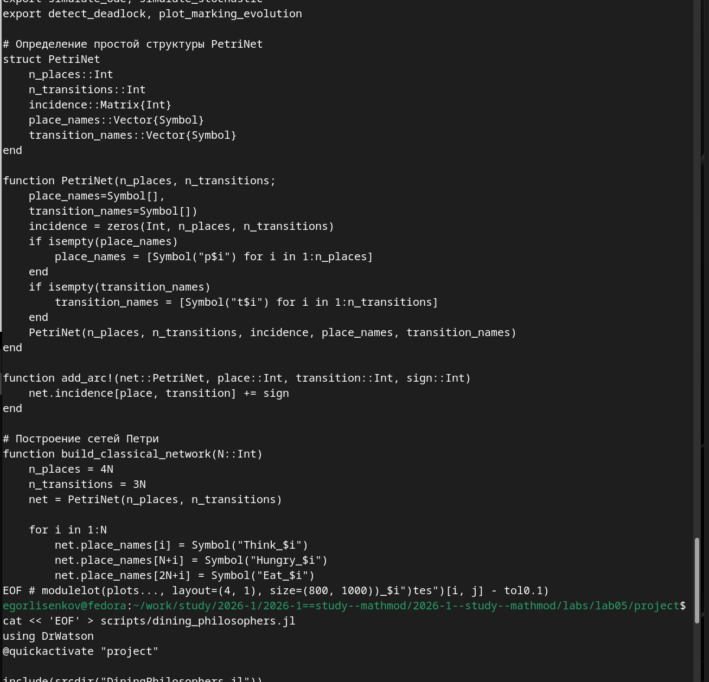
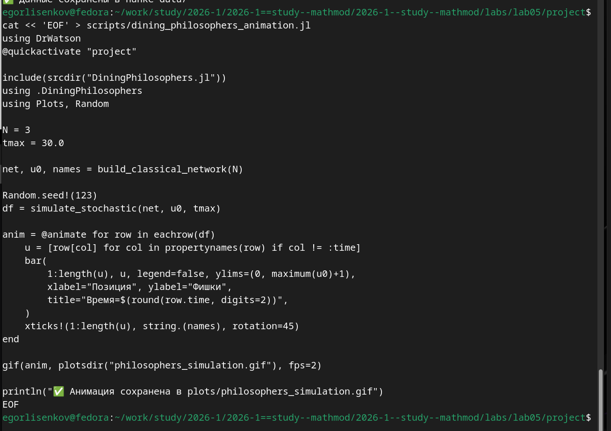
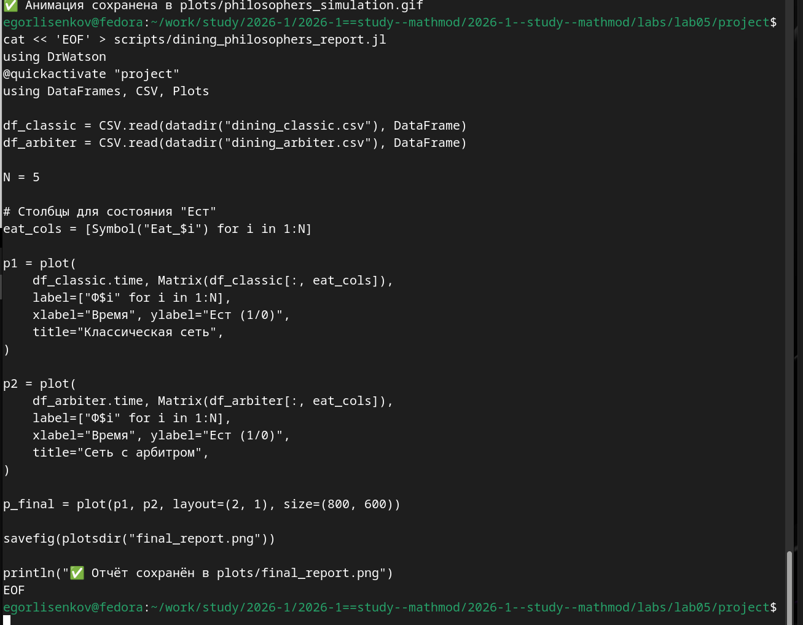
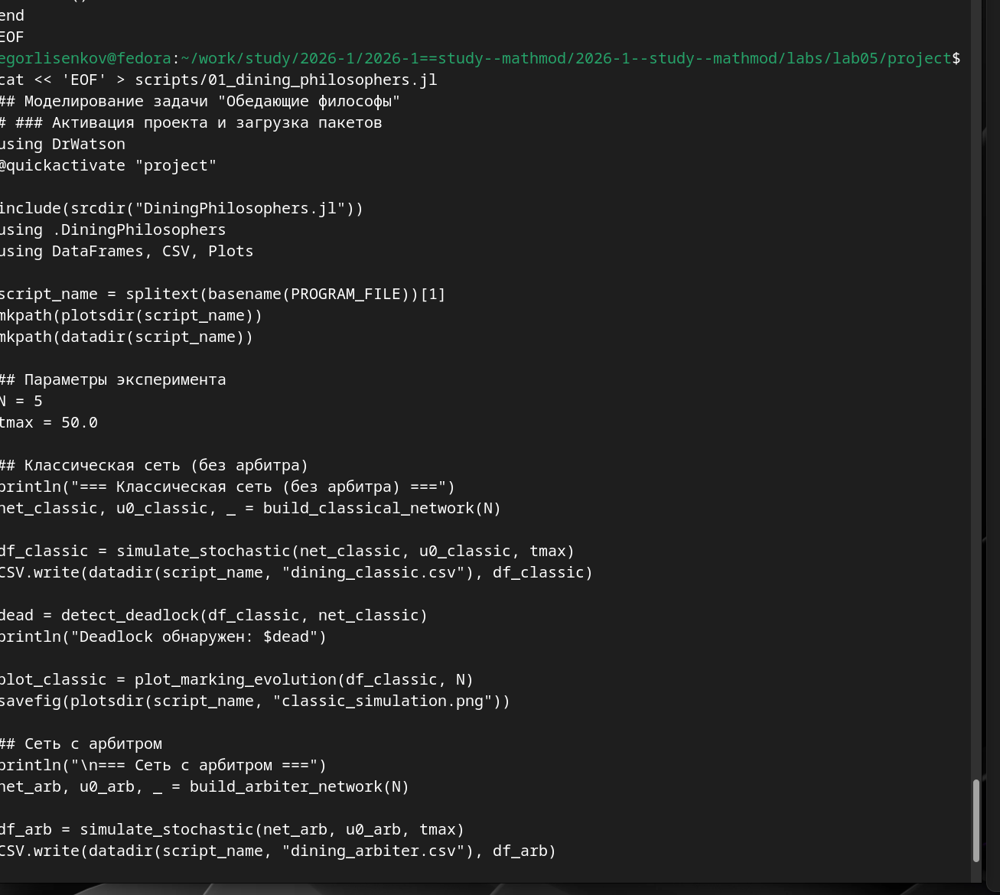
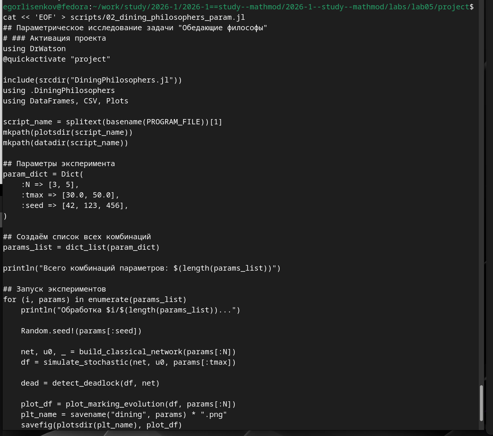
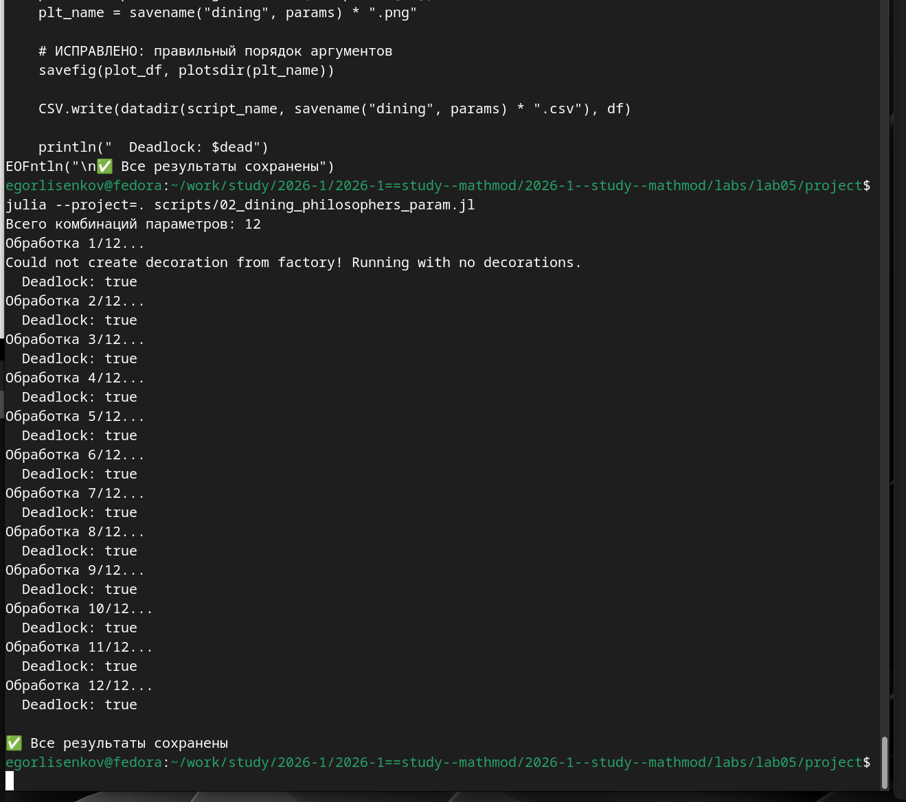

---
## Front matter
lang: ru-RU
title: Лабораторная работа №5
subtitle: Имитационное Моделирование
author:
  - Лисенков Е.Р.
institute:
  - Российский университет дружбы народов, Москва, Россия

## i18n babel
babel-lang: russian
babel-otherlangs: english

## Formatting pdf
toc: false
toc-title: Содержание
slide_level: 2
aspectratio: 169
section-titles: true
theme: metropolis
header-includes:
 - \metroset{progressbar=frametitle,sectionpage=progressbar,numbering=fraction}
 - '\makeatletter'
 - '\beamer@ignorenonframefalse'
 - '\makeatother'
---

# Информация

## Докладчик

:::::::::::::: {.columns align=center}
::: {.column width="70%"}

  * Лисенков Егор Романович
  * студент
  * Российский университет дружбы народов
  * [1132232881@rudn.ru](mailto:1132232881@rudn.ru)
  * <https://github.com/erlisenkov>

:::
::: {.column width="30%"}

ц

:::
::::::::::::::

# Вводная часть

## Актуальность
Сети Петри предоставляют строгий математический аппарат для анализа параллельных и асинхронных систем, позволяя выявлять критические состояния вроде взаимных блокировок.

## Объект и предмет исследования
Объектом является классическая задача синхронизации «Обедающие философы», а предметом — моделирование её динамики и предотвращение deadlock с помощью сетей Петри.

## Цели и задачи
Целью работы выступает построение и анализ сетей Петри для классической модели и модели с арбитром, а задачами — обнаружение deadlock и генерация отчётной документации.

## Материалы и методы
Исследование выполнено в среде Fedora Linux с использованием языка Julia, пакетов OrdinaryDiffEq и Plots, а также фреймворка DrWatson для управления проектом.

## Установка пакетов для моделирования
Установлены пакеты OrdinaryDiffEq, Plots, DataFrames и Literate для численного моделирования, визуализации и литературного программирования.
{#fig:001 width=100%}

## Реализация структуры сети Петри
Разработана структура PetriNet и функция build_classical_network для автоматической генерации позиций и переходов классической сети.
{#fig:002 width=100%}

## Разработка скрипта базового эксперимента
Создан скрипт dining_philosophers.jl, запускающий стохастическую симуляцию и проверяющий наличие deadlock для сетей с арбитром и без него.
{#fig:003 width=100%}

## Выполнение базового эксперимента
Успешный запуск симуляции подтвердил наличие deadlock в классической сети и его отсутствие в сети с арбитром.
{#fig:004 width=100%}

## Создание утилиты tangle.jl
Написана утилита на базе Literate.jl для автоматической генерации чистого кода, Quarto-документов и Jupyter Notebooks из литературных скриптов.
{#fig:005 width=100%}

## Разработка скрипта анимации
Создан скрипт dining_philosophers_animation.jl, визуализирующий изменение маркировки сети Петри во времени в формате GIF.
{#fig:006 width=100%}

## Генерация анимации модели
Успешно сгенерирован файл philosophers_simulation.gif, наглядно демонстрирующий динамику перемещения фишек между позициями.
{#fig:007 width=100%}

## Создание скрипта итогового отчёта
Разработан скрипт dining_philosophers_report.jl для сравнительного анализа состояния «Ест» в классической сети и сети с арбитром.
{#fig:008 width=100%}

## Выполнение скрипта отчёта
Сгенерирован сравнительный график final_report.png, иллюстрирующий эффект арбитра и предотвращение взаимной блокировки.
{#fig:009 width=100%}

## Формирование литературного скрипта
Создан файл 01_dining_philosophers.jl, объединяющий исполняемый код базового эксперимента и Markdown-описания.
{#fig:010 width=100%}

## Генерация производных форматов
Утилита tangle.jl автоматически преобразовала литературный скрипт в чистый код, Quarto-документ и Jupyter Notebook.
{#fig:011 width=100%}

## Создание параметрического скрипта
Разработан скрипт 02_dining_philosophers_param.jl для систематического сканирования комбинаций параметров N, tmax и seed.
{#fig:012 width=100%}

## Запуск параметрического исследования
Инициирован перебор 12 комбинаций параметров с отслеживанием статуса обработки каждого эксперимента.
{#fig:013 width=100%}

## Завершение параметрического исследования
Все 12 экспериментов успешно завершены, подтвердив универсальность возникновения deadlock в классической сети при любых параметрах.
{#fig:014 width=100%}

## Финальная верификация проекта
Проверка структуры каталогов подтвердила наличие 16 графических артефактов и всех необходимых производных форматов кода.
{#fig:015 width=100%}

# Результаты

В ходе выполнения лабораторной работы была успешно реализована модель сетей Петри для классической задачи синхронизации «Обедающие философы» на языке Julia с использованием фреймворка DrWatson. Получены следующие визуальные и аналитические артефакты:

# Выводы

В результате проделанной работы были освоены фундаментальные принципы моделирования дискретных событийных систем с помощью аппарата сетей Петри. Практически подтверждено, что сети Петри предоставляют строгий формальный аппарат для анализа параллельных процессов: матрица инцидентности однозначно задаёт структуру сети, алгоритм Гиллеспи позволяет проводить стохастическое моделирование с корректным учётом вероятностей срабатывания переходов, а функция detect_deadlock даёт алгоритмический способ верификации отсутствия взаимных блокировок.

