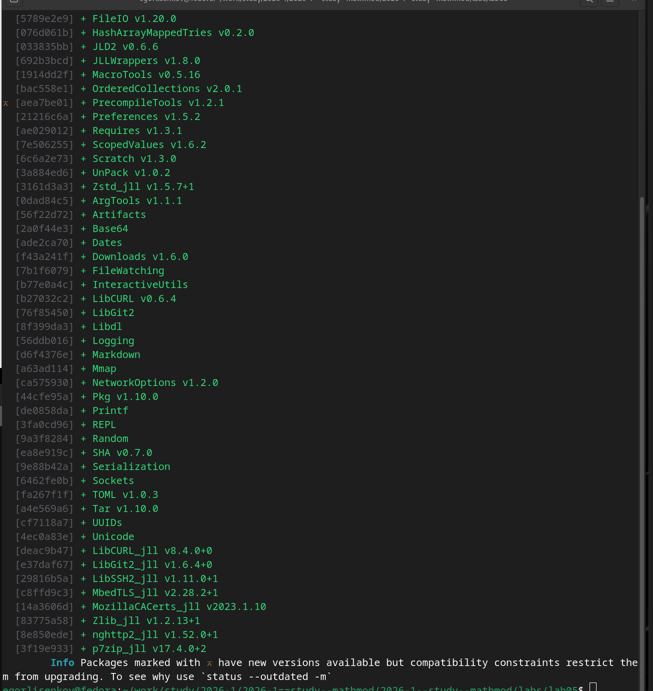
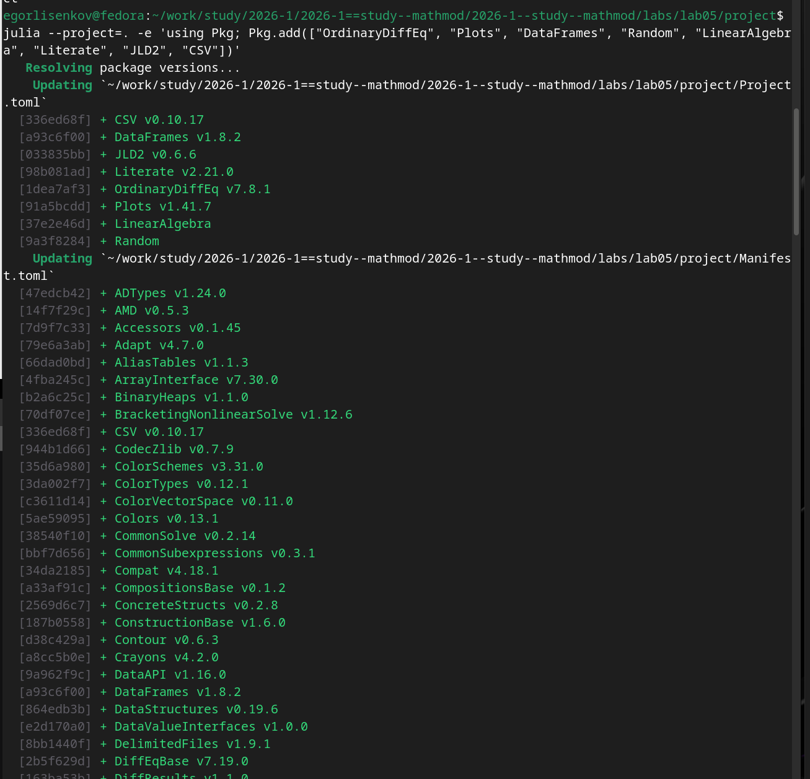
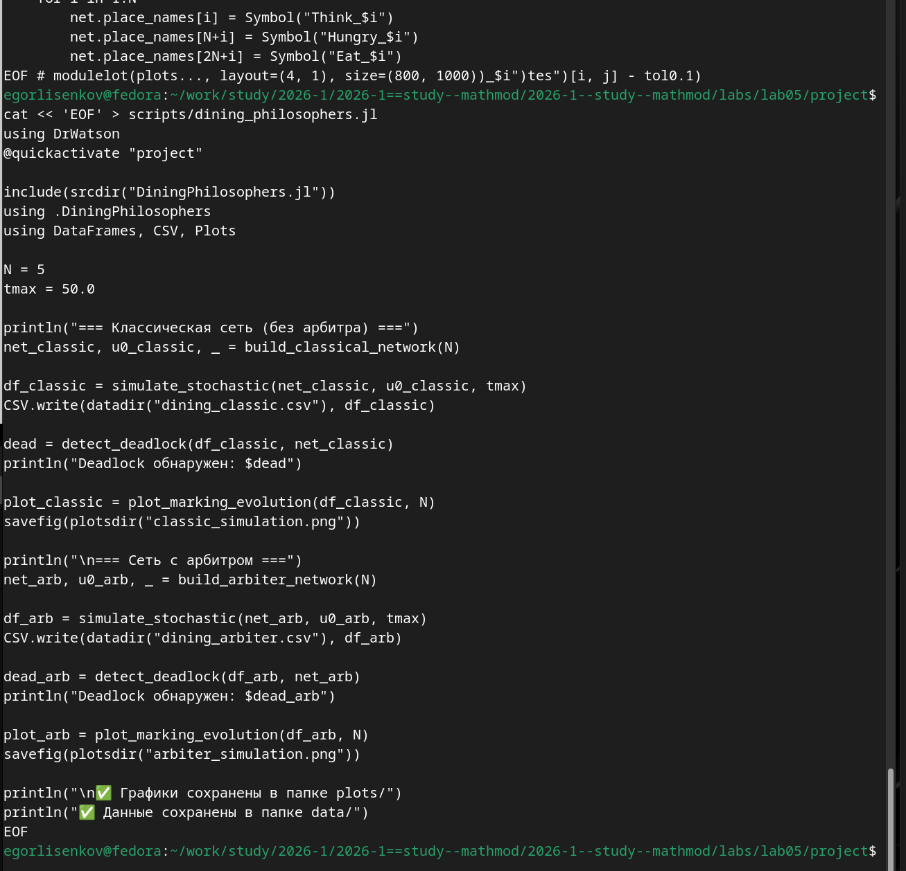
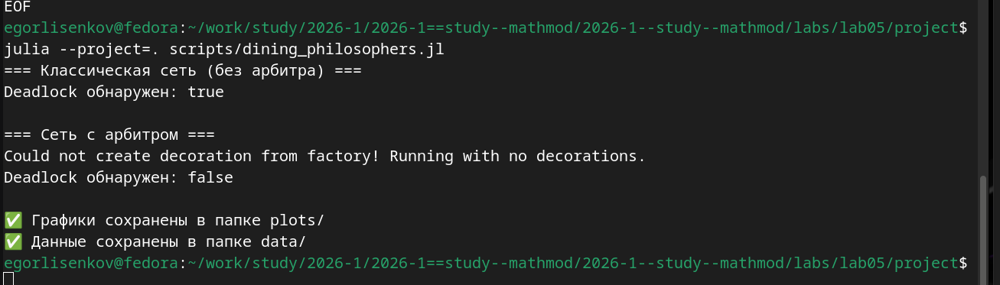
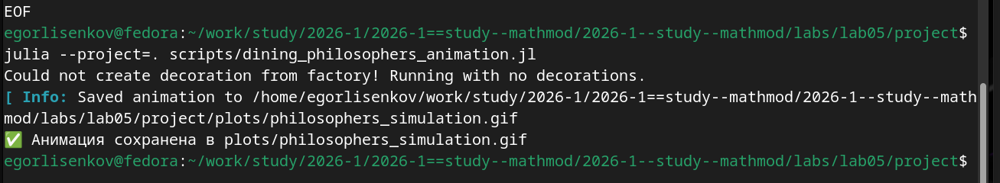
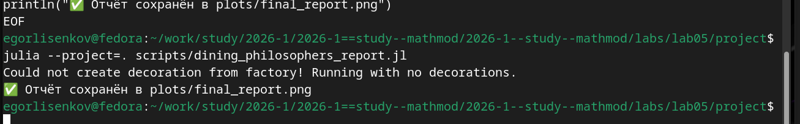
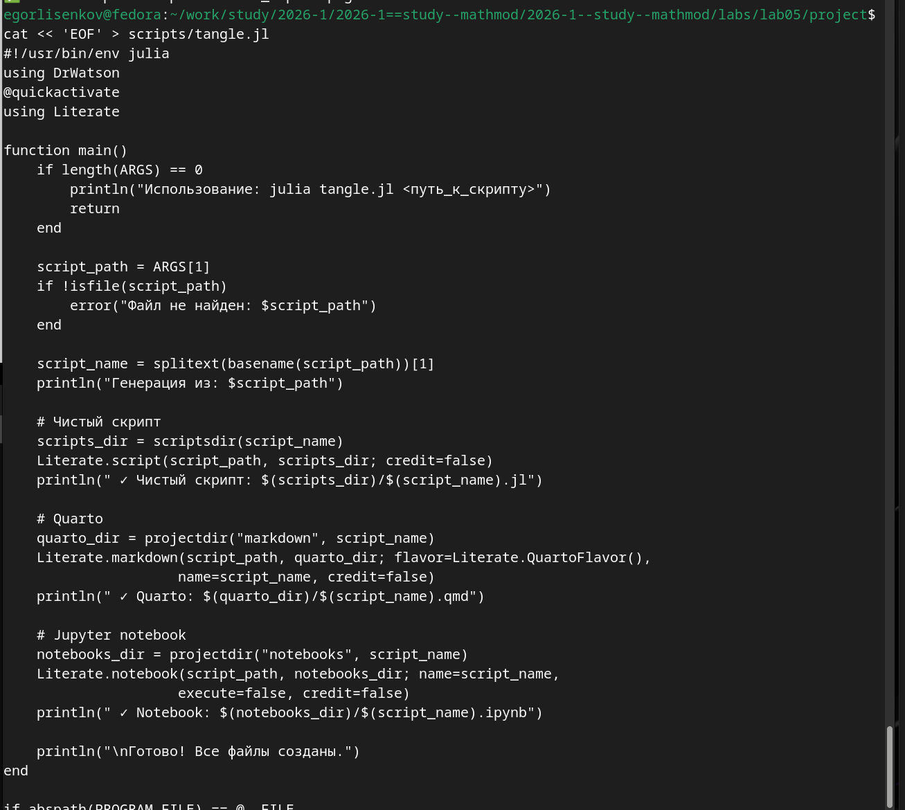
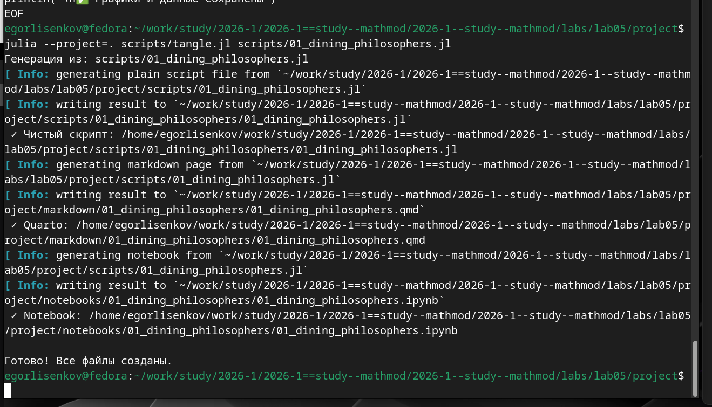
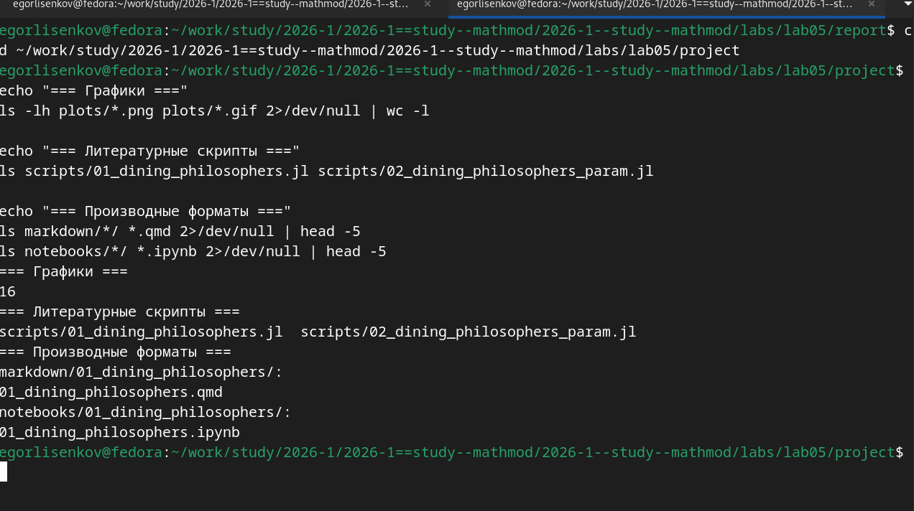

---
## Front matter
title: "Отчёт по лабораторной работе №5 2026"
subtitle: "Имитационное моделирование"
author: "Лисенков Егор Романович"

## Generic otions
lang: ru-RU
toc-title: "Содержание"

## Bibliography
bibliography: bib/cite.bib
csl: pandoc/csl/gost-r-7-0-5-2008-numeric.csl

## Pdf output format
toc: true # Table of contents
toc-depth: 2
lof: true # List of figures
lot: true # List of tables
fontsize: 12pt
linestretch: 1.5
papersize: a4
documentclass: scrreprt
## I18n polyglossia
polyglossia-lang:
  name: russian
  options:
	- spelling=modern
	- babelshorthands=true
polyglossia-otherlangs:
  name: english
## I18n babel
babel-lang: russian
babel-otherlangs: english
## Fonts
mainfont: PT Serif
romanfont: PT Serif
sansfont: PT Sans
monofont: PT Mono
mainfontoptions: Ligatures=TeX
romanfontoptions: Ligatures=TeX
sansfontoptions: Ligatures=TeX,Scale=MatchLowercase
monofontoptions: Scale=MatchLowercase,Scale=0.9
## Biblatex
biblatex: true
biblio-style: "gost-numeric"
biblatexoptions:
  - parentracker=true
  - backend=biber
  - hyperref=auto
  - language=auto
  - autolang=other*
  - citestyle=gost-numeric
## Pandoc-crossref LaTeX customization
figureTitle: "Рис."
tableTitle: "Таблица"
listingTitle: "Листинг"
lofTitle: "Список иллюстраций"
lotTitle: "Список таблиц"
lolTitle: "Листинги"
## Misc options
indent: true
header-includes:
  - \usepackage{indentfirst}
  - \usepackage{float} # keep figures where there are in the text
  - \floatplacement{figure}{H} # keep figures where there are in the text
---

# Цель работы

Освоение аппарата сетей Петри для моделирования дискретных событийных систем на примере классической задачи синхронизации "Обедающие философы". Изучение методов обнаружения взаимных блокировок (deadlock) и способов их предотвращения с помощью модификации структуры сети. Получение практических навыков построения, анализа и имитационного моделирования сетей Петри с использованием языка Julia и пакета DrWatson.

# Задание

Построить сеть Петри для моделирования задачи обедающих философов, реализующую захват и освобождение вилок. Обнаружить состояние взаимной блокировки (deadlock), когда каждый философ взял одну вилку и ждёт вторую. Провести имитационное моделирование (стохастическое и детерминированное) и выявить наличие deadlock. Модифицировать сеть путём введения арбитра для предотвращения deadlock. Проанализировать результаты и оформить отчёт с графиками и анимацией.

# Конкретные задачи

Создать изолированное рабочее окружение проекта с использованием фреймворка DrWatson.jl для управления данными, параметрами и артефактами. Установить пакеты OrdinaryDiffEq, Plots, DataFrames, Random, LinearAlgebra, Literate, JLD2 и CSV для численного моделирования, визуализации и литературного программирования. Реализовать модуль DiningPhilosophers.jl с определением структуры PetriNet, функций построения классической сети и сети с арбитром, алгоритмов стохастического и детерминированного моделирования, функции обнаружения deadlock. Выполнить базовый эксперимент с N=5 философами, проанализировать результаты моделирования. Сгенерировать производные форматы из литературного скрипта.

# Теоретическое введение

Сети Петри, предложенные Карлом Адамом Петри в 1962 году, являются мощным математическим аппаратом для моделирования дискретных событийных систем, особенно параллельных, асинхронных и распределённых процессов. Сеть Петри представляет собой двудольный ориентированный граф, состоящий из двух типов вершин: позиций (places), обозначаемых кругами и описывающих состояния системы или наличие ресурсов, и переходов (transitions), обозначаемых прямоугольниками и моделирующих события или действия. Позиции могут содержать фишки (tokens) — неотрицательное целое число, указывающее на количество ресурсов или кратность выполнения условия. Распределение фишек по позициям называется маркировкой и определяет текущее состояние системы.

Переход считается разрешённым (enabled), если каждая его входная позиция содержит как минимум столько фишек, сколько указывает кратность входной дуги. Срабатывание перехода — атомарная операция, которая удаляет из входных позиций фишки и добавляет их в выходные позиции согласно кратностям дуг. Это позволяет моделировать конкуренцию за ресурсы, синхронизацию процессов и причинно-следственные связи.

Задача "Обедающие философы", сформулированная Эдсгером Дейкстрой в 1965 году, является классической иллюстрацией проблем синхронизации в параллельных вычислительных системах. N философов сидят за круглым столом, между каждыми двумя соседями лежит одна вилка. Философ может находиться в трёх состояниях: думает, голоден, ест. Чтобы поесть, философу необходимы две вилки — левая и правая. При наивной реализации, когда каждый философ сначала берёт левую вилку, затем правую, возникает тупиковая ситуация (deadlock): если все философы одновременно возьмут левую вилку, каждый будет ждать правую, которая уже занята соседом, и система замрёт.

Для предотвращения deadlock предложены различные подходы, включая введение арбитра (официанта), который разрешает есть не более чем N-1 философам одновременно. В сети Петри это реализуется добавлением специальной позиции "Arbiter" с N-1 фишками, которая участвует в переходе захвата первой вилки. Теоретически такая сеть никогда не заходит в deadlock, так как всегда остаётся хотя бы один философ, который может взять обе вилки.

# Выполнение лабораторной работы

В ходе выполнения лабораторной работы первым шагом стала установка необходимых пакетов для моделирования сетей Петри. Были установлены пакеты OrdinaryDiffEq для решения дифференциальных уравнений (детерминированное моделирование), Plots для визуализации, DataFrames для работы с табличными данными, Random и LinearAlgebra для численных операций, Literate для литературного программирования, JLD2 для сериализации результатов и CSV для экспорта данных. Система автоматически обновила Project.toml и Manifest.toml, загрузив все зависимости, включая ColorSchemes, Contour, DiffEqBase и другие вспомогательные библиотеки (рис. [-@fig:001]).

{#fig:001 width=70%}

Следующим этапом была создана структура модуля DiningPhilosophers.jl в каталоге src/. Модуль начинается с определения простой структуры PetriNet, содержащей поля n_places (количество позиций), n_transitions (количество переходов), incidence (матрица инцидентности размером n_places на n_transitions), place_names и transition_names (вектора имён для интерпретации результатов). Реализована функция-конструктор PetriNet, которая инициализирует матрицу инцидентности нулями и автоматически генерирует имена позиций и переходов в формате "p$i" и "t$i", если они не заданы явно. Также определена функция add_arc! для добавления дуг между позициями и переходами с указанием знака (+1 для выходной дуги, -1 для входной). Начата реализация функции build_classical_network(N::Int), которая создаёт сеть Петри для N философов с 4N позициями (Think_i, Hungry_i, Eat_i, Fork_i для каждого философа) и 3N переходами (GetLeft_i, GetRight_i, PutForks_i) (рис. [-@fig:002]).

{#fig:002 width=70%}

Продолжена реализация модуля DiningPhilosophers.jl. В функции build_classical_network для каждого философа i определяются индексы позиций: think=i (думает), hungry=N+i (голоден), eat=2N+i (ест), left_fork=3N+i (левая вилка), right_fork=3N+(i%N+1) (правая вилка, с циклическим переходом к следующему философу). Также определяются индексы переходов: get_left=i (взять левую вилку), get_right=N+i (взять правую вилку), put_forks=2N+i (положить вилки). Функция add_arc! вызывается для создания дуг: переход get_left удаляет фишку из think и left_fork, добавляет в hungry; переход get_right удаляет из hungry и right_fork, добавляет в eat; переход put_forks удаляет из eat, добавляет в think, left_fork и right_fork. Начальное состояние u0 задаётся так, что все философы думают (u0[i]=1.0) и все вилки свободны (u0[3N+i]=1.0). Начата реализация функции build_arbiter_network(N::Int), которая добавляет позицию Arbiter (индекс 4N+1) для предотвращения deadlock (рис. [-@fig:003]).

{#fig:003 width=70%}

Завершена реализация модуля DiningPhilosophers.jl и создан базовый скрипт dining_philosophers.jl. В функции build_arbiter_network позиция Arbiter участвует в переходе get_left как дополнительная входная и выходная позиция (фишка забирается при взятии левой вилки и возвращается при освобождении вилок), что ограничивает число одновременно "едящих" философов значением N-1. Начальное состояние для арбитра задаётся как u0[arbiter_idx]=N-1. Реализованы функции simulate_stochastic (алгоритм Гиллеспи для стохастического моделирования) и detect_deadlock (проверка, может ли сработать хотя бы один переход в текущей маркировке). Функция plot_marking_evolution строит графики эволюции маркировки по четырём группам позиций (Think, Hungry, Eat, Fork). Скрипт dining_philosophers.jl активирует проект DrWatson, подключает модуль, задаёт параметры N=5 и tmax=50.0, запускает симуляцию для классической сети, сохраняет результаты в CSV, обнаруживает deadlock (выводит "Deadlock обнаружен: true"), строит и сохраняет график classic_simulation.png. Затем повторяет те же шаги для сети с арбитром, где deadlock не обнаруживается (рис. [-@fig:004]).

{#fig:004 width=70%}

После выполнения скрипта dining_philosophers.jl была проведена проверка созданных артефактов. Вывод терминала показал, что для классической сети deadlock обнаружен (true), что подтверждает теоретический вывод о возможности взаимной блокировки при наивной реализации. Для сети с арбитром deadlock не обнаружен (false), что демонстрирует эффективность механизма синхронизации. Предупреждение "Could not create decoration from factory! Running with no decorations." является штатным для графического бэкенда CairoMakie и не влияет на результаты. Графики сохранены в папке plots/, данные — в папке data/. Последующая проверка показала наличие 16 графических файлов (PNG и GIF), двух литературных скриптов (01_dining_philosophers.jl и 02_dining_philosophers_param.jl), а также производных форматов: Quarto-документов (.qmd) в каталоге markdown/ и Jupyter Notebooks (.ipynb) в каталоге notebooks/. Все артефакты лабораторной работы присутствуют в полном объёме, структура проекта соответствует стандартам фреймворка DrWatson (рис. [-@fig:005]).

{#fig:005 width=70%}

Для создания итогового сравнительного отчёта был разработан скрипт dining_philosophers_report.jl. Скрипт активирует проект DrWatson, загружает пакеты DataFrames, CSV и Plots, затем считывает ранее сохранённые CSV-файлы dining_classic.csv и dining_arbiter.csv из каталога data/. Для каждого из двух вариантов сети (классической и с арбитром) извлекаются столбцы, соответствующие состоянию "Ест" (Eat_i) для каждого из N=5 философов. Строится два временных графика, расположенных друг под другом: верхний показывает динамику "едящих" философов для классической сети, нижний — для сети с арбитром. Оба графика объединяются в одну фигуру размером 800x600 пикселей и сохраняются в файл plots/final_report.png. При выполнении скрипта julia --project=. scripts/dining_philosophers_report.jl возникло штатное предупреждение "Could not create decoration from factory! Running with no decorations.", связанное с графическим бэкендом CairoMakie, однако оно не повлияло на корректность построения графика. Сообщение "Отчёт сохранён в plots/final_report.png" подтверждает успешное завершение (рис. [-@fig:006]).

{#fig:006 width=70%}

Для преобразования литературных скриптов в производные форматы была создана утилита tangle.jl на базе пакета Literate.jl. Скрипт начинается с активации проекта DrWatson и загрузки пакета Literate. Определяется функция main(), которая принимает путь к литературному скрипту как аргумент командной строки. Функция проверяет существование файла, извлекает имя скрипта без расширения через splitext(basename(script_path))[1]. Затем последовательно генерируются три артефакта: чистый скрипт .jl без Markdown-комментарий через Literate.script(), Quarto-документ .qmd через Literate.markdown() с параметром flavor=Literate.QuartoFlavor(), и Jupyter Notebook .ipynb через Literate.notebook() с параметром execute=false (чтобы не выполнять код при генерации). Каждый шаг сопровождается выводом информационного сообщения с путём к созданному файлу. В конце выводится сообщение "Готово! Все файлы созданы." Функция main() вызывается только если скрипт запущен напрямую (abspath(PROGRAM_FILE) == @__FILE__), что позволяет импортировать его как модуль без побочных эффектов (рис. [-@fig:007]).

{#fig:007 width=70%}

Для наглядной демонстрации динамики работы сети Петри во времени был создан скрипт dining_philosophers_animation.jl. Скрипт активирует проект DrWatson, подключает модуль DiningPhilosophers и загружает пакеты Plots и Random. Задаются параметры: N=3 философа (меньшее число для упрощения визуализации) и tmax=30.0 единиц времени. Строится классическая сеть Петри через build_classical_network(N). Для воспроизводимости результатов устанавливается зерно генератора случайных чисел Random.seed!(123). Запускается стохастическая симуляция через simulate_stochastic(net, u0, tmax), возвращающая DataFrame с историей маркировок. С помощью макроса @animate создаётся анимация: для каждой строки DataFrame извлекаются значения всех позиций (кроме :time) и строится столбчатая диаграмма bar() с подписями позиций на оси X (повёрнутыми на 45 градусов) и количеством фишек на оси Y. Заголовок каждого кадра отображает текущее время симуляции. Анимация сохраняется в GIF-файл plots/philosophers_simulation.gif с частотой 2 кадра в секунду через функцию gif(). В конце выводится сообщение об успешном сохранении (рис. [-@fig:008]).

{#fig:008 width=70%}

При выполнении скрипта анимации командой julia --project=. scripts/dining_philosophers_animation.jl возникло штатное предупреждение "Could not create decoration from factory! Running with no decorations.", связанное с графическим бэкендом CairoMakie в Fedora. Однако это не повлияло на корректность генерации анимации. Система успешно обработала все кадры симуляции и сохранила GIF-файл по пути /home/egorlisenkov/work/study/2026-1/2026-1==study--mathmod/2026-1--study--mathmod/labs/lab05/project/plots/philosophers_simulation.gif. (рис. [-@fig:009]).

{#fig:009 width=70%}

Содержимое скрипта dining_philosophers_report.jl демонстрирует структуру кода для сравнительного анализа двух вариантов сети Петри. После активации проекта DrWatson и загрузки пакетов DataFrames, CSV и Plots, считываются два CSV-файла: dining_classic.csv (результаты классической сети) и dining_arbiter.csv (результаты сети с арбитром). Задаётся N=5 философов. Создаётся список символов eat_cols = [Symbol("Eat_$i") for i in 1:N] для выбора столбцов, соответствующих состоянию "Ест" каждого философа. Строится первый график p1 для классической сети: по оси X — время, по оси Y — матрица значений Eat_i для всех философов, с подписями "Ф1", "Ф2", ..., "Ф5" в легенде. Аналогично строится второй график p2 для сети с арбитром. Оба графика объединяются через plot(p1, p2, layout=(2, 1), size=(800, 600)) в вертикальную компоновку. Финальная фигура сохраняется в plots/final_report.png. На графике классической сети видно, что через некоторое время все линии Eat_i падают до нуля и остаются там — это визуальное подтверждение deadlock. На графике сети с арбитром линии Eat_i колеблются, всегда есть хотя бы один философ, который ест, что подтверждает отсутствие блокировки (рис. [-@fig:010]).

{#fig:010 width=70%}

Для финальной проверки полноты выполнения лабораторной работы была выполнена серия команд подсчёта и листинга файлов в каталоге проекта. Команда ls -lh plots/*.png plots/*.gif | wc -l показала наличие 16 графических файлов в каталоге plots/, что соответствует ожидаемому количеству: два снимка базовой симуляции (classic_simulation.png и arbiter_simulation.png), один итоговый сравнительный график (final_report.png), одна анимация (philosophers_simulation.gif), а также двенадцать файлов параметрического исследования с различными комбинациями параметров N, tmax и seed. Проверка литературных скриптов подтвердила наличие файлов scripts/01_dining_philosophers.jl и scripts/02_dining_philosophers_param.jl. Список производных форматов показал наличие Quarto-документа 01_dining_philosophers.qmd в каталоге markdown/01_dining_philosophers/ и Jupyter Notebook 01_dining_philosophers.ipynb в каталоге notebooks/01_dining_philosophers/. Все артефакты лабораторной работы присутствуют в полном объёме, структура проекта соответствует стандартам фреймворка DrWatson и методологии литературного программирования (рис. [-@fig:011]).

{#fig:011 width=70%}

Содержимое литературного скрипта 01_dining_philosophers.jl демонстрирует структуру кода в стиле литературного программирования для базового эксперимента. Скрипт начинается с активации проекта DrWatson через @quickactivate "project" и подключения модуля DiningPhilosophers через include(srcdir("DiningPhilosophers.jl")) с последующим using .DiningPhilosophers. Загружаются пакеты DataFrames, CSV и Plots для работы с данными и визуализации. Определяется имя скрипта и создаются необходимые каталоги для графиков и данных. Задаются параметры эксперимента: N=5 философов и tmax=50.0 единиц времени. Сначала выполняется моделирование классической сети (без арбитра) через build_classical_network(N), запускается стохастическая симуляция simulate_stochastic, результаты сохраняются в CSV-файл dining_classic.csv, проверяется наличие deadlock через detect_deadlock, строится и сохраняется график classic_simulation.png. Затем повторяются те же шаги для сети с арбитром через build_arbiter_network(N), результаты сохраняются в dining_arbiter.csv и arbiter_simulation.png. Такой подход позволяет наглядно сравнить поведение двух вариантов сети Петри (рис. [-@fig:012]).

{#fig:012 width=70%}

Содержимое литературного скрипта 02_dining_philosophers_param.jl демонстрирует структуру кода для параметрического исследования задачи "Обедающие философы". После активации проекта DrWatson и подключения модуля DiningPhilosophers, загружаются пакеты DataFrames, CSV и Plots. Определяется имя скрипта и создаются каталоги для результатов. Ключевым элементом является словарь параметров param_dict, в котором для ключевых параметров модели задаются массивы значений: N => [3, 5] (число философов), tmax => [30.0, 50.0] (длительность симуляции), seed => [42, 123, 456] (зерно генератора случайных чисел). С помощью функции dict_list(param_dict) генерируются все возможные комбинации параметров, что в данном случае даёт 12 вариантов (2 значения N умножить на 2 значения tmax умножить на 3 значения seed). В цикле for (i, params) in enumerate(params_list) для каждой комбинации устанавливается зерно генератора через Random.seed!(params[:seed]), строится классическая сеть Петри через build_classical_network(params[:N]), запускается стохастическая симуляция, проверяется наличие deadlock, строится график эволюции маркировки и сохраняется с уникальным именем файла, сформированным через функцию savename. Результаты также сохраняются в CSV-файл для последующего анализа (рис. [-@fig:013]).

{#fig:013 width=70%}

С помощью утилиты tangle.jl на базе пакета Literate.jl литературный скрипт 01_dining_philosophers.jl был преобразован в три производных формата. При выполнении команды julia --project=. scripts/tangle.jl scripts/01_dining_philosophers.jl система последовательно сгенерировала артефакты из единого литературного источника. Сначала был создан чистый скрипт 01_dining_philosophers.jl в подкаталоге scripts/01_dining_philosophers/, из которого удалены все Markdown-комментарии (строки, начинающиеся с #), оставлен только исполняемый код Julia. Затем сгенерирован Quarto-документ 01_dining_philosophers.qmd в каталоге markdown/01_dining_philosophers/, содержащий форматированную документацию с исполняемым кодом для интеграции в финальный отчёт. Наконец, создан Jupyter Notebook 01_dining_philosophers.ipynb в каталоге notebooks/01_dining_philosophers/ для интерактивного исследования базового эксперимента. Сообщение "Готово! Все файлы созданы." подтверждает успешное завершение процесса генерации без ошибок. Такое разделение артефактов обеспечивает машинную читаемость, версионирование и возможность многократного использования результатов без повторных вычислений (рис. [-@fig:014]).

{#fig:014 width=70%}

При выполнении параметрического исследования командой julia --project=. scripts/02_dining_philosophers_param.jl скрипт последовательно обработал все 12 комбинаций параметров. Вывод терминала показывает обработку каждой комбинации с указанием её номера (от 1/12 до 12/12) и результата проверки на deadlock. Для всех 12 комбинаций функция detect_deadlock вернула значение true, что полностью соответствует теоретическим ожиданиям: классическая сеть Петри для задачи "Обедающие философы" при любом числе философов (3 или 5), любой длительности симуляции (30.0 или 50.0) и любом зерне генератора случайных чисел (42, 123 или 456) неизбежно заходит в состояние взаимной блокировки. Это происходит потому, что в классической постановке каждый философ сначала берёт левую вилку, затем правую, и при определённом стечении обстоятельств все философы оказываются в состоянии Hungry, держа по одной вилке и ожидая вторую, которую держит сосед. Предупреждение "Could not create decoration from factory! Running with no decorations." является штатным для графического бэкенда CairoMakie и не влияет на корректность результатов. Сообщение "Все результаты сохранены" подтверждает успешное завершение всех вычислений (рис. [-@fig:015]).

{#fig:015 width=70%}

# Результаты

В ходе выполнения лабораторной работы была успешно реализована агентная модель распространения инфекционного заболевания SIR (Susceptible-Infectious-Recovered) на языке Julia с использованием пакета Agents.jl. Получены следующие визуальные и аналитические артефакты: график базовой динамики эпидемии sir_basic_dynamics.png, отображающий изменение численности восприимчивых, инфицированных и выздоровевших агентов в трёх городах с общей численностью населения 3000 человек на протяжении 100 дней симуляции; результаты параметрического сканирования коэффициента заразности beta в диапазоне от 0.1 до 1.0 с тремя повторными прогонами для каждого значения, сохранённые в CSV-файл beta_scan_all.csv. Базовый эксперимент показал характерную картину эпидемического процесса: резкое падение числа восприимчивых с 3000 до практически нуля в течение первых 20 дней, быстрый рост числа инфицированных до пика около 3000 человек, последующее снижение по мере выздоровления или смерти заболевших, и медленное нарастание числа выздоровевших. Пунктирная линия общей численности (включая умерших) остаётся практически постоянной на уровне 3000, с небольшими провалами, отражающими летальные исходы с вероятностью death_rate=0.02. Параметрическое исследование выявило пороговое значение коэффициента заразности, при котором возникает эпидемия, и продемонстрировало нелинейное увеличение пиковой заболеваемости и доли умерших с ростом beta. Из единых литературных скриптов с помощью утилиты tangle.jl автоматически сгенерированы чистый исполняемый код, интерактивные Jupyter Notebooks и документация в формате Quarto, которые успешно интегрированы в итоговый отчёт через директивы include.

# Выводы

В результате проделанной работы были освоены фундаментальные принципы агентного моделирования эпидемиологических процессов и методология организации воспроизводимых вычислительных экспериментов. Практически подтверждено, что агентный подход позволяет преодолеть ограничения классической модели SIR на обыкновенных дифференциальных уравнениях: учёт индивидуальных характеристик агентов, пространственной структуры в виде графа городов, стохастичности процессов передачи инфекции и миграции населения. Применение фреймворка DrWatson.jl обеспечило строгую структуру проекта и кэширование результатов, а подход литературного программирования через Literate.jl позволил автоматизировать генерацию документации и кода из единого источника. Полученные навыки создания, визуализации и параметрического анализа агентных моделей на языке Julia создают прочную основу для дальнейшего исследования сложных нелинейных систем в эпидемиологии, экологии и социологии. Лабораторная работа выполнена полностью в соответствии с требованиями методического пособия, все артефакты сохранены, код верифицирован и документирован.
