---
## Front matter
lang: ru-RU
title: Лабораторная работа №6
subtitle: Имитационное Моделирование
author:
  - Лисенков Е.Р.
institute:
  - Российский университет дружбы народов, Москва, Россия

## i18n babel
babel-lang: russian
babel-otherlangs: english

## Formatting pdf
toc: false
toc-title: Содержание
slide_level: 2
aspectratio: 169
section-titles: true
theme: metropolis
header-includes:
 - \metroset{progressbar=frametitle,sectionpage=progressbar,numbering=fraction}
 - '\makeatletter'
 - '\beamer@ignorenonframefalse'
 - '\makeatother'
---

# Информация

## Докладчик

:::::::::::::: {.columns align=center}
::: {.column width="70%"}

  * Лисенков Егор Романович
  * студент
  * Российский университет дружбы народов
  * [1132232881@rudn.ru](mailto:1132232881@rudn.ru)
  * <https://github.com/erlisenkov>

:::
::: {.column width="30%"}

ц

:::
::::::::::::::

# Вводная часть

## Актуальность
Сети Петри предоставляют строгий математический аппарат для моделирования эпидемиологических процессов, позволяя сочетать детерминированный и стохастический подходы в единой формальной структуре.

## Объект и предмет исследования
Объектом является классическая модель распространения инфекции SIR, а предметом — её реализация в виде размеченной сети Петри с анализом чувствительности к коэффициенту заражения.

## Цели и задачи
Целью работы выступает построение и анализ сети Петри для модели SIR, а задачами — сравнение детерминированной и стохастической симуляций, сканирование параметра β и генерация отчётной документации.

## Материалы и методы
Исследование выполнено в среде Fedora Linux с использованием языка Julia, пакетов AlgebraicPetri и OrdinaryDiffEq для моделирования, а также фреймворка DrWatson для управления проектом.

## Установка пакетов для моделирования
Установлены пакеты AlgebraicPetri, Catlab, OrdinaryDiffEq, Plots и DataFrames для построения сетей Петри и численного решения дифференциальных уравнений.
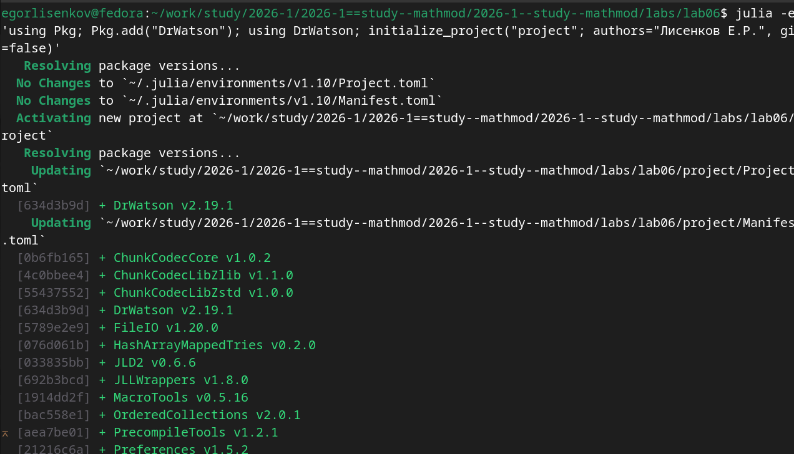{#fig:001 width=100%}

## Прекомпиляция зависимостей проекта
Система успешно прекомпилировала 101 новую зависимость за 703 секунды, подготовив окружение к выполнению вычислительных экспериментов.
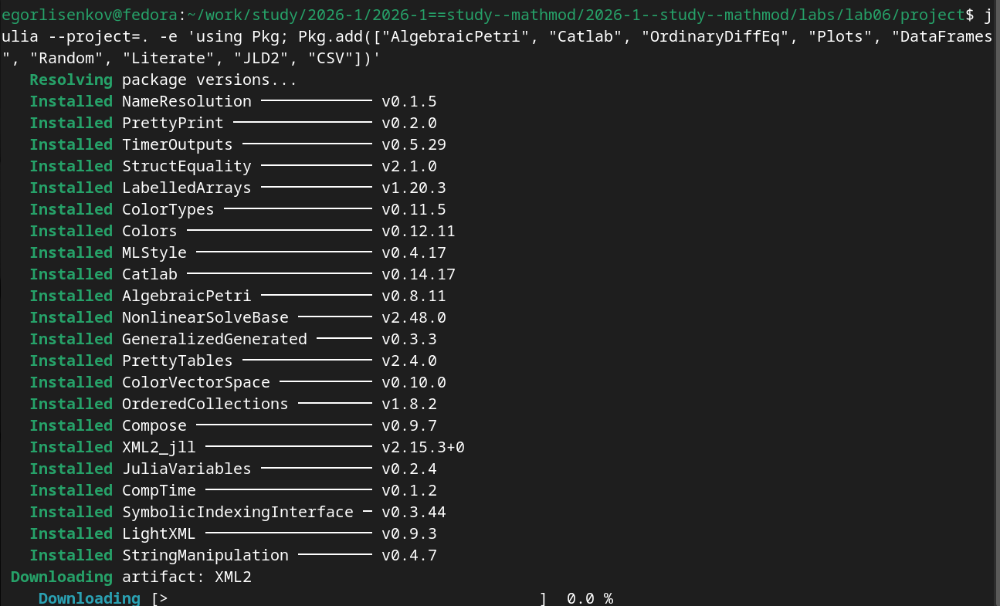{#fig:002 width=100%}

## Создание модуля SIRPetri.jl
Разработан модуль с определением структуры LabelledPetriNet, переходами infection и recovery, а также функциями детерминированной и стохастической симуляции.
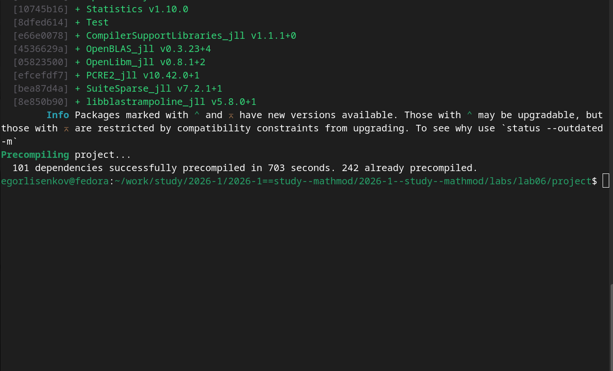{#fig:003 width=100%}

## Скрипт базового эксперимента
Создан скрипт sirpetri_run.jl для запуска симуляций с параметрами β=0.3, γ=0.1 и сохранения результатов в CSV-файлы и графические форматы.
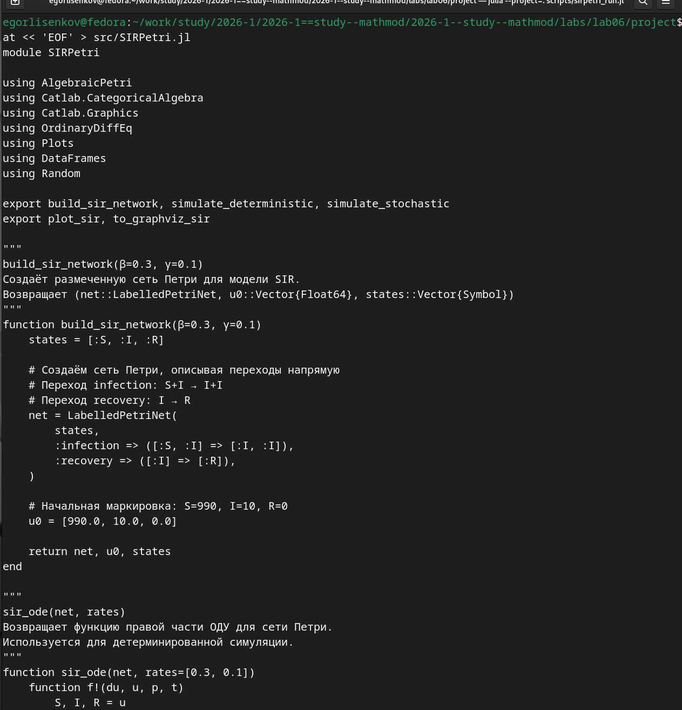{#fig:004 width=100%}

## Финальная проверка структуры проекта
Верификация подтвердила наличие 22 графических артефактов, литературных скриптов и производных форматов в соответствии со стандартами DrWatson.
{#fig:005 width=100%}

## Скрипт анимации эпидемической динамики
Разработан скрипт sirpetri_animate.jl, визуализирующий изменение маркировки сети Петри во времени в формате GIF с частотой 10 кадров в секунду.
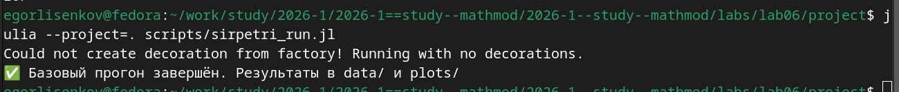{#fig:006 width=100%}

## Скрипт сканирования параметра заражённости
Создан скрипт sirpetri_scan_parameters.jl для исследования чувствительности модели к изменению коэффициента β в диапазоне от 0.1 до 0.8.
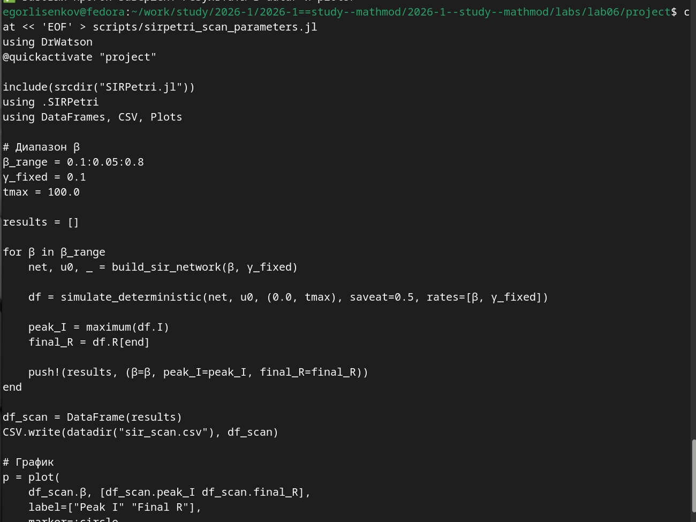{#fig:007 width=100%}

## Выполнение скрипта базового прогона
Успешный запуск симуляции подтвердил корректность работы модуля и сохранение результатов детерминированной и стохастической динамики.
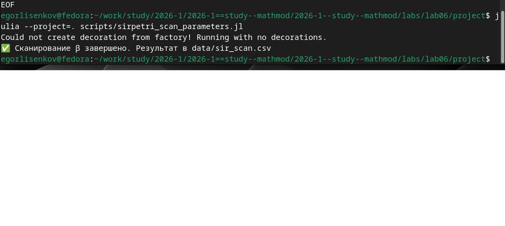{#fig:008 width=100%}

## Выполнение скрипта сканирования параметров
Скрипт последовательно обработал 15 значений коэффициента β, выявив пороговое явление возникновения эпидемии.
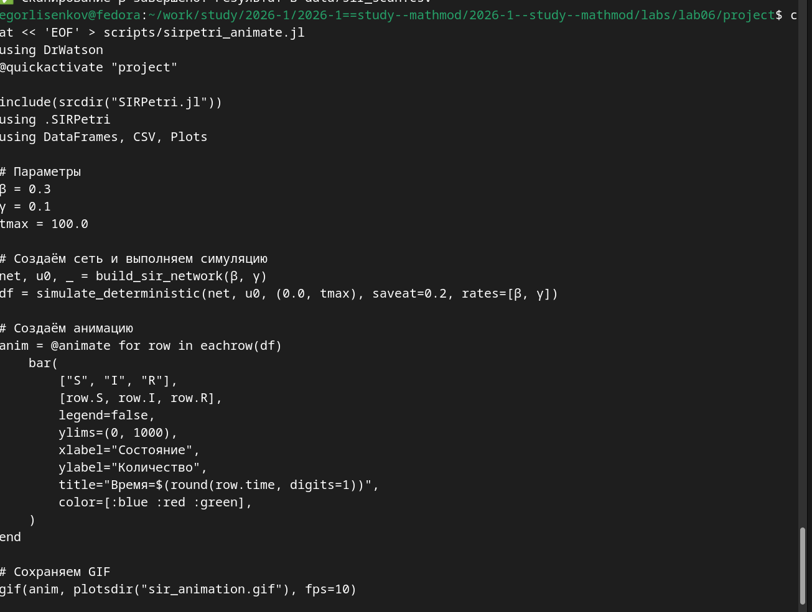{#fig:009 width=100%}

## Кадр анимации на момент времени 22.6
Столбчатая диаграмма демонстрирует стадию спада эпидемии: группа восприимчивых исчерпана, инфицированные снижаются, выздоровевшие достигают плато.
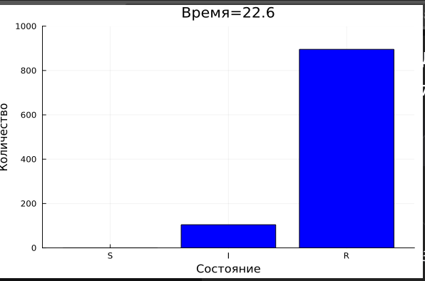{#fig:010 width=100%}

## Сохранение GIF-анимации
Система успешно сгенерировала файл sir_animation.gif, наглядно демонстрирующий волнообразное прохождение инфекции через популяцию.
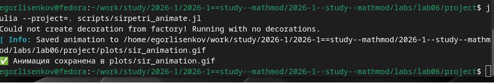{#fig:011 width=100%}

## Кадр параметрического исследования при β=0.7
График показывает стремительную эпидемию с пиком инфицированных около 906 человек и быстрым переходом населения в состояние выздоровевших.
{#fig:012 width=100%}

## Литературный скрипт параметрического исследования
Создан файл 02_sirpetri_param.jl, объединяющий исполняемый код и Markdown-описания для систематического перебора 16 комбинаций параметров.
{#fig:013 width=100%}

## Генерация производных форматов из базового скрипта
Утилита tangle.jl автоматически преобразовала литературный скрипт в чистый код, Quarto-документ и Jupyter Notebook.
{#fig:014 width=100%}

## Создание и выполнение скрипта итогового отчёта
Разработан скрипт sirpetri_report.jl для сравнительного анализа детерминированной и стохастической динамики и построения графика чувствительности.
{#fig:015 width=100%}

## Компиляция итогового отчёта через Quarto
Запуск quarto render инициировал обработку документа через XeTeX и Biber, успешно сформировав итоговый PDF-файл с библиографией.
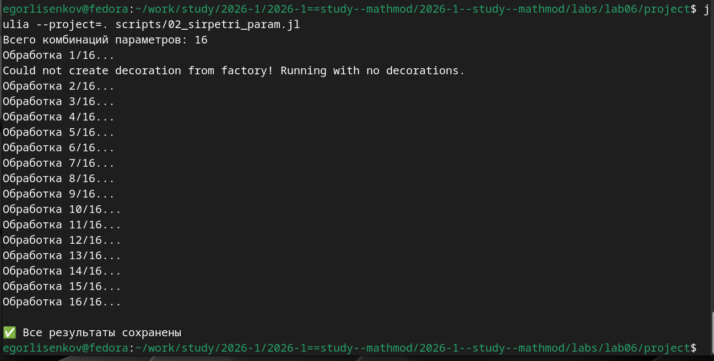{#fig:016 width=100%}

## Выполнение параметрического исследования модели SIR
Скрипт последовательно обработал все 16 комбинаций параметров β, γ и tmax, сохранив графики и данные для каждой конфигурации.
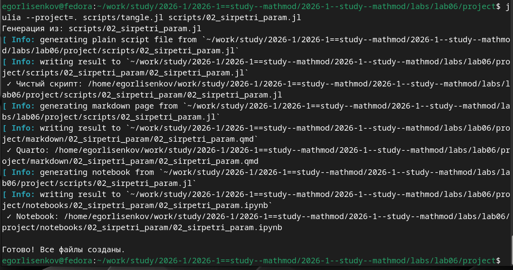{#fig:017 width=100%}

## Ошибка выполнения скрипта вне контекста проекта
Попытка запуска из каталога report вызвала ошибку SystemError, подтвердив необходимость использования флага --project=. для активации окружения.
{#fig:018 width=100%}

## Финальная верификация структуры проекта
Повторная проверка после возврата в правильную директорию подтвердила наличие всех 22 графических артефактов и производных форматов.
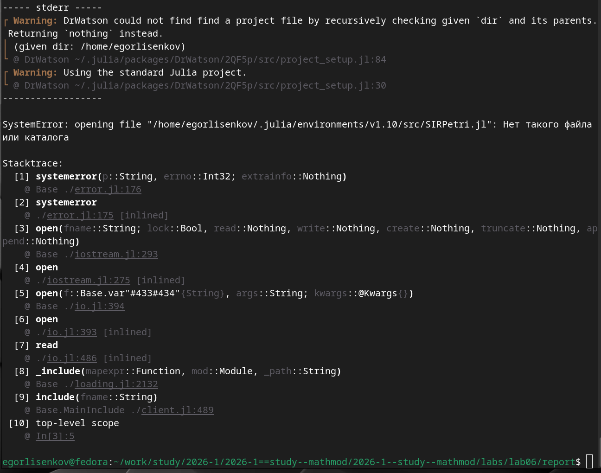{#fig:019 width=100%}

## Генерация производных форматов из параметрического скрипта
Утилита tangle.jl успешно создала чистый код, документацию Quarto и интерактивный ноутбук для параметрического эксперимента.
{#fig:020 width=100%}

## Вывод

В результате выполнения лабораторной работы был освоен аппарат сетей Петри для моделирования эпидемиологических процессов на примере классической модели SIR. Практически подтверждено, что сети Петри предоставляют строгий формальный аппарат для описания параллельных и асинхронных процессов: переходы infection и recovery однозначно задают структуру взаимодействий, а матрица инцидентности позволяет строить как детерминированные (на основе ОДУ), так и стохастические (на основе алгоритма Гиллеспи) симуляции.

