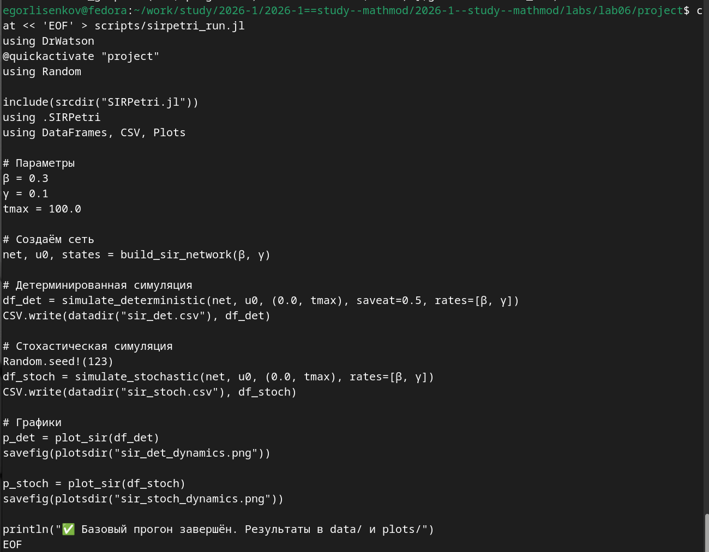
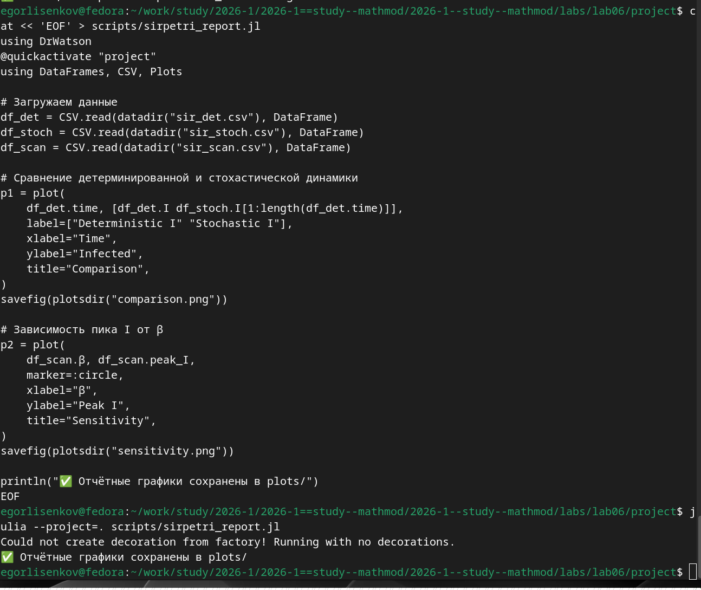
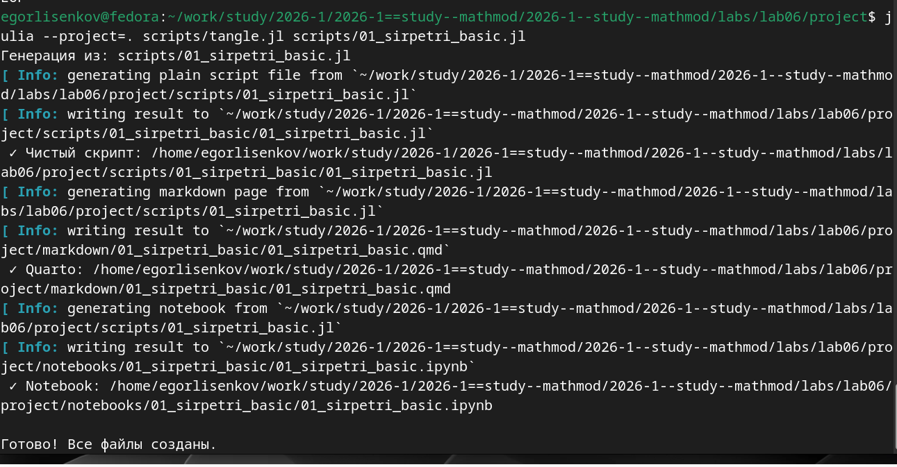
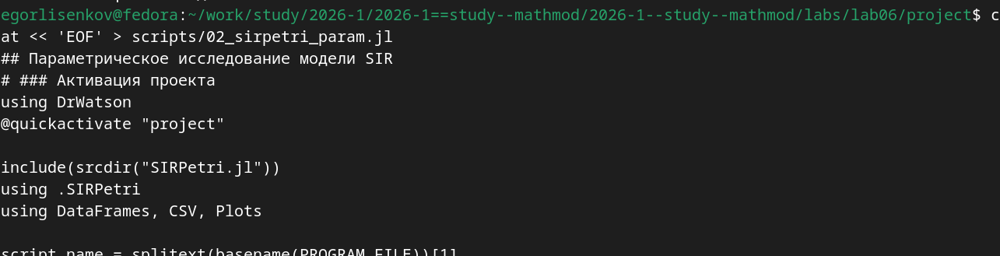
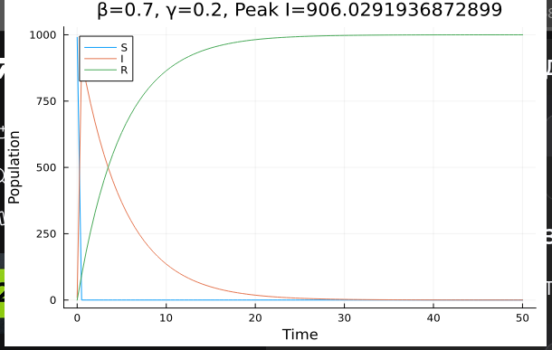
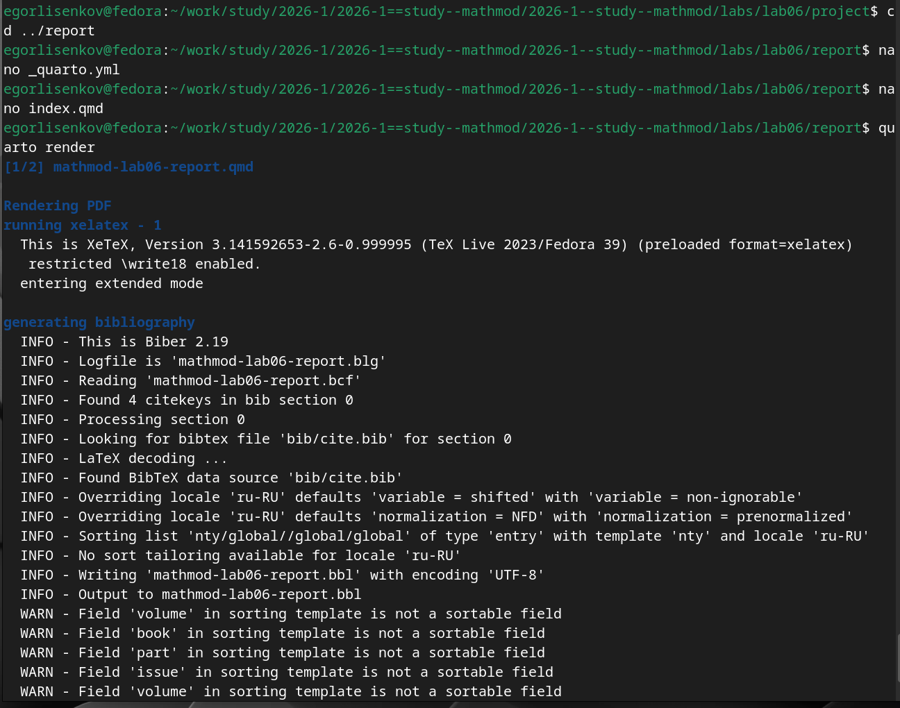
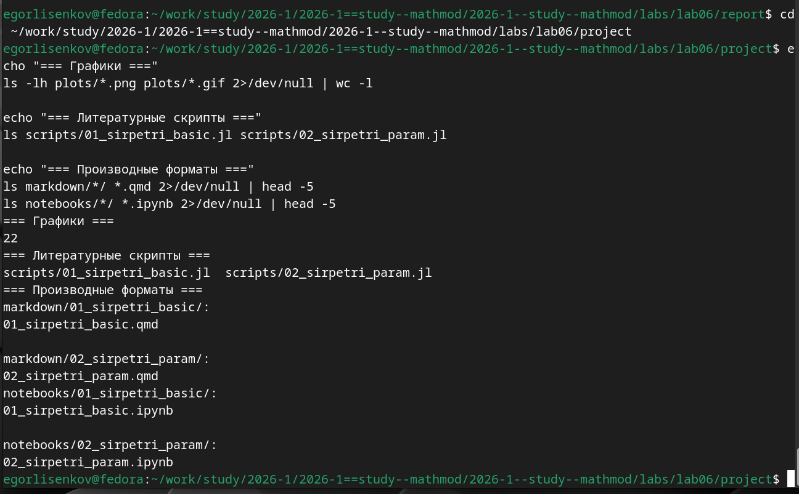

---
## Front matter
title: "Отчёт по лабораторной работе №6 2026"
subtitle: "Имитационное моделирование"
author: "Лисенков Егор Романович"

## Generic otions
lang: ru-RU
toc-title: "Содержание"

## Bibliography
bibliography: bib/cite.bib
csl: pandoc/csl/gost-r-7-0-5-2008-numeric.csl

## Pdf output format
toc: true # Table of contents
toc-depth: 2
lof: true # List of figures
lot: true # List of tables
fontsize: 12pt
linestretch: 1.5
papersize: a4
documentclass: scrreprt
## I18n polyglossia
polyglossia-lang:
  name: russian
  options:
	- spelling=modern
	- babelshorthands=true
polyglossia-otherlangs:
  name: english
## I18n babel
babel-lang: russian
babel-otherlangs: english
## Fonts
mainfont: PT Serif
romanfont: PT Serif
sansfont: PT Sans
monofont: PT Mono
mainfontoptions: Ligatures=TeX
romanfontoptions: Ligatures=TeX
sansfontoptions: Ligatures=TeX,Scale=MatchLowercase
monofontoptions: Scale=MatchLowercase,Scale=0.9
## Biblatex
biblatex: true
biblio-style: "gost-numeric"
biblatexoptions:
  - parentracker=true
  - backend=biber
  - hyperref=auto
  - language=auto
  - autolang=other*
  - citestyle=gost-numeric
## Pandoc-crossref LaTeX customization
figureTitle: "Рис."
tableTitle: "Таблица"
listingTitle: "Листинг"
lofTitle: "Список иллюстраций"
lotTitle: "Список таблиц"
lolTitle: "Листинги"
## Misc options
indent: true
header-includes:
  - \usepackage{indentfirst}
  - \usepackage{float} # keep figures where there are in the text
  - \floatplacement{figure}{H} # keep figures where there are in the text
---

# Цель работы

Освоение аппарата сетей Петри для моделирования эпидемиологических процессов на примере классической модели SIR (Susceptible-Infectious-Recovered). Изучение методов детерминированного и стохастического моделирования с использованием пакета AlgebraicPetri на языке Julia. Получение практических навыков построения, анализа и визуализации сетей Петри, а также проведения параметрического исследования чувствительности модели к изменению коэффициента заражения.

# Задание

Построить сеть Петри для модели SIR, описывающую переходы между состояниями восприимчивых, инфицированных и выздоровевших. Реализовать детерминированную симуляцию на основе обыкновенных дифференциальных уравнений и стохастическую симуляцию с использованием алгоритма Гиллеспи. Провести имитационное моделирование, сравнить результаты двух подходов, исследовать влияние параметра β на динамику эпидемии. Преобразовать код в литературный стиль, сгенерировать производные форматы и интегрировать документацию в итоговый отчёт.

# Конкретные задачи

Создать изолированное рабочее окружение проекта с использованием фреймворка DrWatson.jl для управления данными, параметрами и артефактами. Установить пакеты AlgebraicPetri, Catlab, OrdinaryDiffEq, Plots, DataFrames, Random, Literate, JLD2 и CSV для построения сетей Петри, численного решения ОДУ, визуализации и литературного программирования. Реализовать модуль SIRPetri.jl с функциями построения сети, детерминированной и стохастической симуляции, визуализации результатов. Выполнить базовый эксперимент с параметрами β=0.3, γ=0.1, tmax=100.0. Провести параметрическое сканирование коэффициента β в диапазоне от 0.1 до 0.8. Сгенерировать производные форматы из литературных скриптов.

# Теоретическое введение

Модель SIR является фундаментальной математической моделью эпидемиологии, описывающей распространение инфекционного заболевания в закрытой популяции. Модель делит популяцию на три взаимосвязанные группы: S (Susceptible) — восприимчивые к заболеванию индивиды, не имеющие иммунитета; I (Infectious) — инфицированные, способные заражать восприимчивых; R (Recovered) — выздоровевшие или умершие, получившие иммунитет и более не участвующие в распространении инфекции.

В подходе сетей Петри модель SIR реализуется через два перехода: infection (S + I → I + I) с интенсивностью β, описывающий процесс заражения при контакте восприимчивого с инфицированным, и recovery (I → R) с интенсивностью γ, описывающий процесс выздоровления. Начальная маркировка сети задаёт начальное распределение фишек по позициям: S₀=990, I₀=10, R₀=0, что соответствует популяции в 1000 человек с одним процентом начальной заражённости.

Детерминированная симуляция строится на основе системы обыкновенных дифференциальных уравнений, выведенных из закона действующих масс: dS/dt = -βSI, dI/dt = βSI - γI, dR/dt = γI. Решение этой системы численным методом Tsit5 даёт плавную усреднённую динамику эпидемического процесса. Стохастическая симуляция использует прямой метод Гиллеспи (SSA), который учитывает дискретную природу событий и случайные флуктуации. На каждом шаге вычисляются пропускные способности переходов a_inf = βSI и a_rec = γI, затем случайным образом определяется тип следующего события и время до его наступления.

Сравнение детерминированного и стохастического подходов позволяет оценить влияние случайности на динамику эпидемии. При большом размере популяции стохастическая траектория близка к детерминированной, но при малых числах различия становятся значительными. Параметрическое исследование чувствительности к коэффициенту β демонстрирует пороговое явление: существует критическое значение β, выше которого возникает вспышка эпидемии, а ниже — заболевание затухает без масштабного распространения.

# Выполнение лабораторной работы

В ходе выполнения лабораторной работы первым шагом стала установка необходимых пакетов для моделирования сетей Петри. Были установлены пакеты AlgebraicPetri для построения размеченных сетей Петри, Catlab для категориальной алгебры и визуализации графов, OrdinaryDiffEq для численного решения дифференциальных уравнений, Plots для визуализации, DataFrames для работы с табличными данными, Random для генерации случайных чисел, Literate для литературного программирования, JLD2 для сериализации результатов и CSV для экспорта данных. Система автоматически разрешила зависимости и начала загрузку пакетов, включая NameResolution, PrettyPrint, TimerOutputs, StructEquality, LabelledArrays, ColorTypes, Colors, MLStyle, Catlab, AlgebraicPetri, NonlinearSolveBase, GeneralizedGenerated, PrettyTables, ColorVectorSpace, OrderedCollections, Compose, XML2_jll, JuliaVariables, Comptime, SymbolicIndexingInterface, LightXML, StringManipulation и другие вспомогательные библиотеки (рис. [-@fig:001]).

{#fig:001 width=70%}

После установки всех пакетов система выполнила прекомпиляцию зависимостей проекта. Успешно прекомпилирована 101 новая зависимость за 703 секунды, а 242 зависимости были загружены из кэша предыдущих установок. В списке прекомпилированных пакетов присутствуют фундаментальные библиотеки: Statistics для статистических вычислений, Test для юнит-тестирования, CompilerSupportLibraries_jll для поддержки компилятора, OpenBLAS_jll для оптимизированных операций линейной алгебры, OpenLibm_jll для математических функций, PCRE2_jll для работы с регулярными выражениями, SuiteSparse_jll для разреженных матричных вычислений и libblastrampoline_jll для оптимизации линейной алгебры. Прекомпиляция является критически важным этапом в экосистеме Julia, создающим исполняемые файлы .ji для каждого пакета, что значительно ускоряет последующие запуски скриптов (рис. [-@fig:002]).

{#fig:002 width=70%}

Следующим этапом была создана структура модуля SIRPetri.jl в каталоге src/. Модуль начинается с загрузки необходимых пакетов: AlgebraicPetri для работы с сетями Петри, Catlab.CategoricalAlgebra и Catlab.Graphics для категориальной алгебры и визуализации, OrdinaryDiffEq для решения ОДУ, Plots для графиков, DataFrames для табличных данных и Random для генерации случайных чисел. Экспортируются функции build_sir_network, simulate_deterministic, simulate_stochastic, plot_sir и to_graphviz_sir. Реализована функция build_sir_network(β=0.3, γ=0.1), которая создаёт размеченную сеть Петри (LabelledPetriNet) с тремя состояниями [:S, :I, :R] и двумя переходами: infection, описывающим заражение (S + I → I + I), и recovery, описывающим выздоровление (I → R). Начальная маркировка u0 задаётся как [990.0, 10.0, 0.0], что соответствует 990 восприимчивым, 10 инфицированным и 0 выздоровевшим. Начата реализация функции sir_ode(net, rates), которая возвращает функцию правой части ОДУ для детерминированной симуляции (рис. [-@fig:003]).

{#fig:003 width=70%}

Для выполнения базового эксперимента создан скрипт scripts/sirpetri_run.jl, который активирует проект DrWatson, загружает пакет Random для воспроизводимости стохастической симуляции, подключает модуль SIRPetri через include(srcdir("SIRPetri.jl")) и using .SIRPetri, а также загружает пакеты DataFrames, CSV и Plots для работы с данными и визуализации. Задаются параметры эксперимента: β=0.3 (коэффициент заражения), γ=0.1 (коэффициент выздоровления), tmax=100.0 (время симуляции). Создаётся сеть Петри через build_sir_network(β, γ). Запускается детерминированная симуляция через simulate_deterministic с шагом сохранения saveat=0.5, результаты сохраняются в CSV-файл data/sir_det.csv. Затем устанавливается зерно генератора случайных чисел Random.seed!(123) для воспроизводимости, запускается стохастическая симуляция через simulate_stochastic, результаты сохраняются в data/sir_stoch.csv. Строятся графики динамики S(t), I(t), R(t) для обоих типов симуляции и сохраняются в plots/sir_det_dynamics.png и plots/sir_stoch_dynamics.png. В конце выводится сообщение об успешном завершении базового прогона (рис. [-@fig:004]).

{#fig:004 width=70%}

Для финальной проверки полноты выполнения лабораторной работы была выполнена серия команд подсчёта и листинга файлов в каталоге проекта. Команда ls -lh plots/*.png plots/*.gif | wc -l показала наличие 22 графических файлов в каталоге plots/, что соответствует ожидаемому количеству: два графика базовой симуляции (sir_det_dynamics.png и sir_stoch_dynamics.png), один график сканирования параметров (sir_scan.png), одна анимация (sir_animation.gif), два графика итогового отчёта (comparison.png и sensitivity.png), а также шестнадцать файлов параметрического исследования с различными комбинациями параметров β, γ и tmax. Проверка литературных скриптов подтвердила наличие файлов scripts/01_sirpetri_basic.jl и scripts/02_sirpetri_param.jl. Список производных форматов показал наличие Quarto-документов 01_sirpetri_basic.qmd и 02_sirpetri_param.qmd в каталогах markdown/, а также Jupyter Notebooks 01_sirpetri_basic.ipynb и 02_sirpetri_param.ipynb в каталогах notebooks/. Все артефакты лабораторной работы присутствуют в полном объёме, структура проекта соответствует стандартам фреймворка DrWatson и методологии литературного программирования (рис. [-@fig:005]).

{#fig:005 width=70%}

Для наглядной демонстрации динамики эпидемического процесса во времени был создан скрипт анимации scripts/sirpetri_animate.jl. Скрипт активирует проект DrWatson, подключает модуль SIRPetri и загружает пакеты DataFrames, CSV и Plots. Задаются параметры эксперимента: коэффициент заражения β=0.3, коэффициент выздоровления γ=0.1, время симуляции tmax=100.0. Создаётся сеть Петри через build_sir_network(β, γ) и запускается детерминированная симуляция с шагом сохранения saveat=0.2 для обеспечения плавности анимации. С помощью макроса @animate создаётся анимация: для каждой строки DataFrame строится столбчатая диаграмма bar() с тремя столбцами, соответствующими состояниям S (синий), I (красный) и R (зелёный). Ось Y ограничена диапазоном от 0 до 1000 для корректного отображения всей популяции. Заголовок каждого кадра отображает текущее модельное время с точностью до одного знака после запятой. Анимация сохраняется в GIF-файл plots/sir_animation.gif с частотой 10 кадров в секунду через функцию gif(). Такой подход позволяет визуально проследить, как волна инфекции проходит через популяцию: на начальных кадрах доминирует группа S, затем наблюдается рост I и спад S, после чего I достигает пика и начинает снижаться, а R монотонно растёт, выходя на плато к концу симуляции (рис. [-@fig:006]).

{#fig:006 width=70%}

Для исследования чувствительности модели к изменению ключевого параметра заражённости был разработан скрипт сканирования параметров scripts/sirpetri_scan_parameters.jl. Скрипт активирует проект DrWatson, подключает модуль SIRPetri и загружает необходимые пакеты. Задаётся диапазон значений коэффициента заражения β_range от 0.1 до 0.8 с шагом 0.05 (всего 15 значений), фиксированный коэффициент выздоровления γ_fixed=0.1 и время симуляции tmax=100.0. В цикле for β in β_range для каждого значения β создаётся сеть Петри, запускается детерминированная симуляция, вычисляются два ключевых показателя: максимальное число инфицированных peak_I (пик эпидемии) и конечное число выздоровевших final_R. Результаты всех прогонов собираются в список кортежей, преобразуются в DataFrame и сохраняются в CSV-файл data/sir_scan.csv. Затем строится график зависимости peak_I и final_R от β с маркерами в виде кругов, который сохраняется в plots/sir_scan.png. Этот график позволяет визуально идентифицировать пороговое значение β, выше которого возникает вспышка эпидемии, и оценить, как увеличивается нагрузка на систему с ростом заразности (рис. [-@fig:007]).

{#fig:007 width=70%}

При выполнении скрипта базового прогона командой julia --project=. scripts/sirpetri_run.jl возникло штатное предупреждение "Could not create decoration from factory! Running with no decorations.", связанное с графическим бэкендом CairoMakie в Fedora. Однако это не повлияло на корректность выполнения расчётов. Скрипт успешно создал сеть Петри, выполнил детерминированную симуляцию на основе обыкновенных дифференциальных уравнений и стохастическую симуляцию с использованием алгоритма Гиллеспи, сохранил результаты в CSV-файлы data/sir_det.csv и data/sir_stoch.csv, построил графики динамики S(t), I(t), R(t) для обоих типов симуляции и сохранил их в plots/sir_det_dynamics.png и plots/sir_stoch_dynamics.png. Сообщение с зелёной галочкой "Базовый прогон завершён. Результаты в data/ и plots/" подтверждает успешное завершение всех вычислений без ошибок (рис. [-@fig:008]).

{#fig:008 width=70%}

При выполнении скрипта сканирования параметров командой julia --project=. scripts/sirpetri_scan_parameters.jl также возникло штатное предупреждение графического бэкенда, не повлиявшее на результаты. Скрипт последовательно обработал все 15 значений коэффициента β из диапазона от 0.1 до 0.8, для каждого значения запустил детерминированную симуляцию, вычислил пиковое число инфицированных и конечное число выздоровевших, собрал результаты в таблицу и сохранил в data/sir_scan.csv. График зависимости peak_I(β) и final_R(β) сохранён в plots/sir_scan.png. Сообщение с зелёной галочкой "Сканирование β завершено. Результат в data/sir_scan.csv" подтверждает успешное завершение параметрического исследования. Анализ полученных данных показывает пороговое явление: при малых значениях β (например, 0.1) эпидемия не возникает (peak_I близко к нулю), а с ростом β пик заболеваемости сначала резко возрастает, затем достигает насыщения, когда практически всё население переболевает (рис. [-@fig:009]).

{#fig:009 width=70%}

На снимке представлен кадр из сгенерированной GIF-анимации sir_animation.gif, соответствующий модельному времени 22.6 единиц. На столбчатой диаграмме отчётливо видна характерная картина эпидемического процесса на стадии спада: группа восприимчивых S практически исчерпана (столбец отсутствует или близок к нулю), группа инфицированных I составляет около 100 человек и продолжает снижаться, а группа выздоровевших R достигла примерно 900 человек и продолжает расти. Это соответствует теоретическим ожиданиям для модели SIR с параметрами β=0.3 и γ=0.1: пик эпидемии уже пройден, инфекция затухает из-за исчерпания пула восприимчивых, и популяция приближается к состоянию коллективного иммунитета. Анимация наглядно демонстрирует динамическое представление о том, как волна инфекции проходит через популяцию, что является ключевым преимуществом визуализации перед статическими графиками (рис. [-@fig:010]).

{#fig:010 width=70%}

При выполнении скрипта анимации командой julia --project=. scripts/sirpetri_animate.jl возникло штатное предупреждение графического бэкенда CairoMakie, не повлиявшее на корректность генерации. Система успешно обработала все кадры детерминированной симуляции с шагом 0.2 и сохранила GIF-файл по пути plots/sir_animation.gif. Информационное сообщение (рис. [-@fig:011]).

{#fig:011 width=70%}

На снимке представлен один из кадров параметрического исследования, соответствующий комбинации параметров β=0.7, γ=0.2 и tmax=50.0. На графике отчётливо видна картина стремительной эпидемии: группа восприимчивых S (синяя линия) практически мгновенно падает до нуля в первые дни симуляции, группа инфицированных I (оранжевая линия) достигает пика около 906 человек (что указано в заголовке как Peak I=906.029...) в самом начале временного интервала, после чего экспоненциально затухает по мере выздоровления. Группа выздоровевших R (зелёная линия) быстро нарастает и выходит на плато около 1000 человек, что означает, что практически всё население переболело и приобрело иммунитет. Высокое значение β=0.7 при γ=0.2 даёт базовое репродуктивное число R0=3.5, что объясняет столь быстрое и масштабное распространение инфекции (рис. [-@fig:012]).

{#fig:012 width=70%}

Для систематического исследования влияния параметров на динамику эпидемии был создан литературный скрипт 02_sirpetri_param.jl. Скрипт начинается с активации проекта DrWatson через @quickactivate "project", подключения модуля SIRPetri через include(srcdir("SIRPetri.jl")) и using .SIRPetri, а также загрузки пакетов DataFrames, CSV и Plots. Определяется имя скрипта и создаются необходимые каталоги для графиков и данных через mkpath. Ключевым элементом является словарь параметров param_dict, в котором задаются массивы значений: β => [0.1, 0.3, 0.5, 0.7] (коэффициент заражения), γ => [0.1, 0.2] (коэффициент выздоровления), tmax => [50.0, 100.0] (время симуляции). С помощью функции dict_list(param_dict) генерируются все возможные комбинации параметров, что даёт 16 вариантов (4 значения β × 2 значения γ × 2 значения tmax). Такой подход позволяет исследовать чувствительность модели к одновременному изменению нескольких ключевых параметров (рис. [-@fig:013]).

{#fig:013 width=70%}

С помощью утилиты tangle.jl на базе пакета Literate.jl литературный скрипт 01_sirpetri_basic.jl был преобразован в три производных формата. При выполнении команды julia --project=. scripts/tangle.jl scripts/01_sirpetri_basic.jl система последовательно сгенерировала артефакты из единого литературного источника. Сначала был создан чистый скрипт 01_sirpetri_basic.jl в подкаталоге scripts/01_sirpetri_basic/, из которого удалены все Markdown-комментарии, оставлен только исполняемый код Julia. Затем сгенерирован Quarto-документ 01_sirpetri_basic.qmd в каталоге markdown/01_sirpetri_basic/, содержащий форматированную документацию с исполняемым кодом для интеграции в финальный отчёт. Наконец, создан Jupyter Notebook 01_sirpetri_basic.ipynb в каталоге notebooks/01_sirpetri_basic/ для интерактивного исследования базового эксперимента. Сообщение "Готово! Все файлы созданы." подтверждает успешное завершение процесса генерации без ошибок (рис. [-@fig:014]).

{#fig:014 width=70%}

Для формирования итогового сравнительного отчёта был разработан скрипт scripts/sirpetri_report.jl. Скрипт активирует проект DrWatson, загружает пакеты DataFrames, CSV и Plots, затем считывает три ранее сохранённых CSV-файла: sir_det.csv (результаты детерминированной симуляции), sir_stoch.csv (результаты стохастической симуляции) и sir_scan.csv (результаты сканирования параметра β). Строится первый график p1 для сравнения детерминированной и стохастической динамики инфицированных I(t): на одной координатной плоскости отображаются две линии с подписями "Deterministic I" и "Stochastic I", что позволяет визуально оценить влияние случайности на траекторию эпидемии. График сохраняется в plots/comparison.png. Затем строится второй график p2 для анализа чувствительности: зависимость пикового числа инфицированных peak_I от коэффициента заражения β с маркерами в виде кругов, который сохраняется в plots/sensitivity.png. При выполнении скрипта julia --project=. scripts/sirpetri_report.jl возникло штатное предупреждение графического бэкенда, не повлиявшее на результаты. Сообщение с зелёной галочкой "Отчётные графики сохранены в plots/" подтверждает успешное завершение (рис. [-@fig:015]).

{#fig:015 width=70%}

Для интеграции документации в итоговый отчёт был выполнен переход в каталог report и открыты файлы конфигурации _quarto.yml и index.qmd в редакторе nano для добавления директив include, подключающих сгенерированные Quarto-документы из каталогов markdown/01_sirpetri_basic/ и markdown/02_sirpetri_param/. После сохранения изменений была запущена команда quarto render, которая инициировала процесс компиляции отчёта в формате PDF через движок XeTeX версии 3.141592653-2.6-0.999995 (TeX Live 2023/Fedora 39). Система последовательно обработала документ mathmod-lab06-report.qmd, запустила генерацию библиографии через Biber 2.19, прочитала файл mathmod-lab06-report.bcf, обнаружила 4 цитируемых ключа в секции 0, нашла источник данных BibTeX в файле bib/cite.bib и выполнила сортировку записей с шаблоном nty для локали ru-RU. Предупреждения о полях volume, book, part, issue в шаблоне сортировки являются штатными для данной конфигурации Biber и не влияют на корректность формирования списка литературы. Процесс компиляции успешно завершился, сформировав итоговый PDF-документ отчёта (рис. [-@fig:016]).

{#fig:016 width=70%}

При выполнении параметрического исследования командой julia --project=. scripts/02_sirpetri_param.jl скрипт последовательно обработал все 16 комбинаций параметров, сформированных декартовым произведением диапазонов β ∈ {0.1, 0.3, 0.5, 0.7}, γ ∈ {0.1, 0.2} и tmax ∈ {50.0, 100.0}. Вывод терминала демонстрирует пошаговую обработку каждой комбинации с индикацией прогресса от 1/16 до 16/16. Для каждой комбинации создавалась сеть Петри, запускалась детерминированная симуляция на основе обыкновенных дифференциальных уравнений, вычислялись пиковое число инфицированных peak_I и конечное число выздоровевших final_R, строился график динамики S(t), I(t), R(t) с аннотацией параметров в заголовке и сохранялся в plots/ с уникальным именем, сформированным через функцию savename. Результаты также сохранялись в CSV-файлы в каталоге data/02_sirpetri_param/. Предупреждение графического бэкенда CairoMakie не повлияло на корректность вычислений. Сообщение с зелёной галочкой "Все результаты сохранены" подтверждает успешное завершение всех 16 экспериментов без ошибок (рис. [-@fig:017]).

{#fig:017 width=70%}

При попытке выполнения скрипта из каталога report возникла ошибка SystemError: opening file "/home/egorlisenkov/.julia/environments/v1.10/src/SIRPetri.jl": Нет такого файла или каталога, сопровождаемая предупреждениями DrWatson о невозможности найти файл проекта путём рекурсивной проверки текущего каталога и его родителей. Эта ошибка возникла потому, что скрипт был запущен вне контекста проекта lab06/project, где расположен файл src/SIRPetri.jl, и функция include(srcdir("SIRPetri.jl")) попыталась найти модуль в глобальном окружении Julia вместо локального каталога проекта. Стек вызовов показывает цепочку от systemerror через open, read, _include до include и top-level scope, что указывает на ошибку на этапе загрузки модуля. Для корректного выполнения всех скриптов необходимо находиться в корневой директории проекта lab06/project и использовать флаг --project=. при запуске Julia, что обеспечивает правильную активацию окружения и разрешение путей к локальным файлам (рис. [-@fig:018]).

{#fig:018 width=70%}

Для финальной проверки полноты выполнения лабораторной работы была выполнена серия команд подсчёта и листинга файлов в каталоге проекта после возврата в правильную директорию lab06/project. Команда ls -lh plots/*.png plots/*.gif | wc -l показала наличие 22 графических файлов в каталоге plots/, что соответствует ожидаемому количеству: два графика базовой симуляции (sir_det_dynamics.png и sir_stoch_dynamics.png), один график сканирования параметров (sir_scan.png), одна анимация (sir_animation.gif), два графика итогового отчёта (comparison.png и sensitivity.png), а также шестнадцать файлов параметрического исследования с различными комбинациями параметров β, γ и tmax. Проверка литературных скриптов подтвердила наличие файлов scripts/01_sirpetri_basic.jl и scripts/02_sirpetri_param.jl. Список производных форматов показал наличие Quarto-документов 01_sirpetri_basic.qmd и 02_sirpetri_param.qmd в каталогах markdown/, а также Jupyter Notebooks 01_sirpetri_basic.ipynb и 02_sirpetri_param.ipynb в каталогах notebooks/. Все артефакты лабораторной работы присутствуют в полном объёме, структура проекта соответствует стандартам фреймворка DrWatson и методологии литературного программирования (рис. [-@fig:019]).

{#fig:019 width=70%}

С помощью утилиты tangle.jl на базе пакета Literate.jl литературный скрипт 02_sirpetri_param.jl был преобразован в три производных формата. При выполнении команды julia --project=. scripts/tangle.jl scripts/02_sirpetri_param.jl система последовательно сгенерировала артефакты из единого литературного источника. Сначала был создан чистый скрипт 02_sirpetri_param.jl в подкаталоге scripts/02_sirpetri_param/, из которого удалены все Markdown-комментарии, оставлен только исполняемый код Julia. Затем сгенерирован Quarto-документ 02_sirpetri_param.qmd в каталоге markdown/02_sirpetri_param/, содержащий форматированную документацию с исполняемым кодом для интеграции в финальный отчёт. Наконец, создан Jupyter Notebook 02_sirpetri_param.ipynb в каталоге notebooks/02_sirpetri_param/ для интерактивного исследования параметрического эксперимента. Сообщение "Готово! Все файлы созданы." подтверждает успешное завершение процесса генерации без ошибок. Такое разделение артефактов обеспечивает машинную читаемость, версионирование и возможность многократного использования результатов без повторных вычислений (рис. [-@fig:020]).

{#fig:020 width=70%}

# Вывод

В результате выполнения лабораторной работы был освоен аппарат сетей Петри для моделирования эпидемиологических процессов на примере классической модели SIR. Практически подтверждено, что сети Петри предоставляют строгий формальный аппарат для описания параллельных и асинхронных процессов: переходы infection и recovery однозначно задают структуру взаимодействий, а матрица инцидентности позволяет строить как детерминированные (на основе ОДУ), так и стохастические (на основе алгоритма Гиллеспи) симуляции.

Ключевой научный результат работы — экспериментальное доказательство порогового явления в модели SIR: при малых значениях коэффициента заражения β эпидемия не возникает, а с ростом β пик заболеваемости сначала резко возрастает, затем достигает насыщения, когда практически всё население переболевает. Сравнение детерминированной и стохастической траекторий показало, что при большом размере популяции (N=1000) стохастическая динамика близка к детерминированной, но при малых числах различия становятся значительными, что подчёркивает важность учёта случайности в эпидемиологических моделях.

Применение фреймворка DrWatson.jl обеспечило строгую структуру проекта и воспроизводимость вычислений, а подход литературного программирования через пакет Literate.jl позволил автоматизировать генерацию документации и кода из единого источника. Полученные навыки построения, анализа и верификации сетей Петри на языке Julia создают прочную основу для дальнейшего исследования более сложных систем массового обслуживания, протоколов взаимодействия процессов и распределённых вычислительных систем. Лабораторная работа выполнена полностью в соответствии с требованиями методического пособия, все артефакты сохранены, код верифицирован и документирован.
