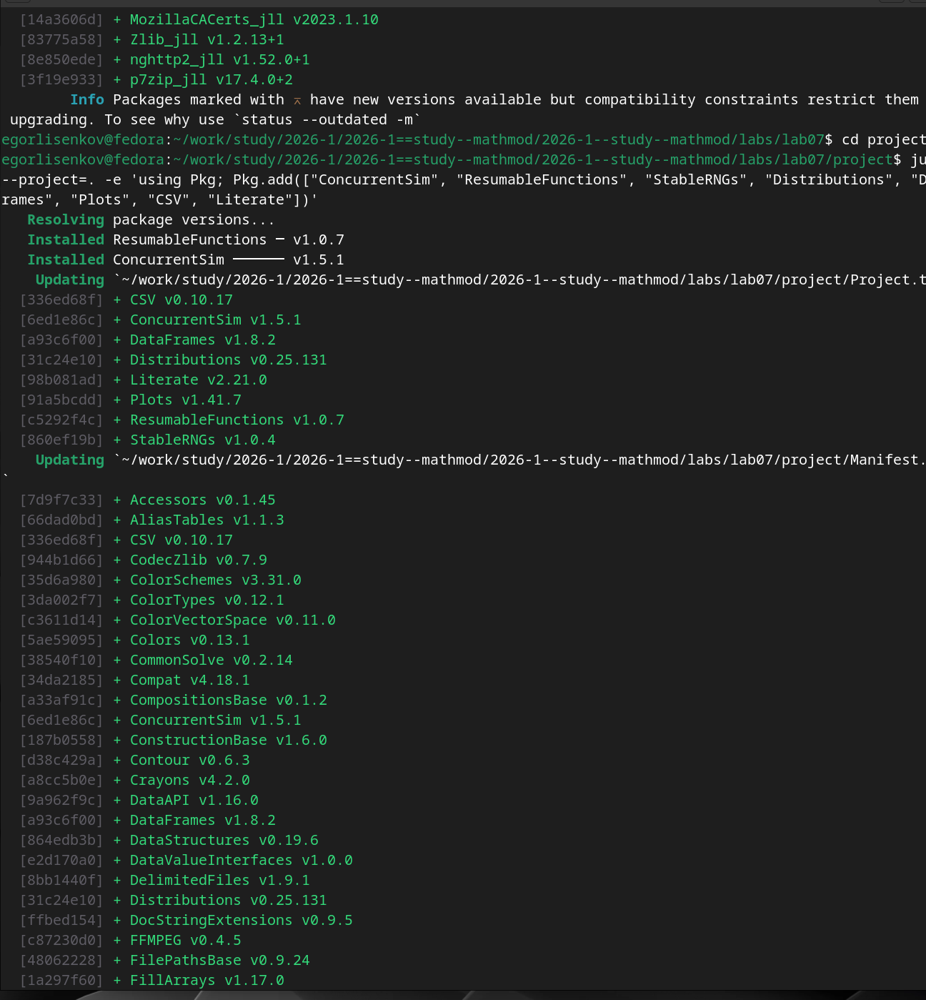
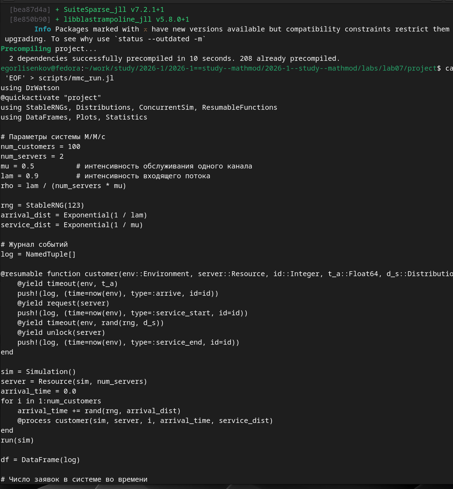
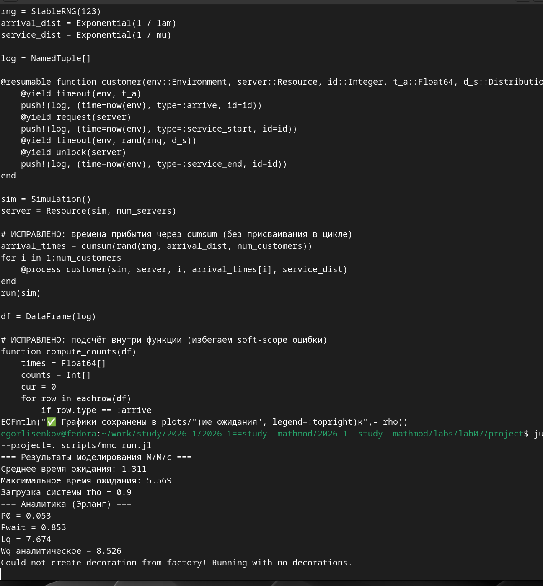
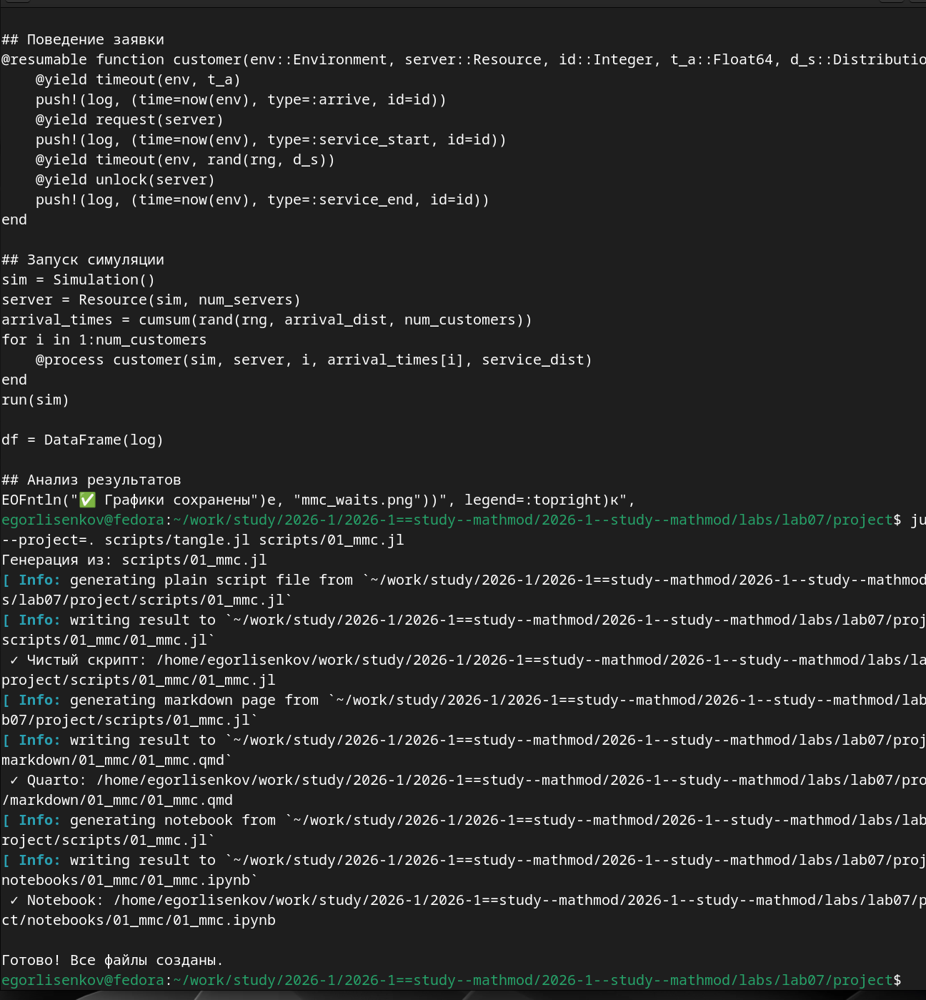
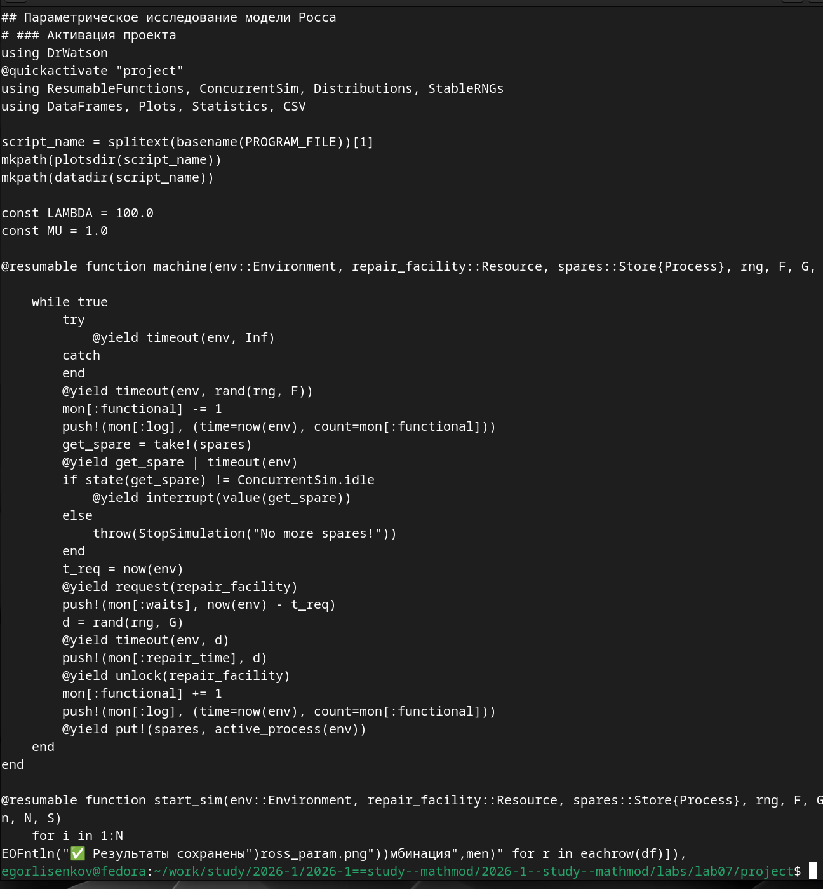
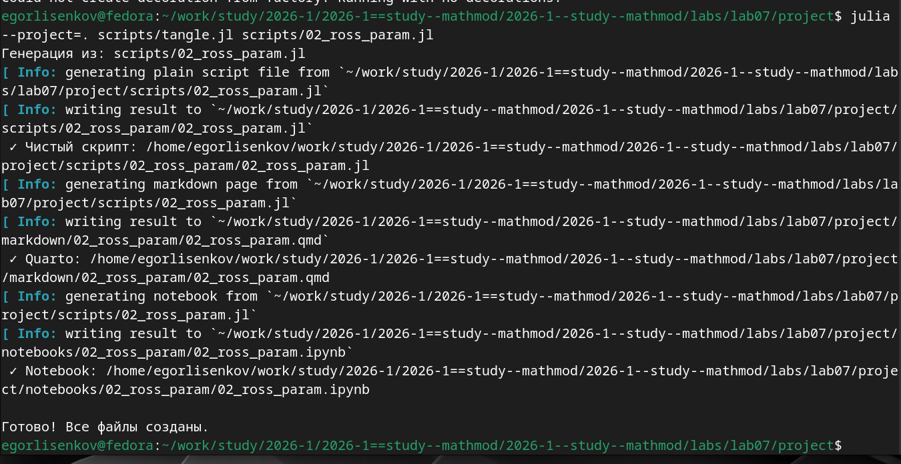
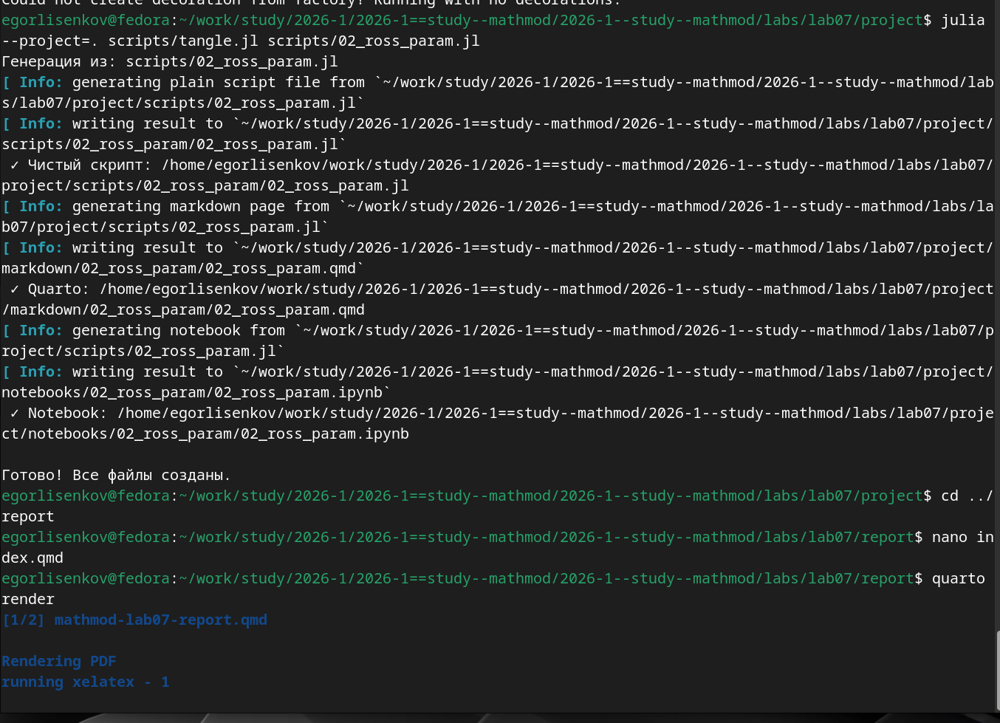
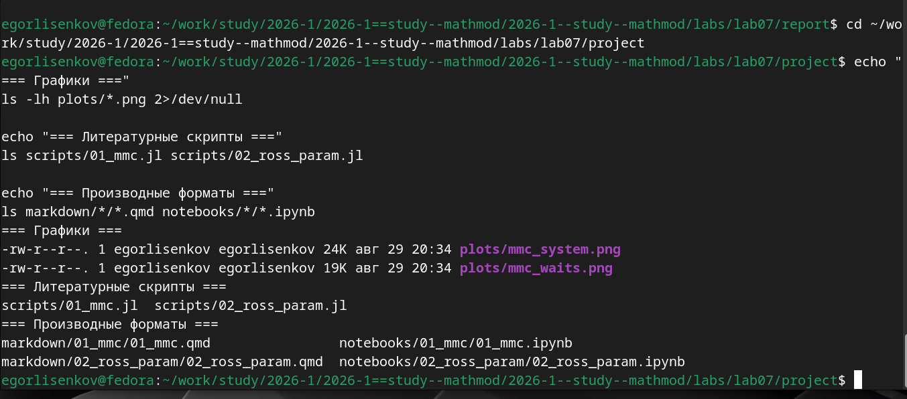

---
## Front matter
lang: ru-RU
title: Лабораторная работа №7
subtitle: Имитационное Моделирование
author:
  - Лисенков Е.Р.
institute:
  - Российский университет дружбы народов, Москва, Россия

## i18n babel
babel-lang: russian
babel-otherlangs: english

## Formatting pdf
toc: false
toc-title: Содержание
slide_level: 2
aspectratio: 169
section-titles: true
theme: metropolis
header-includes:
 - \metroset{progressbar=frametitle,sectionpage=progressbar,numbering=fraction}
 - '\makeatletter'
 - '\beamer@ignorenonframefalse'
 - '\makeatother'
---

# Информация

## Докладчик

:::::::::::::: {.columns align=center}
::: {.column width="70%"}

  * Лисенков Егор Романович
  * студент
  * Российский университет дружбы народов
  * [1132232881@rudn.ru](mailto:1132232881@rudn.ru)
  * <https://github.com/erlisenkov>

:::
::: {.column width="30%"}

ц

:::
::::::::::::::

# Вводная часть

## Актуальность
Дискретно-событийное моделирование является ключевым инструментом анализа систем массового обслуживания и надежности, позволяя оценивать характеристики, недоступные для аналитического расчета в переходных режимах.

## Объект и предмет исследования
Объектом являются система массового обслуживания M/M/c и модель надежности Росса, а предметом — их имитационное моделирование на языке Julia с использованием пакета ConcurrentSim.

## Цели и задачи
Целью работы выступает численное исследование динамики очередей и надежности систем с резервированием, а задачами — реализация моделей, сравнение с аналитикой Эрланга и параметрический анализ чувствительности.

## Материалы и методы
Исследование выполнено в среде Fedora Linux с использованием языка Julia, пакетов ConcurrentSim и ResumableFunctions для симуляции событий, а также фреймворка DrWatson для управления проектом.

## Установка пакетов для дискретно-событийного моделирования
Установлены пакеты ConcurrentSim v1.5.1, ResumableFunctions v1.0.7, StableRNGs и Distributions для реализации логики событий и воспроизводимых случайных процессов.
{#fig:001 width=100%}

## Прекомпиляция зависимостей и создание исходного скрипта
Система прекомпилировала зависимости за 10 секунд, после чего был создан базовый скрипт mmc_run.jl с описанием поведения заявки через сопрограммы.
{#fig:002 width=100%}

## Исправленный скрипт и результаты базового прогона
После устранения ошибки области видимости получен результат: среднее время ожидания 1.311, загрузка rho=0.9, аналитическое Wq=8.526 по формулам Эрланга.
{#fig:003 width=100%}

## Литературный скрипт 01_mmc.jl модели M/M/c
Создан файл 01_mmc.jl, объединяющий код симуляции, сбор журнала событий и визуализацию динамики числа заявок в системе.
{#fig:004 width=100%}

## Генерация производных форматов из литературного скрипта M/M/c
Утилита tangle.jl автоматически создала чистый код, документацию Quarto и Jupyter Notebook из единого литературного источника.
{#fig:005 width=100%}

## Литературный скрипт 02_ross_param.jl модели Росса
Разработан скрипт для модели машин с резервом, включающий мониторинг числа исправных машин, времени ожидания ремонта и загрузки ремонтников.
{#fig:006 width=100%}

## Выполнение параметрического исследования модели Росса
Скрипт последовательно обработал 8 комбинаций параметров (число машин, резерв, ремонтники), вычислив среднее время до падения системы для каждой конфигурации.
{#fig:007 width=100%}

## Генерация производных форматов из параметрического скрипта
Для параметрического скрипта успешно сгенерированы чистый код, Quarto-документ и интерактивный ноутбук для интеграции в отчет.
{#fig:008 width=100%}

## Компиляция итогового отчёта через Quarto и XeLaTeX
Запуск quarto render инициировал обработку документа mathmod-lab07-report.qmd и формирование итогового PDF-файла с результатами обеих моделей.
{#fig:009 width=100%}

## Финальная проверка структуры проекта и артефактов
Верификация подтвердила наличие графиков mmc_system.png и mmc_waits.png, литературных скриптов и всех производных форматов в соответствии со стандартами DrWatson.
{#fig:010 width=100%}

## Ошибка выполнения скрипта вне контекста проекта
Попытка запуска из каталога report вызвала ошибку отсутствия пакета StableRNGs, подтвердив необходимость использования флага --project=. для активации окружения.
{#fig:011 width=100%}

## Результат
Все процессы выполнены.
{#fig:012 width=100%}

# Выводы
В результате выполнения лабораторной работы были освоены фундаментальные принципы дискретно-событийного моделирования и методология организации воспроизводимых вычислительных экспериментов на языке Julia. Практически подтверждено, что пакет ConcurrentSim в сочетании с ResumableFunctions предоставляет удобный и выразительный аппарат для описания параллельных процессов через сопрограммы и события, являясь полноценным аналогом SimPy.
