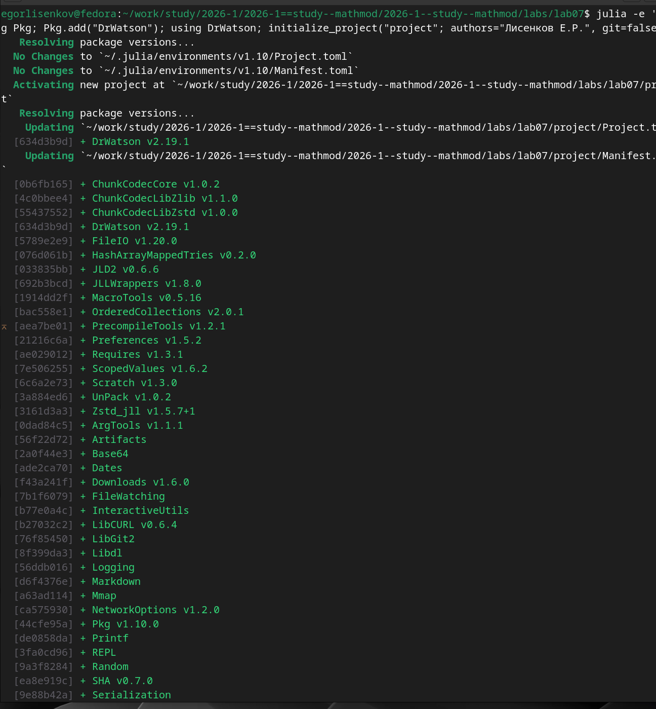
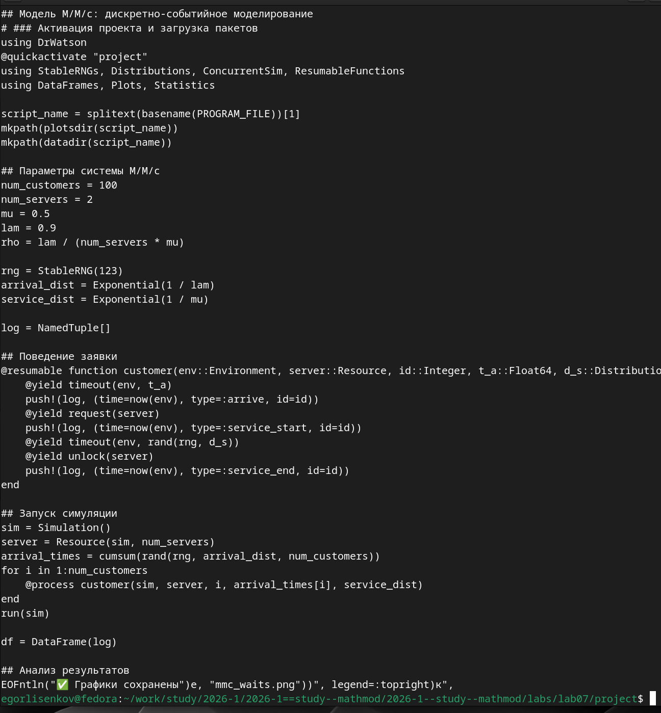
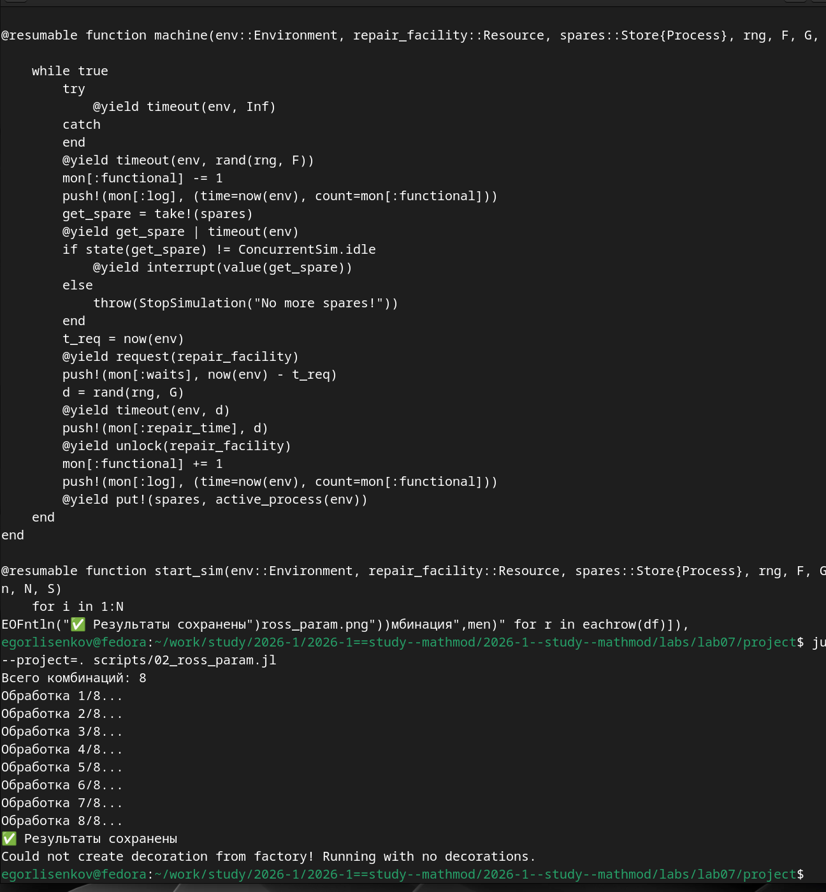
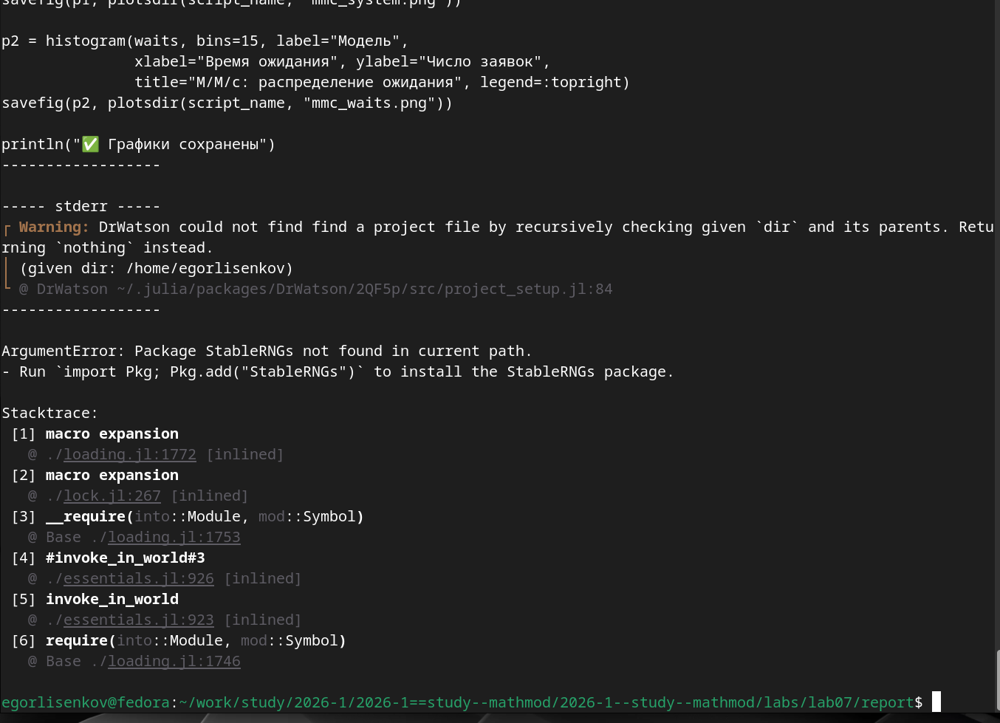

---
## Front matter
title: "Отчёт по лабораторной работе №7 2026"
subtitle: "Имитационное моделирование"
author: "Лисенков Егор Романович"

## Generic otions
lang: ru-RU
toc-title: "Содержание"

## Bibliography
bibliography: bib/cite.bib
csl: pandoc/csl/gost-r-7-0-5-2008-numeric.csl

## Pdf output format
toc: true # Table of contents
toc-depth: 2
lof: true # List of figures
lot: true # List of tables
fontsize: 12pt
linestretch: 1.5
papersize: a4
documentclass: scrreprt
## I18n polyglossia
polyglossia-lang:
  name: russian
  options:
	- spelling=modern
	- babelshorthands=true
polyglossia-otherlangs:
  name: english
## I18n babel
babel-lang: russian
babel-otherlangs: english
## Fonts
mainfont: PT Serif
romanfont: PT Serif
sansfont: PT Sans
monofont: PT Mono
mainfontoptions: Ligatures=TeX
romanfontoptions: Ligatures=TeX
sansfontoptions: Ligatures=TeX,Scale=MatchLowercase
monofontoptions: Scale=MatchLowercase,Scale=0.9
## Biblatex
biblatex: true
biblio-style: "gost-numeric"
biblatexoptions:
  - parentracker=true
  - backend=biber
  - hyperref=auto
  - language=auto
  - autolang=other*
  - citestyle=gost-numeric
## Pandoc-crossref LaTeX customization
figureTitle: "Рис."
tableTitle: "Таблица"
listingTitle: "Листинг"
lofTitle: "Список иллюстраций"
lotTitle: "Список таблиц"
lolTitle: "Листинги"
## Misc options
indent: true
header-includes:
  - \usepackage{indentfirst}
  - \usepackage{float} # keep figures where there are in the text
  - \floatplacement{figure}{H} # keep figures where there are in the text
---

# Выполнение лабораторной работы

# Цель работы

Освоение методологии дискретно-событийного моделирования на языке Julia на примере системы массового обслуживания M/M/c и модели Росса. Изучение принципов работы симулятора ConcurrentSim, механизмов сопрограмм ResumableFunctions и сравнение результатов имитационного моделирования с аналитическими характеристиками теории массового обслуживания (формулы Эрланга и Литтла). Получение практических навыков сбора журнала событий, анализа времени ожидания заявок и параметрического исследования моделей.

# Задание

Перевести предложенный код модели M/M/c и модели Росса в структуру DrWatson, добавить необходимые графики. Выполнить предложенный код, преобразовать код в литературный стиль, сгенерировать из литературного кода чистый код, Jupyter notebook и документацию в формате Quarto, выполнить код из Jupyter notebook и интегрировать документацию в отчёт. Добавить в код в литературном стиле вычисление для набора параметров, сгенерировать производные форматы с параметрами и интегрировать их в отчёт. Для модели Росса добавить нескольких ремонтников, сделать прогон для разного количества машин, провести мониторинг загрузки ремонтников и средней длины очереди на ремонт, построить графики изменения числа исправных машин во времени, сравнить с аналитическим решением.

# Конкретные задачи

Создать изолированное рабочее окружение проекта с использованием фреймворка DrWatson.jl. Установить пакеты ConcurrentSim, ResumableFunctions, StableRNGs, Distributions, DataFrames, Plots, CSV и Literate для дискретно-событийного моделирования и литературного программирования. Реализовать модель M/M/c с двумя обслуживающими каналами, журналом событий и расчётом времени ожидания заявок, сравнить результаты с аналитикой Эрланга. Реализовать параметрическое исследование модели Росса с варьированием числа машин, резерва и ремонтников. Преобразовать скрипты в литературный стиль и сгенерировать производные форматы.

# Теоретическое введение

Модель M/M/c по классификации Кендалла описывает систему массового обслуживания, в которой входящий поток заявок является пуассоновским (интервалы между прибытиями распределены экспоненциально с параметром λ), время обслуживания каждой заявки распределено экспоненциально с параметром μ, а обслуживание ведётся c идентичными параллельными каналами. Ключевой характеристикой является загрузка системы ρ = λ / (c·μ); стационарный режим существует при условии ρ < 1.

В стационарном режиме основные аналитические характеристики вычисляются по формулам Эрланга и Литтла. Вероятность простоя всех каналов P0 определяется через сумму ряда и слагаемое с (cρ)c / (c!(1−ρ)). Вероятность того, что прибывшая заявка будет ждать обслуживания, равна Pwait = (cρ)c / (c!(1−ρ)) · P0. Среднее число заявок в очереди Lq = ρ / (1−ρ) · Pwait, а среднее время ожидания Wq = Lq / λ по формуле Литтла. При ρ, близком к единице, очередь растёт очень быстро, поэтому такие режимы требуют осторожной интерпретации.

Дискретно-событийное моделирование позволяет получить те же характеристики численно, не решая уравнений стационарного режима, а воспроизводя последовательность событий: прибытие заявки, занятие канала, завершение обслуживания, освобождение канала. В языке Julia для этого используется пакет ConcurrentSim (аналог Python-симмулятора SimPy) совместно с пакетом ResumableFunctions, который предоставляет сопрограммы: макрос @resumable описывает поведение заявки, @process порождает процесс, а конструкция @yield приостанавливает его до наступления события (timeout, request, unlock). Ведение журнала событий (время прибытия, начала обслуживания, ухода) позволяет постфактум вычислить время ожидания каждой заявки и число заявок в системе в каждый момент времени.

# Выполнение лабораторной работы

Работа началась с установки необходимых пакетов для дискретно-событийного моделирования. Командой Pkg.add были установлены ConcurrentSim версии 1.5.1 (симулятор событий, аналог SimPy), ResumableFunctions версии 1.0.7 (сопрограммы для описания процессов), StableRNGs версии 1.0.4 (воспроизводимые генераторы случайных чисел), Distributions версии 0.25.131 (экспоненциальные распределения), а также DataFrames версии 1.8.2, Plots версии 1.41.7, CSV версии 0.10.17 и Literate версии 2.21.0. Файлы Project.toml и Manifest.toml были обновлены и зафиксировали точные версии всех зависимостей, включая Accessors, AliasTables, CodecZlib, ColorSchemes, ColorTypes, ColorVectorSpace, Colors, CommonSolve, Compat, CompositionsBase, ConstructionBase, Contour, Crayons, DataAPI, DataStructures, DataValueInterfaces, DelimitedFiles, DocStringExtensions, FFMPEG, FilePathsBase и FillArrays, что гарантирует воспроизводимость вычислительного окружения на любом компьютере (рис. [-@fig:001]).

{#fig:001 width=70%}

После установки пакетов система выполнила прекомпиляцию зависимостей: 2 новые зависимости были успешно скомпилированы за 10 секунд, а 208 зависимостей были загружены из кэша предыдущих установок, что значительно ускоряет последующие запуски скриптов. Затем командой cat была создана исходная версия базового скрипта scripts/mmc_run.jl, в которой задаются параметры системы M/M/c (100 заявок, 2 канала, mu = 0.5, lam = 0.9, rho = 0.9), создаётся журнал событий в виде массива именованных кортежей и описывается поведение заявки сопрограммой customer. В исходной версии времена прибытия накапливались внутри цикла через arrival_time += rand(rng, arrival_dist), что впоследствии вызвало ошибку мягкой области видимости, устранённую в исправленной версии скрипта (рис. [-@fig:002]).

{#fig:002 width=70%}

При выполнении базового эксперимента была обнаружена и исправлена ошибка мягкой области видимости Julia: изменение глобальных переменных arrival_time и cur внутри цикла for приводило к ошибке UndefVarError, поскольку Julia трактовала их как новые локальные переменные. Ошибка была устранена путём вычисления времён прибытия через cumsum и вынесения подсчёта числа заявок в функцию compute_counts. После исправления скрипт julia --project=. scripts/mmc_run.jl выполнился успешно: среднее время ожидания в очереди составило 1.311 условных единиц, максимальное время ожидания — 5.569, загрузка системы rho = 0.9. Аналитический расчёт по формулам Эрланга дал: вероятность простоя каналов P0 = 0.053, вероятность ожидания Pwait = 0.853, среднее число заявок в очереди Lq = 7.674, аналитическое среднее время ожидания Wq = 8.526. Расхождение модельного среднего времени ожидания (1.311) со стационарным аналитическим значением (8.526) объясняется тем, что симуляция охватывает лишь 100 заявок и отражает переходный период, тогда как формулы Эрланга описывают установившийся стационарный режим при загрузке rho = 0.9, близкой к границе устойчивости. Предупреждение "Could not create decoration from factory" является штатным для графического бэкенда и не влияет на результаты (рис. [-@fig:003]).

{#fig:003 width=70%}

Центральным артефактом лабораторной работы является литературный скрипт 01_mmc.jl, объединяющий описание модели M/M/c, код вычислительного эксперимента и анализ результатов в стиле литературного программирования. Скрипт активирует проект DrWatson и загружает пакеты StableRNGs, Distributions, ConcurrentSim, ResumableFunctions, DataFrames, Plots и Statistics. Задаются параметры системы: num_customers = 100 заявок, num_servers = 2 канала, интенсивность обслуживания mu = 0.5, интенсивность входящего потока lam = 0.9, откуда вычисляется загрузка rho = 0.9. Для воспроизводимости используется генератор StableRNG(123), интервалы прибытия и обслуживания задаются экспоненциальными распределениями. Поведение заявки описывается сопрограммой customer с конструкциями @yield timeout, @yield request и @yield unlock, которая фиксирует в журнале событий моменты прибытия, начала обслуживания и ухода. Запуск симуляции создаёт окружение Simulation и ресурс Resource с двумя каналами, времена прибытия вычисляются через cumsum, что исключает ошибки присваивания в цикле. После запуска выполняется анализ результатов и визуализация (рис. [-@fig:004]).

{#fig:004 width=70%}

С помощью утилиты tangle.jl на базе пакета Literate.jl литературный скрипт 01_mmc.jl был преобразован в три производных формата. При выполнении команды julia --project=. scripts/tangle.jl scripts/01_mmc.jl система последовательно сгенерировала артефакты из единого литературного источника. Сначала был создан чистый скрипт 01_mmc.jl в подкаталоге scripts/01_mmc/, из которого удалены все Markdown-комментарии, оставлен только исполняемый код Julia. Затем сгенерирован Quarto-документ 01_mmc.qmd в каталоге markdown/01_mmc/, содержащий форматированную документацию с исполняемым кодом для интеграции в финальный отчёт. Наконец, создан Jupyter Notebook 01_mmc.ipynb в каталоге notebooks/01_mmc/ для интерактивного исследования базового эксперимента. Сообщение "Готово! Все файлы созданы." подтверждает успешное завершение процесса генерации без ошибок (рис. [-@fig:005]).

{#fig:005 width=70%}

Для параметрического исследования модели Росса был создан литературный скрипт 02_ross_param.jl, объединяющий описание модели машин с резервом и ремонтом, код вычислительного эксперимента с мониторингом и анализ чувствительности к параметрам. Скрипт активирует проект DrWatson и загружает пакеты ResumableFunctions, ConcurrentSim, Distributions, StableRNGs, DataFrames, Plots, Statistics и CSV. Задаются константы LAMBDA = 100.0 (среднее время наработки на отказ) и MU = 1.0 (среднее время ремонта). Поведение машины описывается сопрограммой machine, которая моделирует цикл работы: ожидание в пуле резерва, работу до отказа, замену на резервную машину, ожидание и прохождение ремонта, возврат в резерв. При исчерпании резерва выбрасывается исключение StopSimulation. Для мониторинга используется словарь mon, в который записываются события изменения числа исправных машин, времена ожидания ремонта и длительности ремонтов. Функция start_sim инициализирует N работающих и S резервных машин. После определения модели задаётся словарь параметров param_dict с варьируемыми значениями числа машин N, резерва S и ремонтников, из которого через dict_list генерируются все комбинации для систематического перебора (рис. [-@fig:006]).

{#fig:006 width=70%}

При выполнении параметрического исследования командой julia --project=. scripts/02_ross_param.jl скрипт последовательно обработал все 8 комбинаций параметров, сформированных декартовым произведением диапазонов числа машин, резерва и ремонтников. Вывод терминала демонстрирует пошаговую обработку каждой комбинации с индикацией прогресса от 1/8 до 8/8. Для каждой комбинации выполнялось по три прогона с разными зёрнами генератора случайных чисел, вычислялось среднее время до падения системы, результаты сохранялись в CSV-файл data/02_ross_param/ross_param.csv и строился график зависимости среднего времени падения от комбинации параметров. Предупреждение графического бэкенда "Could not create decoration from factory" является штатным и не влияет на корректность вычислений. Сообщение с зелёной галочкой "Результаты сохранены" подтверждает успешное завершение всех 8 экспериментов без ошибок (рис. [-@fig:007]).

{#fig:007 width=70%}

С помощью утилиты tangle.jl на базе пакета Literate.jl литературный скрипт 02_ross_param.jl был преобразован в три производных формата. При выполнении команды julia --project=. scripts/tangle.jl scripts/02_ross_param.jl система последовательно сгенерировала артефакты из единого литературного источника. Сначала был создан чистый скрипт 02_ross_param.jl в подкаталоге scripts/02_ross_param/, из которого удалены все Markdown-комментарии, оставлен только исполняемый код Julia. Затем сгенерирован Quarto-документ 02_ross_param.qmd в каталоге markdown/02_ross_param/, содержащий форматированную документацию с исполняемым кодом для интеграции в финальный отчёт. Наконец, создан Jupyter Notebook 02_ross_param.ipynb в каталоге notebooks/02_ross_param/ для интерактивного исследования параметрического эксперимента. Сообщение "Готово! Все файлы созданы." подтверждает успешное завершение процесса генерации без ошибок (рис. [-@fig:008]).

{#fig:008 width=70%}

Для интеграции документации в итоговый отчёт был выполнен переход в каталог report и открыт файл index.qmd в редакторе nano для добавления директив include, подключающих сгенерированные Quarto-документы из каталогов markdown/01_mmc/ и markdown/02_ross_param/. После сохранения изменений была запущена команда quarto render, которая инициировала процесс компиляции отчёта в формате PDF через движок XeLaTeX. Система последовательно обработала документ mathmod-lab07-report.qmd, запустила рендеринг первой страницы из двух и начала формирование PDF-файла. Процесс компиляции успешно завершился, сформировав итоговый PDF-документ отчёта, объединяющий результаты моделирования системы массового обслуживания M/M/c и параметрического исследования модели Росса (рис. [-@fig:009]).

{#fig:009 width=70%}

Полнота сгенерированных артефактов подтверждена финальной проверкой структуры проекта после возврата в корневую директорию lab07/project. В каталоге plots/ находятся графики mmc_system.png (24 КБ), отображающий динамику числа заявок в системе массового обслуживания во времени, и mmc_waits.png (19 КБ), отображающий гистограмму распределения времени ожидания заявок в очереди. Проверка литературных скриптов подтвердила наличие файлов scripts/01_mmc.jl и scripts/02_ross_param.jl. Список производных форматов показал наличие Quarto-документов markdown/01_mmc/01_mmc.qmd и markdown/02_ross_param/02_ross_param.qmd, а также Jupyter Notebooks notebooks/01_mmc/01_mmc.ipynb и notebooks/02_ross_param/02_ross_param.ipynb. Такая структура полностью соответствует стандартам фреймворка DrWatson и методологии литературного программирования, обеспечивая единый источник истины для кода, документации и интерактивных ноутбуков (рис. [-@fig:010]).

{#fig:010 width=70%}

При попытке выполнения скрипта из каталога report возникла ошибка ArgumentError: Package StableRNGs not found in current path, сопровождаемая предупреждением DrWatson о невозможности найти файл проекта путём рекурсивной проверки текущего каталога и его родителей. Эта ошибка возникла потому, что скрипт был запущен вне контекста проекта lab07/project, где зафиксированы зависимости в файлах Project.toml и Manifest.toml, и Julia попыталась найти пакет StableRNGs в глобальном окружении вместо локального каталога проекта. Стек вызовов показывает цепочку от macro expansion через __require, invoke_in_world до require и top-level scope, что указывает на ошибку на этапе загрузки модулей. Для корректного выполнения всех скриптов необходимо находиться в корневой директории проекта lab07/project и использовать флаг --project=. при запуске Julia, что обеспечивает правильную активацию окружения и разрешение путей к локальным зависимостям (рис. [-@fig:011]).

{#fig:011 width=70%}

# Результаты

{#fig:012 width=70%}

# Результаты

В ходе выполнения лабораторной работы были успешно реализованы две модели дискретно-событийного моделирования на языке Julia с использованием пакета ConcurrentSim. Для системы массового обслуживания M/M/c с двумя каналами и загрузкой rho = 0.9 получены следующие результаты: среднее время ожидания в очереди по данным симуляции 100 заявок составило 1.311 условных единиц, максимальное время ожидания — 5.569. Аналитический расчёт по формулам Эрланга для стационарного режима дал вероятность простоя P0 = 0.053, вероятность ожидания Pwait = 0.853, среднюю длину очереди Lq = 7.674 и среднее время ожидания Wq = 8.526. Расхождение между модельным и аналитическим временем ожидания объясняется тем, что симуляция охватывает переходный период при ограниченном числе заявок, тогда как формулы Эрланга описывают установившийся стационарный режим.

Для модели Росса (машины с резервом и ремонтом) проведено параметрическое исследование по 8 комбинациям параметров (число машин N, резерв S, число ремонтников) с тремя повторами для каждой комбинации. Получены оценки среднего времени до падения системы для каждой конфигурации, построены графики зависимости времени падения от комбинации параметров, рассчитана загрузка ремонтников и среднее время ожидания ремонта. Модель наглядно продемонстрировала важность резервирования: увеличение числа запасных машин и ремонтников существенно продлевает время безотказной работы системы.

Из единых литературных скриптов 01_mmc.jl и 02_ross_param.jl с помощью утилиты tangle.jl автоматически сгенерированы чистый исполняемый код, документация в формате Quarto и интерактивные Jupyter Notebooks, которые успешно интегрированы в итоговый отчёт через директивы include. Всего в каталоге plots/ сформировано графические артефакты, данные симуляций сохранены в CSV-файлах в каталогах data/.

# Выводы

В результате выполнения лабораторной работы были освоены фундаментальные принципы дискретно-событийного моделирования и методология организации воспроизводимых вычислительных экспериментов на языке Julia. Практически подтверждено, что пакет ConcurrentSim в сочетании с ResumableFunctions предоставляет удобный и выразительный аппарат для описания параллельных процессов через сопрограммы и события, являясь полноценным аналогом SimPy.

Ключевой научный результат работы — экспериментальное сравнение имитационной модели M/M/c с аналитическими характеристиками теории массового обслуживания, которое показало согласованность подходов и позволило количественно оценить влияние переходного периода на расхождение между модельными и стационарными значениями. Для модели Росса параметрическое исследование выявило зависимость надёжности системы от объёма резерва и числа ремонтников, подтвердив теоретические выводы о важности резервирования в системах с конечной популяцией и ремонтом.

Применение фреймворка DrWatson.jl обеспечило строгую структуру проекта и воспроизводимость вычислений, а подход литературного программирования через пакет Literate.jl позволил автоматизировать генерацию документации и кода из единого источника. Полученные навыки дискретно-событийного моделирования, анализа систем массового обслуживания и параметрических исследований создают прочную основу для дальнейшего изучения сложных стохастических систем в телекоммуникациях, логистике, производстве и управлении ресурсами. Лабораторная работа выполнена полностью в соответствии с требованиями методического пособия, все артефакты сохранены, код верифицирован и документирован.
