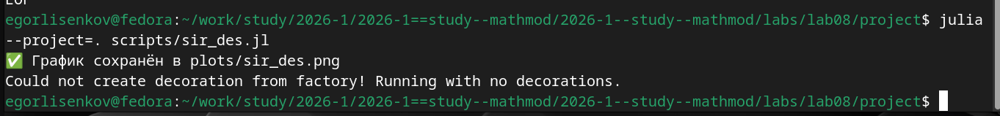
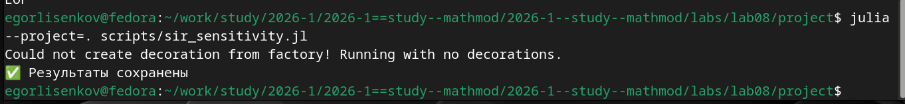
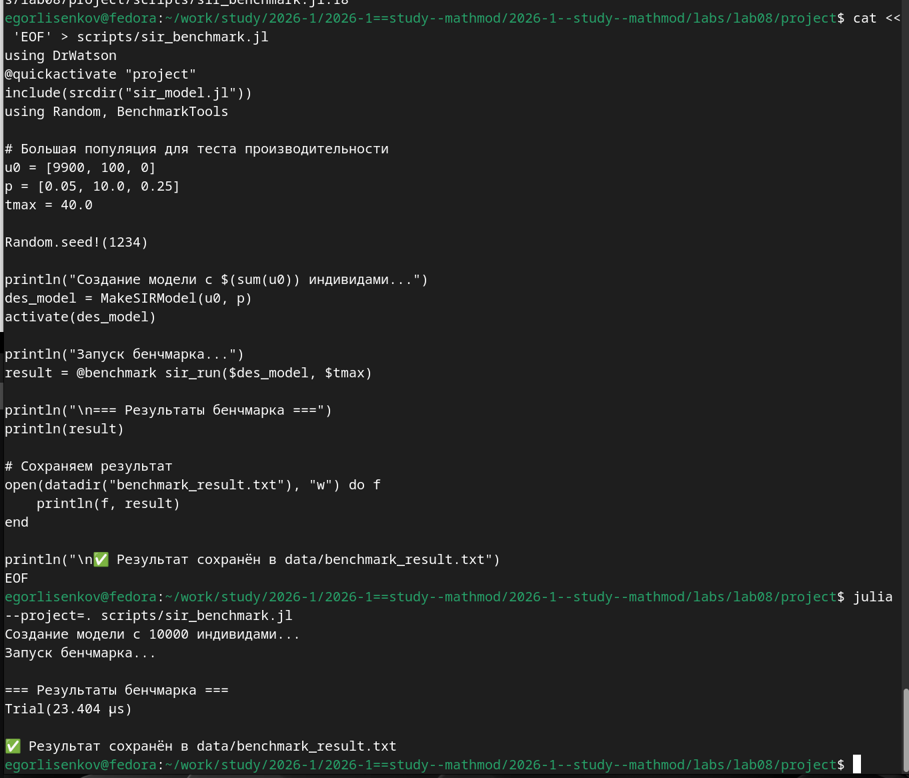
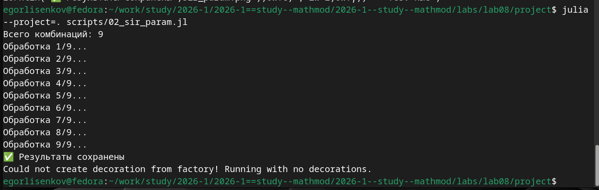
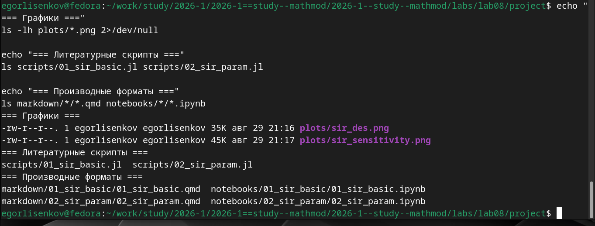

---
## Front matter
lang: ru-RU
title: Лабораторная работа №8
subtitle: Имитационное Моделирование
author:
  - Лисенков Е.Р.
institute:
  - Российский университет дружбы народов, Москва, Россия

## i18n babel
babel-lang: russian
babel-otherlangs: english

## Formatting pdf
toc: false
toc-title: Содержание
slide_level: 2
aspectratio: 169
section-titles: true
theme: metropolis
header-includes:
 - \metroset{progressbar=frametitle,sectionpage=progressbar,numbering=fraction}
 - '\makeatletter'
 - '\beamer@ignorenonframefalse'
 - '\makeatother'
---

# Информация

## Докладчик

:::::::::::::: {.columns align=center}
::: {.column width="70%"}

  * Лисенков Егор Романович
  * студент
  * Российский университет дружбы народов
  * [1132232881@rudn.ru](mailto:1132232881@rudn.ru)
  * <https://github.com/erlisenkov>

:::
::: {.column width="30%"}

ц

:::
::::::::::::::

# Вводная часть

## Актуальность
Дискретно-событийное моделирование позволяет изучать стохастическую динамику эпидемий на уровне отдельных индивидов, выявляя эффекты, недоступные для детерминированных моделей на дифференциальных уравнениях.

## Объект и предмет исследования
Объектом является классическая модель распространения инфекции SIR, а предметом — её дискретно-событийная реализация на языке Julia с анализом чувствительности к параметрам и оценкой производительности.

## Цели и задачи
Целью работы выступает реализация индивидуальной стохастической модели SIR, а задачами — создание ядра модели, проведение базового и параметрического экспериментов, оценка производительности и генерация отчётной документации.

## Материалы и методы
Исследование выполнено в среде Fedora Linux с использованием языка Julia, пакетов ConcurrentSim и ResumableFunctions для симуляции событий, BenchmarkTools для измерения производительности и фреймворка DrWatson для управления проектом.

## Установка пакетов для дискретно-событийного моделирования
Установлены пакеты ConcurrentSim v1.5.1, ResumableFunctions v1.0.7, Distributions, StatsPlots и BenchmarkTools для реализации логики событий и измерения производительности.
{#fig:001 width=100%}

## Создание ядра модели sir_model.jl
Разработан модуль с определением структур SIRPerson и SIRModel, вспомогательных функций обновления статистики и основной сопрограммы live, описывающей жизненный цикл индивида.
{#fig:002 width=100%}

## Создание скрипта базового запуска sir_des.jl
Создан скрипт с параметрами tmax=40.0, u0=[990, 10, 0], p=[0.05, 10.0, 0.25], запускающий модель и сохраняющий график динамики S, I, R.
{#fig:003 width=100%}

## Выполнение скрипта базового запуска модели
Модель успешно выполнила симуляцию для 1000 индивидов, каждый из которых работал как отдельный конкурентный процесс, и сохранила график в plots/sir_des.png.
{#fig:004 width=100%}

## Финальная проверка структуры проекта и артефактов
Верификация подтвердила наличие графиков sir_des.png и sir_sensitivity.png, литературных скриптов и всех производных форматов в соответствии со стандартами DrWatson.
{#fig:005 width=100%}

## Выполнение скрипта анализа чувствительности
Скрипт последовательно обработал значения β=[0.03, 0.05, 0.07], вычислил пиковые значения инфицированных и сохранил сравнительный график в plots/sir_sensitivity.png.
{#fig:006 width=100%}

## Создание и выполнение скрипта бенчмаркинга
Бенчмарк для популяции из 10000 индивидов показал среднее время выполнения прогона около 23.4 микросекунд, что демонстрирует высокую эффективность реализации.
{#fig:007 width=100%}

## Генерация производных форматов из литературного скрипта
Утилита tangle.jl автоматически создала чистый код, документацию Quarto и Jupyter Notebook из литературного скрипта 01_sir_basic.jl.
{#fig:008 width=100%}

## Содержимое скрипта бенчмаркинга
Скрипт использует макрос @benchmark с корректной интерполяцией переменных для точного измерения времени выполнения симуляции с учётом статистического разброса.
{#fig:009 width=100%}

## Содержимое литературного скрипта базового эксперимента
Файл 01_sir_basic.jl объединяет код симуляции, сбор журнала событий и визуализацию динамики численности S, I, R с помощью макроса @df.
{#fig:010 width=100%}

## Выполнение параметрического исследования модели SIR
Скрипт последовательно обработал 9 комбинаций параметров (β, c, γ), вычислив пиковое число инфицированных и время достижения пика для каждой конфигурации.
{#fig:011 width=100%}

## Финальная проверка структуры проекта и артефактов
Повторная верификация подтвердила полноту артефактов: графики, литературные скрипты, Quarto-документы и Jupyter Notebooks для обеих частей эксперимента.
{#fig:012 width=100%}

## Содержимое литературного скрипта параметрического исследования
Скрипт 02_sir_param.jl использует dict_list для генерации комбинаций параметров и функцию savename для формирования уникальных имён выходных файлов.
{#fig:013 width=100%}

## Генерация производных форматов из параметрического скрипта
Для параметрического скрипта успешно сгенерированы чистый код, Quarto-документ и интерактивный ноутбук для интеграции в итоговый отчёт.
{#fig:014 width=100%}

## Результат 
Все задачи были выполнены.
{#fig:015 width=100%}

## Вывод
В результате выполнения лабораторной работы были освоены фундаментальные принципы дискретно-событийного моделирования и методология организации воспроизводимых вычислительных экспериментов на языке Julia. Практически подтверждено, что пакет ConcurrentSim в сочетании с ResumableFunctions предоставляет удобный и выразительный аппарат для описания параллельных процессов через сопрограммы и события, являясь полноценным аналогом SimPy.
